# Отчет: Linux директории

### 1. 
pwd - возвращает полный путь к текущей директории.

Корневой каталог обозначается /
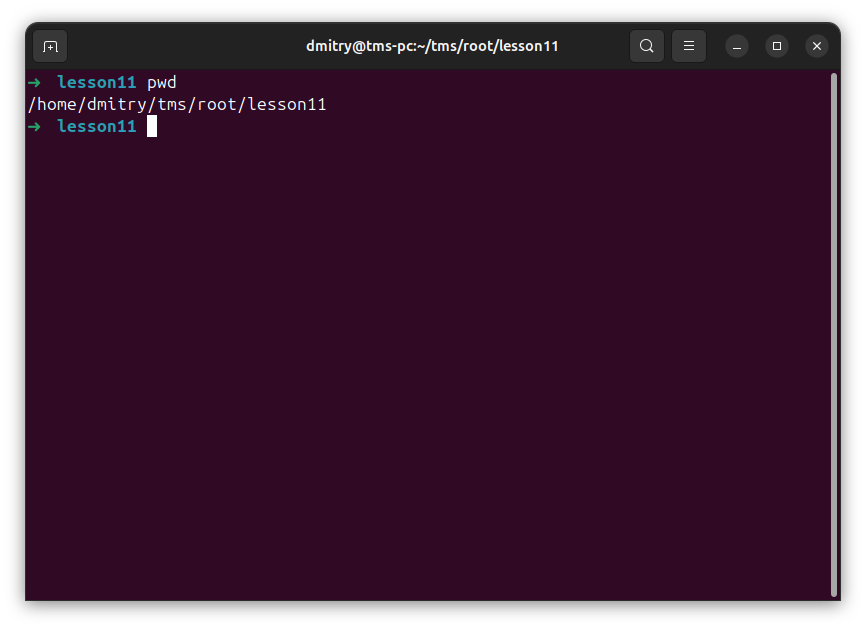

### 2. 
mkdir - создает каталог. 

ls - посмотреть содержимое каталога

ls .. - посмотреть содержимое родительского каталога
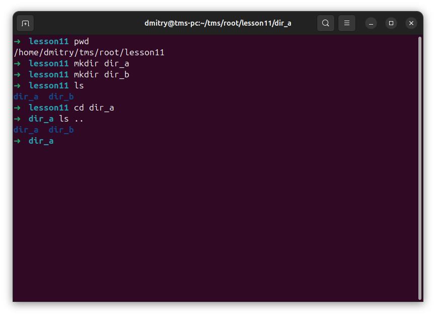

### 3. 
cd / - переход в системный каталог

ls ~ - просмотреть начальный каталог

cd ~ - перейти в начальный каталог
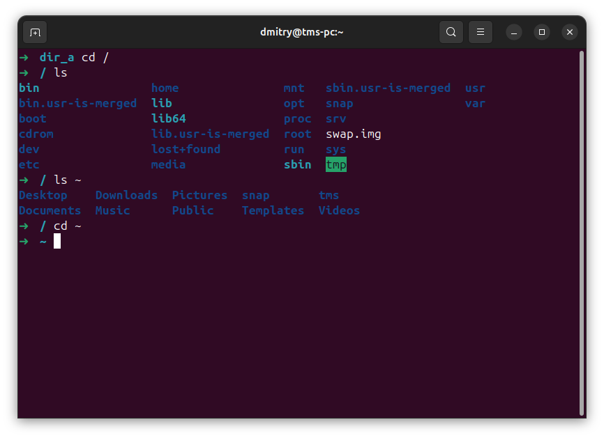

### 4.
rmdir dir_a dir_b - удалить каталоги dir_a, dir_b
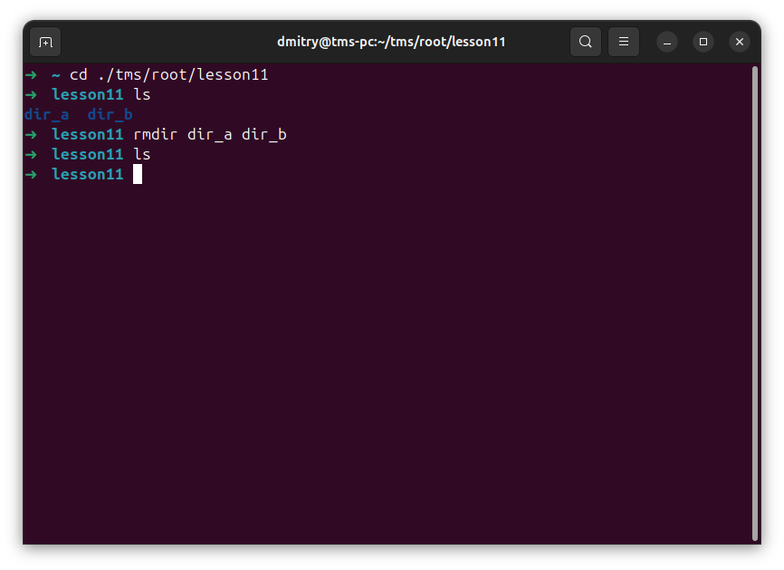

### 5,6,7.

man ls - полное руководство по команде ls

whatis ls - краткое описание ls

apropos ls - поиск по всей базе данных где встречается ls

info ls - открывает подроную документацию по ls
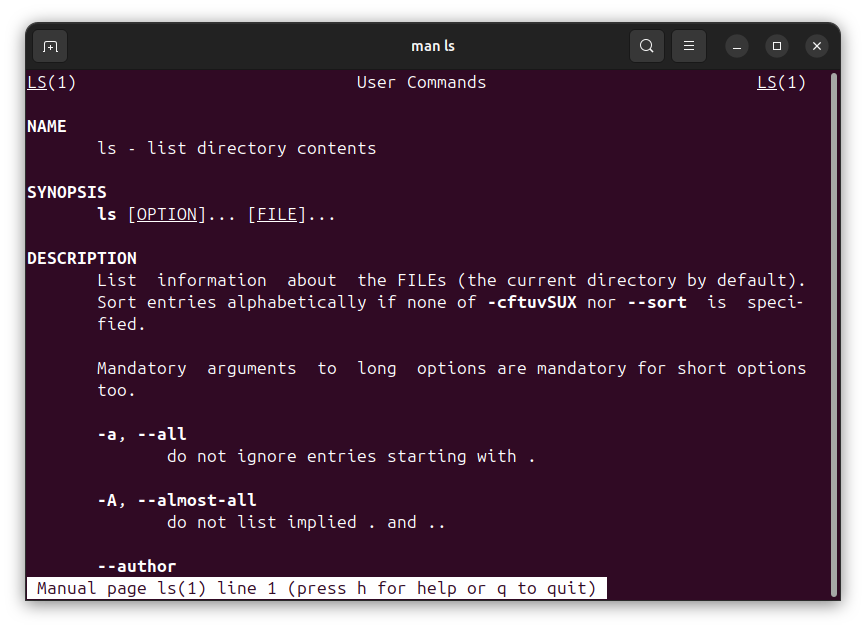
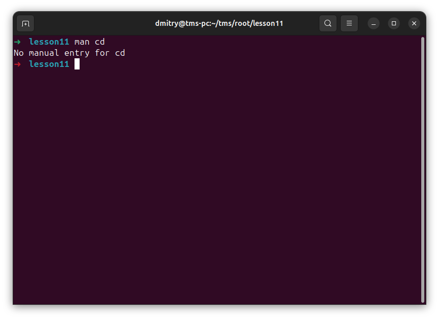
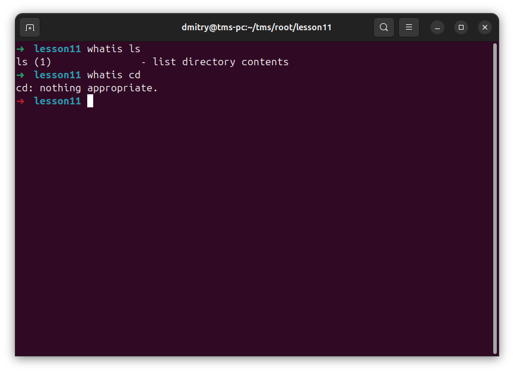
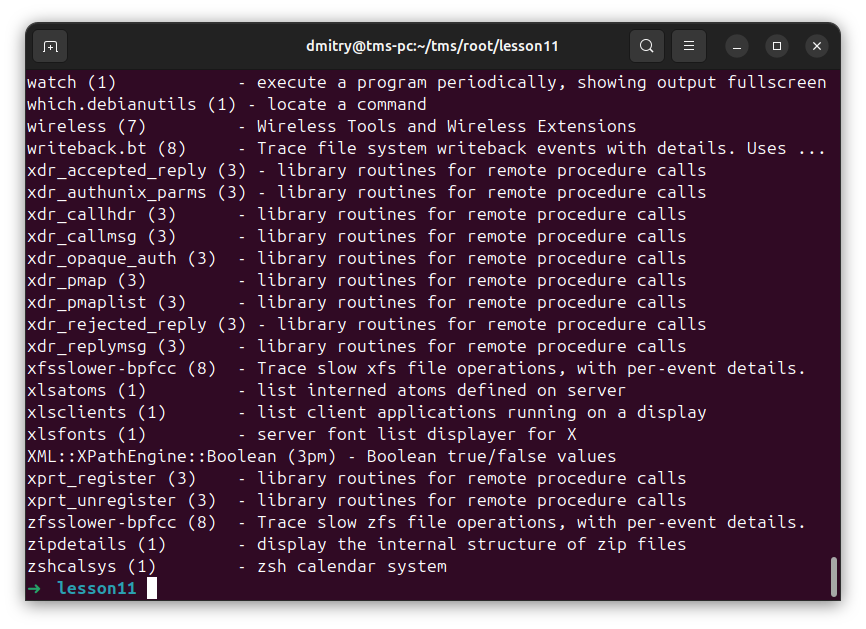
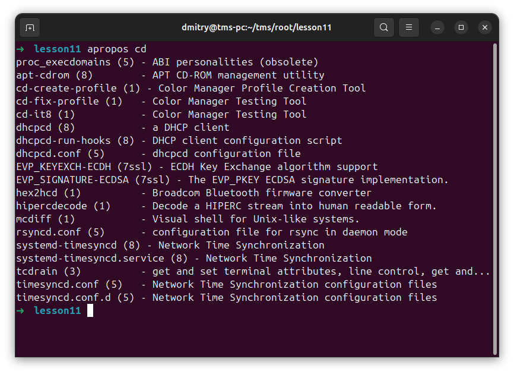
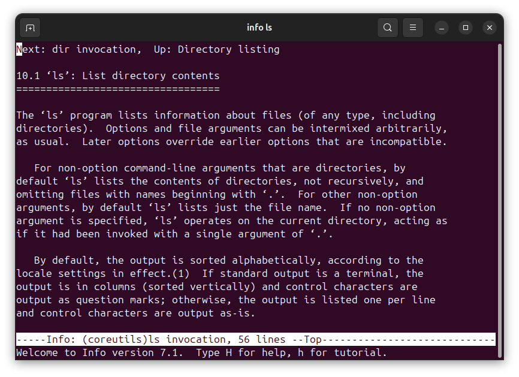
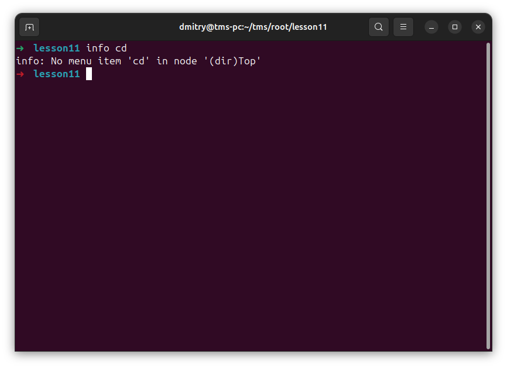

### 8.
mkdir -p dir_a/{1/{2,3},4} - создает дерево каталогов

tree - отображает каталоги деревом
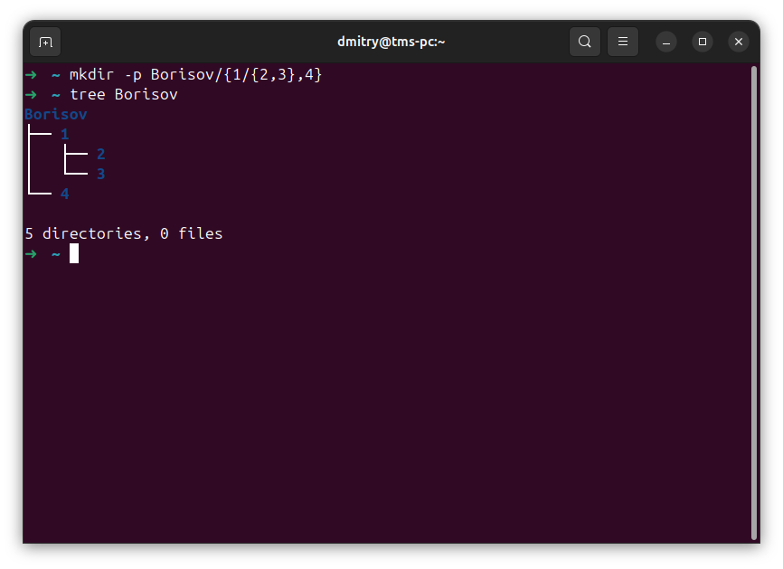

### 9.
head -n 13 /etc/group - возвращает первых 13 строк документа /etc/group

tail -n 13 /etc/group - возвращает последних 13 строк документа /etc/group
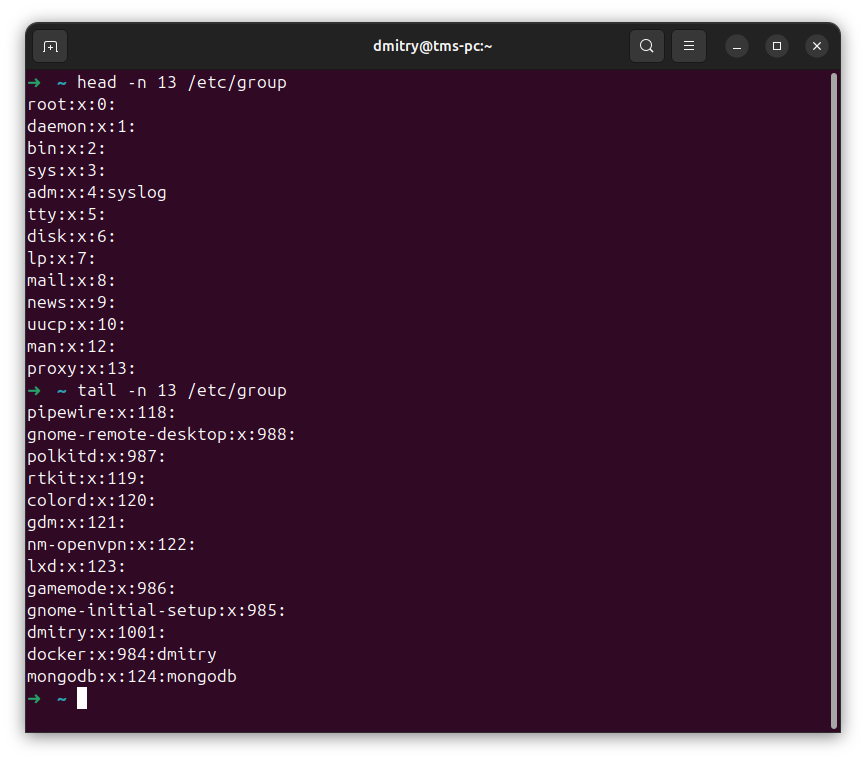

