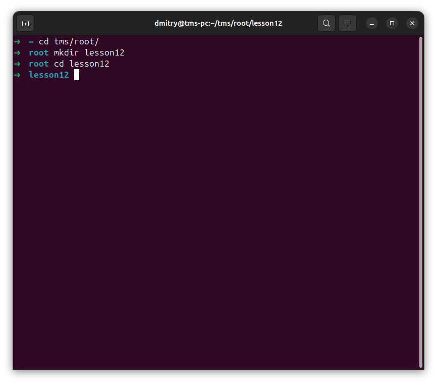
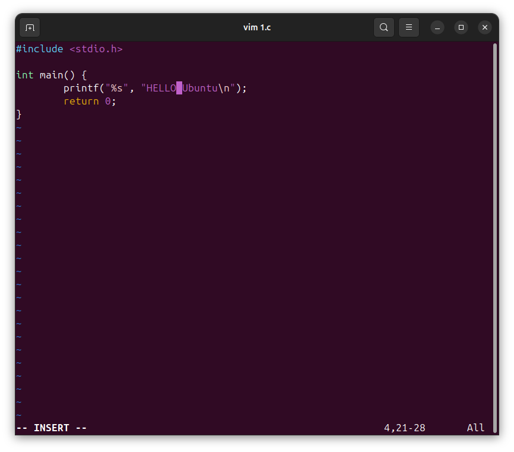
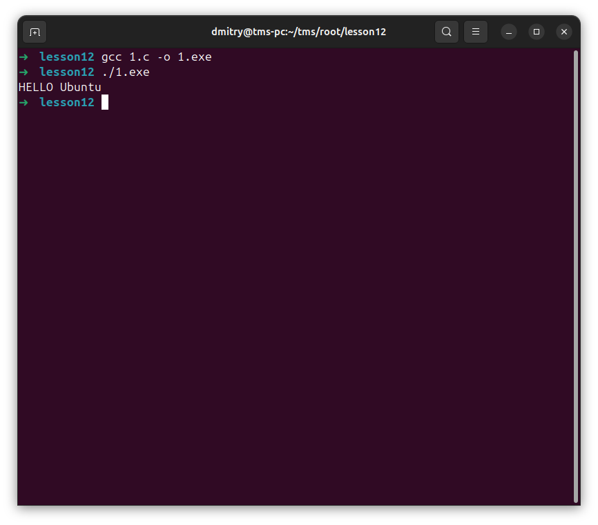
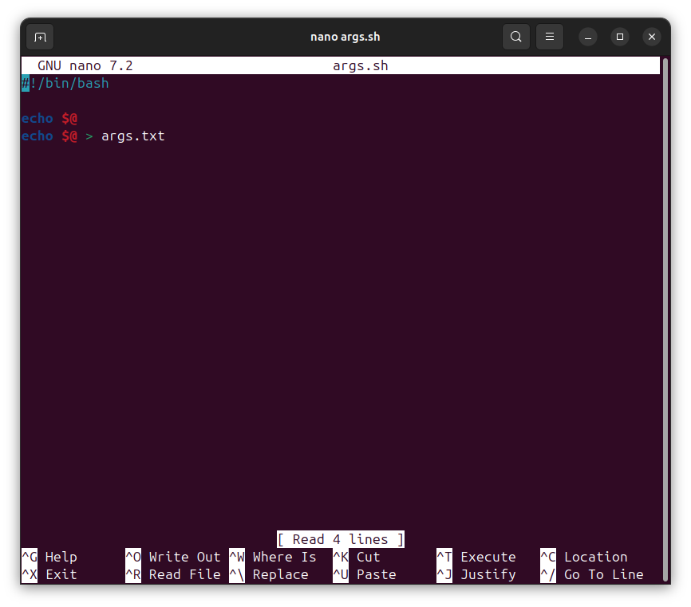
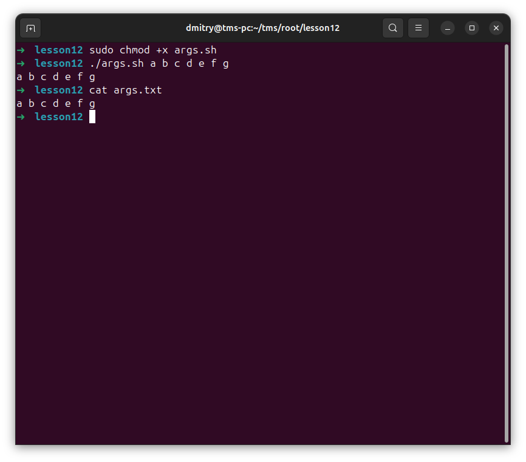
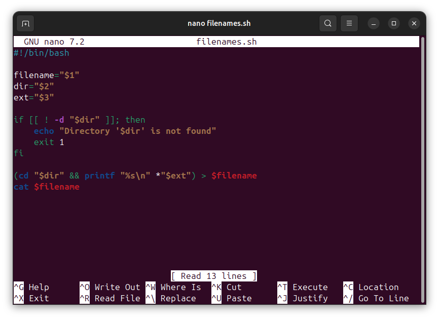
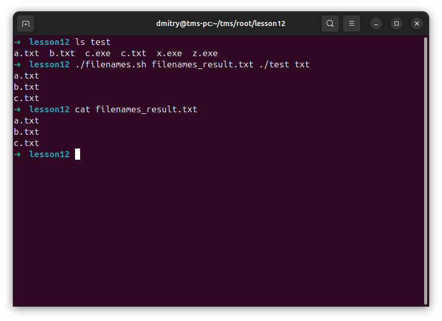
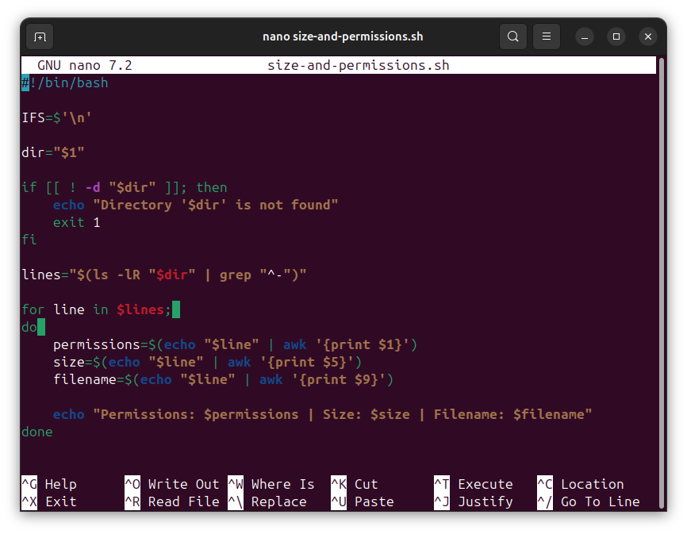
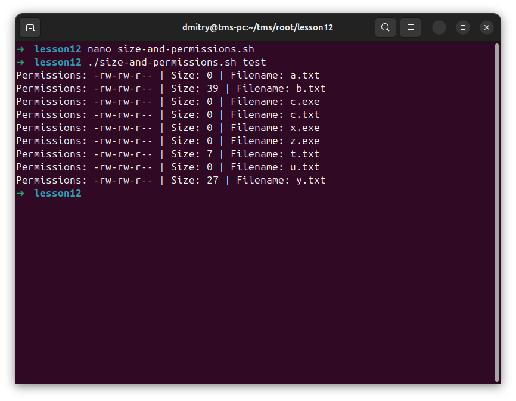

# Отчет: Bash

### 1. 
Создать каталог

### 2. 
Hello ubuntu

### 3. 
Скрипт, выводящий на консоль и в файл все аргументы командной строки

### 4. 
Скрипт, выводящий в файл (имя файла задается пользователем в качестве первого аргумента командной строки) имена всех файлов с заданным расширением (третий аргумент командной строки) из заданного каталога (имя каталога задается пользователем в качестве второго аргумента командной строки).

### 5.
Написать скрипт с использованием цикла for, выводящий на консоль размеры и права доступа всех файлов в заданном каталоге и всех его подкаталогах (имя каталога задается пользователем в качестве первого аргумента командной строки).

