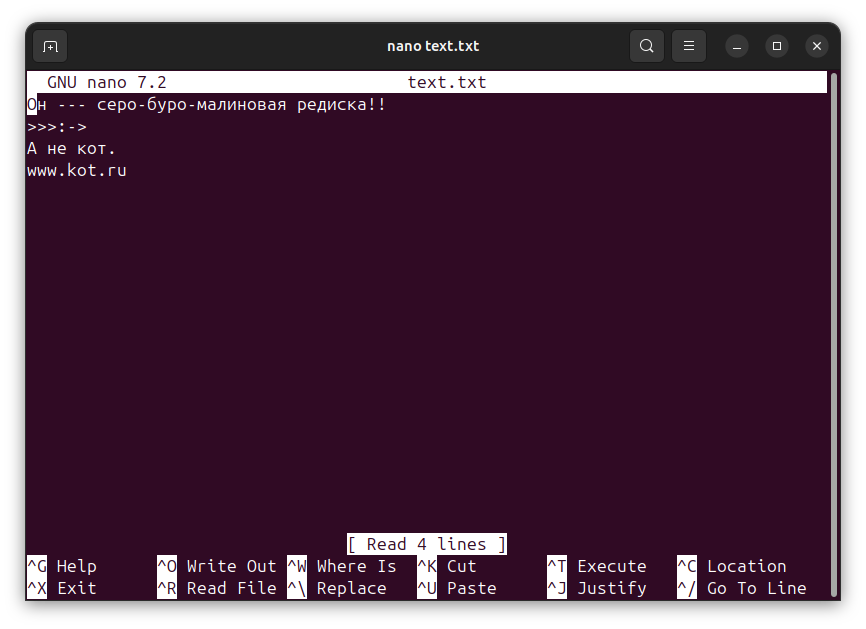
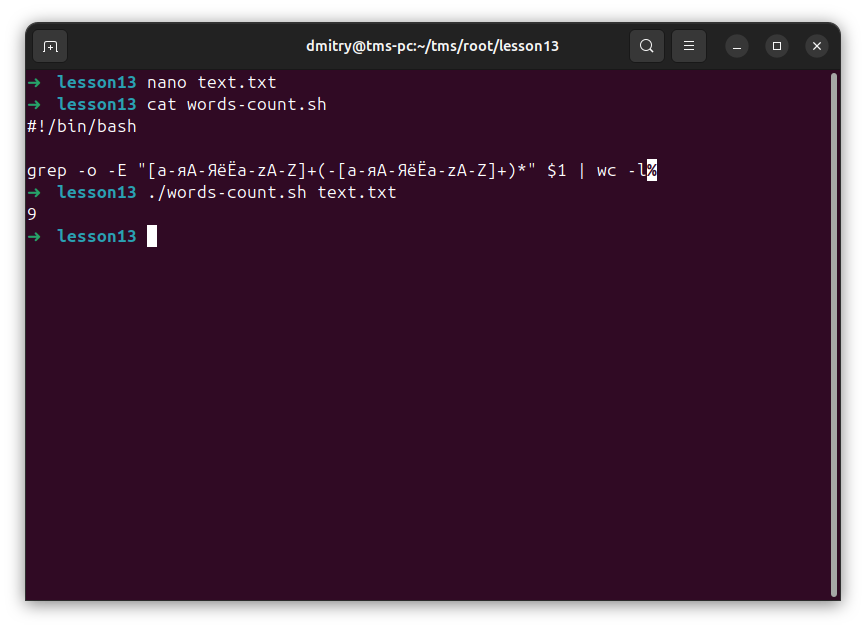
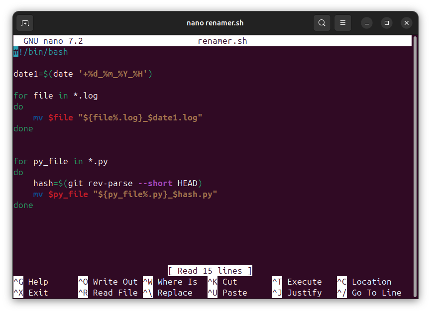
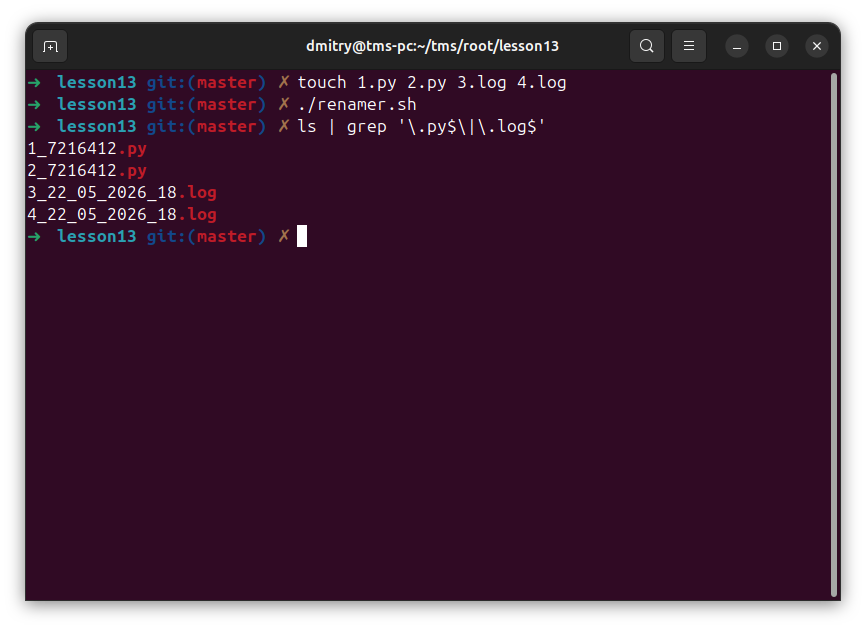
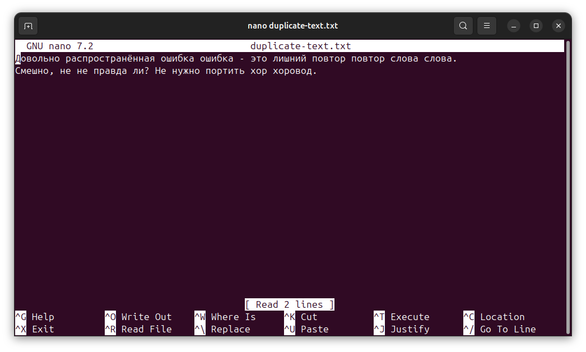
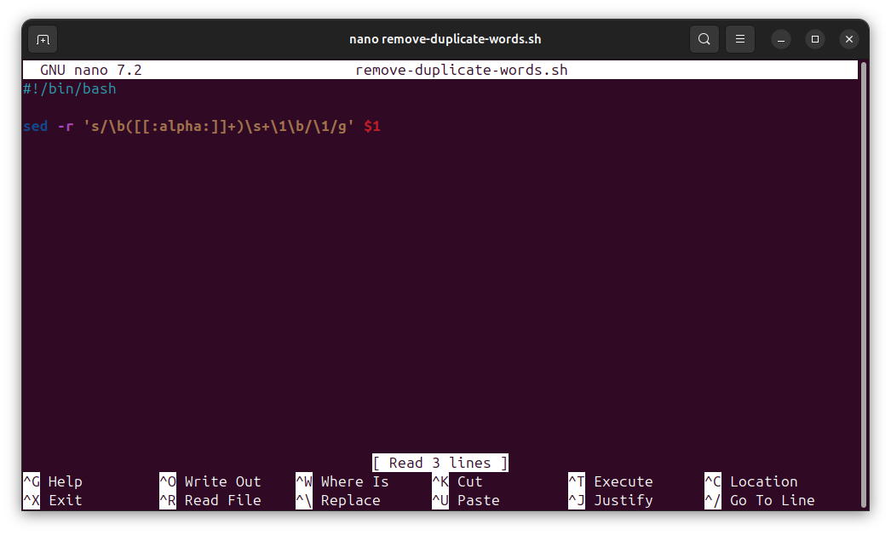
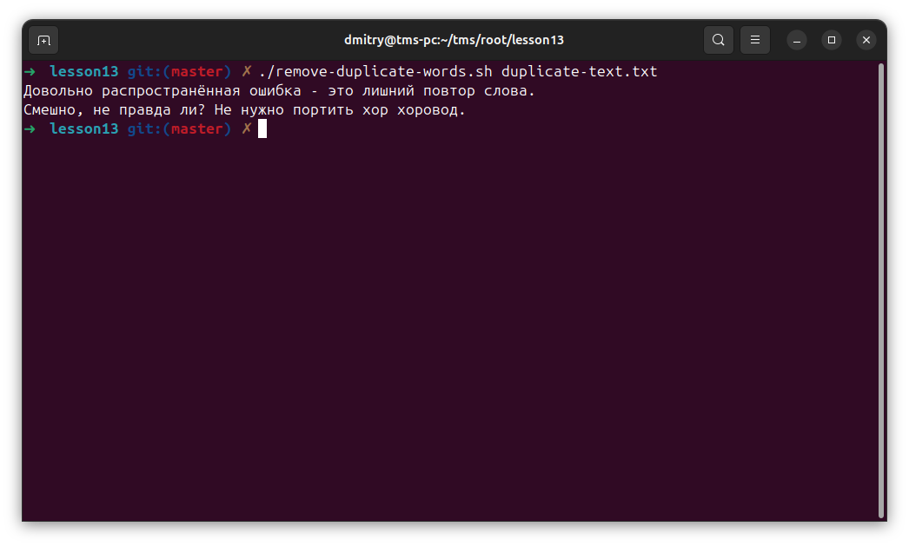

# Отчет: Bash RegExp

### 1. 
На вход дается текст, посчитайте, сколько в нем слов. Задача решается в одну строчку.

### 2. 
Добавить ко всем файлоам формата log timestamp в качестве названия.
Должно получиться filename_{timestamp}.log
Для всех файлов с расширением Py добавьте в конец названия хэш коммита.

### 3. 
Убрать повторы слов в тексте.

