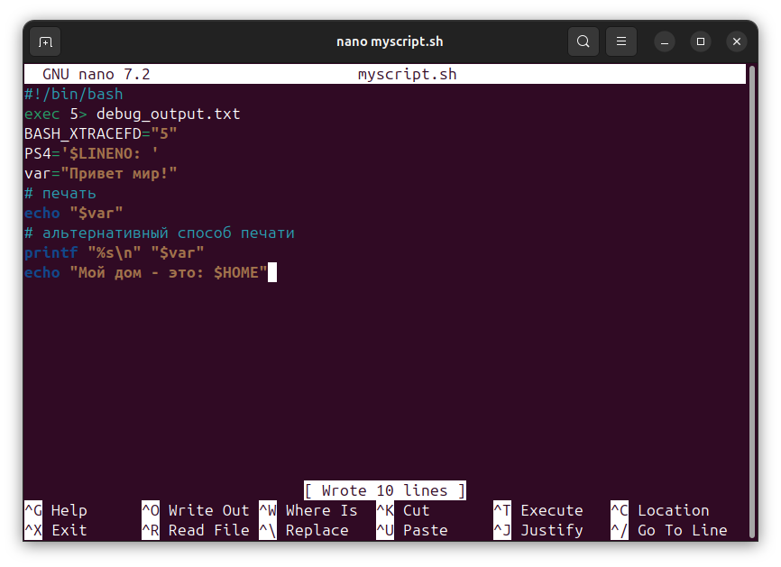
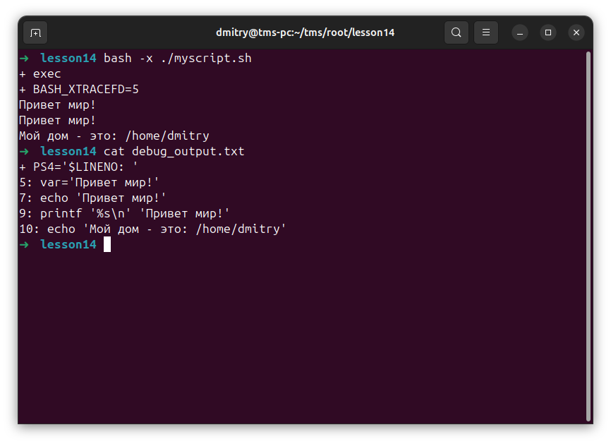
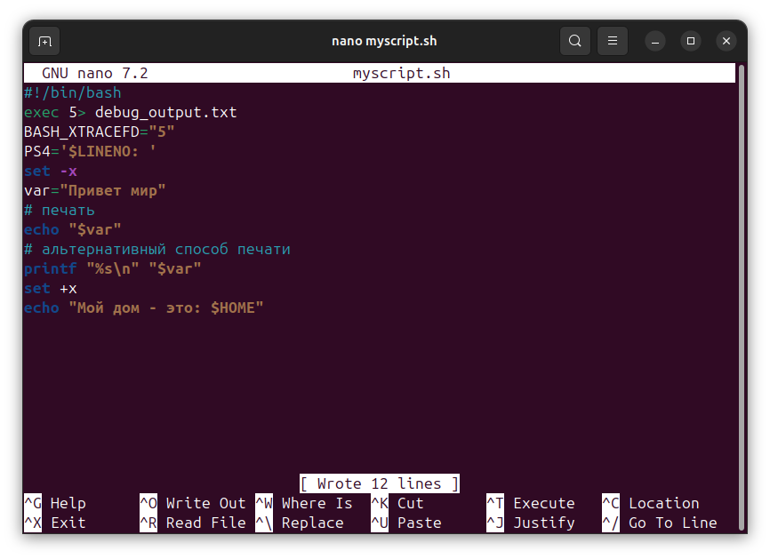
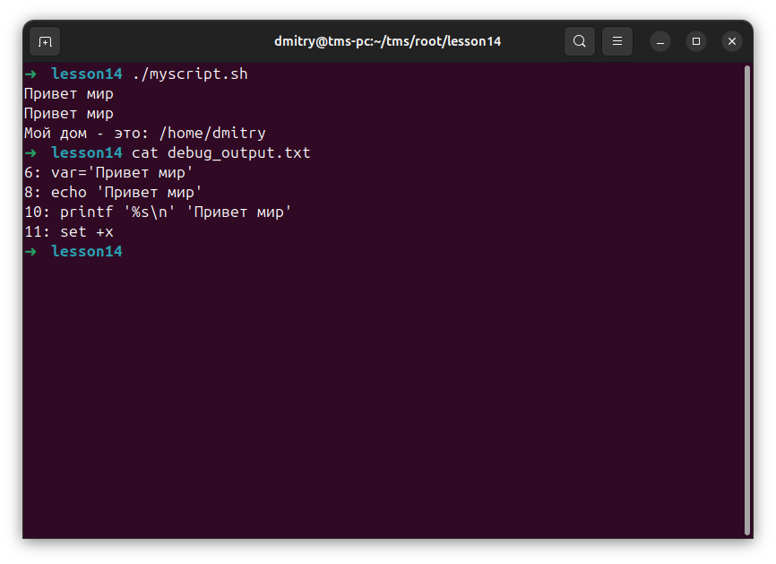
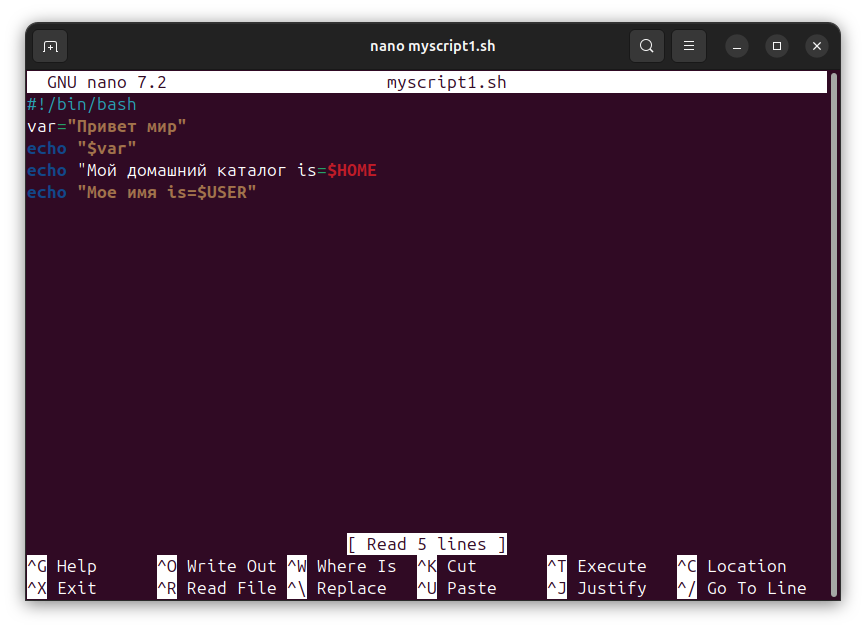
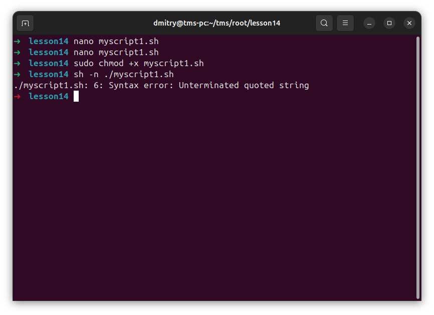
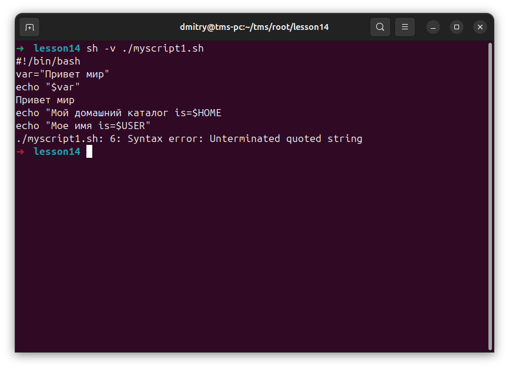
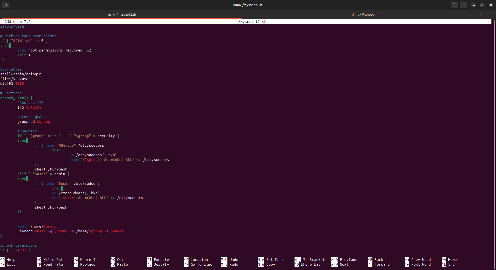
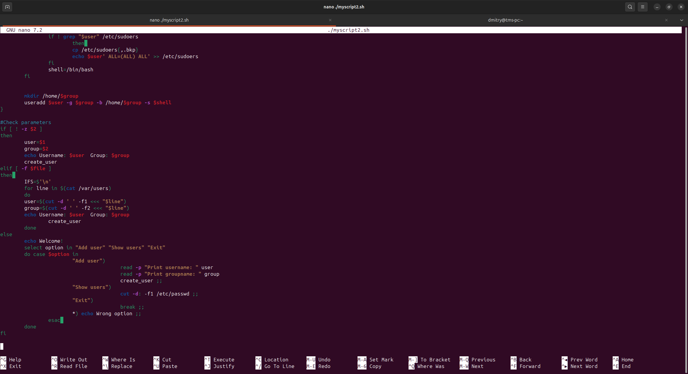
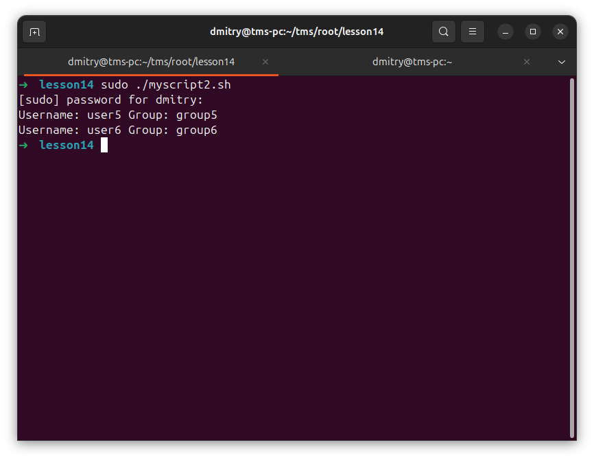

# Отчет: Bash Debug

### 1. 
Повторить шаги 1

параметр -x — отображает следы команд до их выполнения

параметр -n — не отображает команду, просто проверяет синтаксические ошибки

параметр -v — отображает команды во время их чтения

Чтобы запустить весь сценарий в режиме отладки, добавьте параметр -x перед запускающим скриптом следующим образом:

Поместите опцию «set –x» в начальную точку области, в которой требуется отладка, и поместите опцию «set + x» там, где вы хотите, чтобы она остановилась.

Файл "myscript1.sh"

-n

-v

### 2. 
Скрипт, создающий пользователей и группы.

