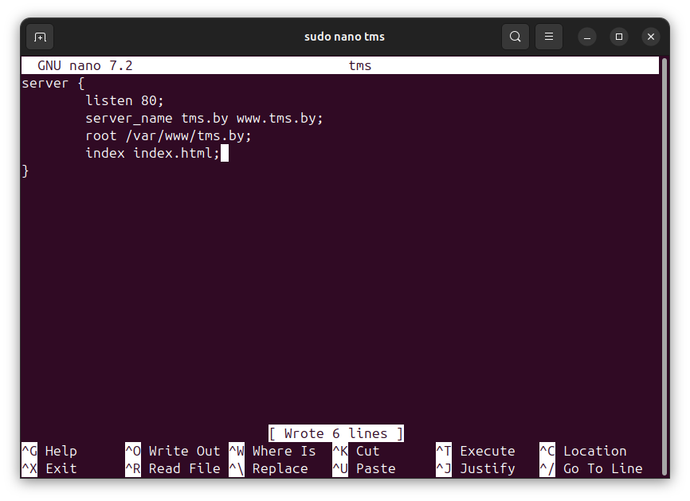
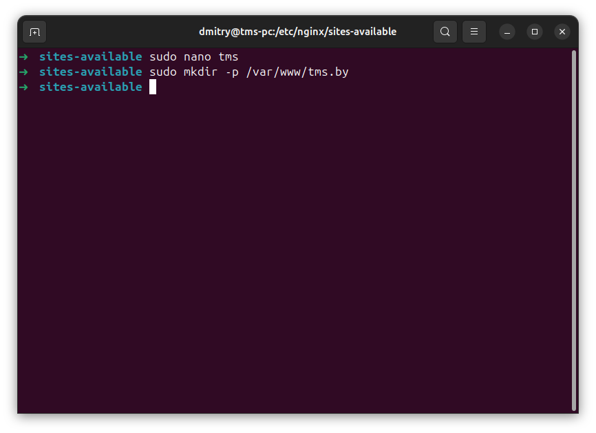
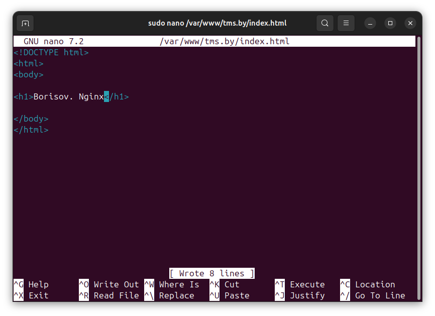
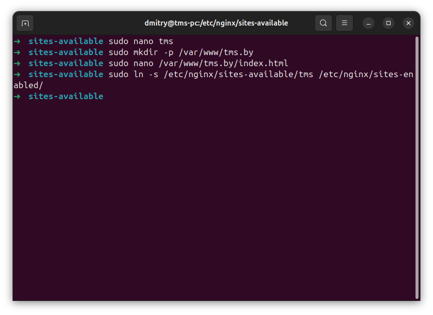
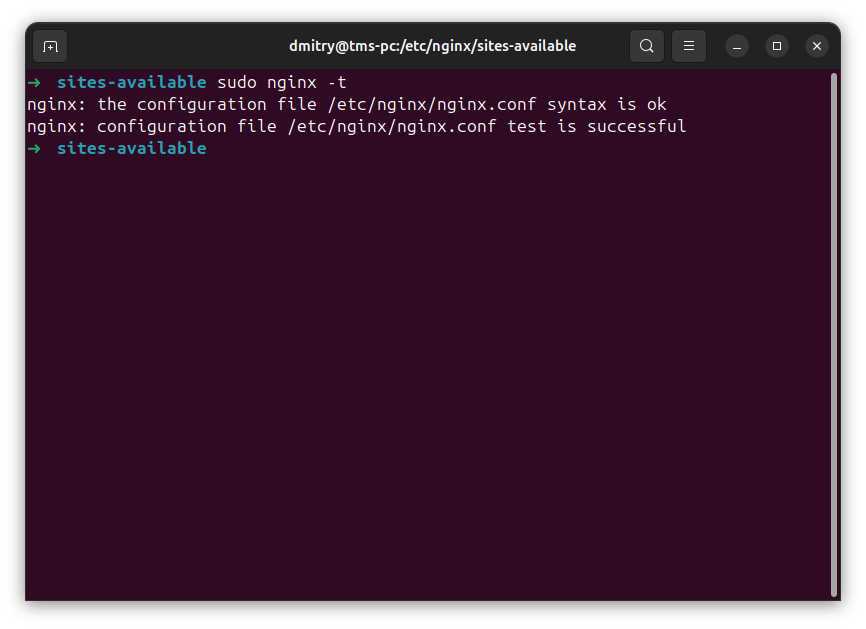
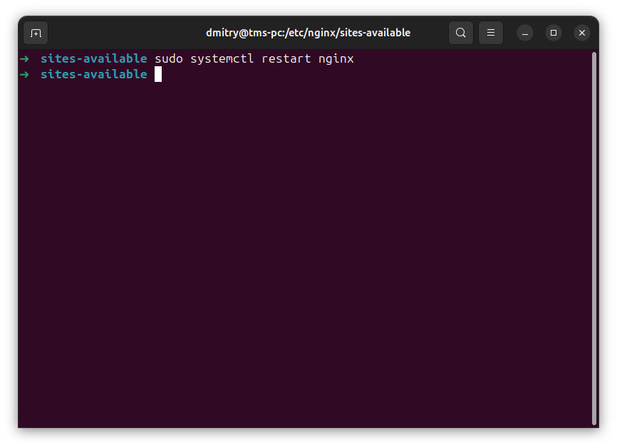
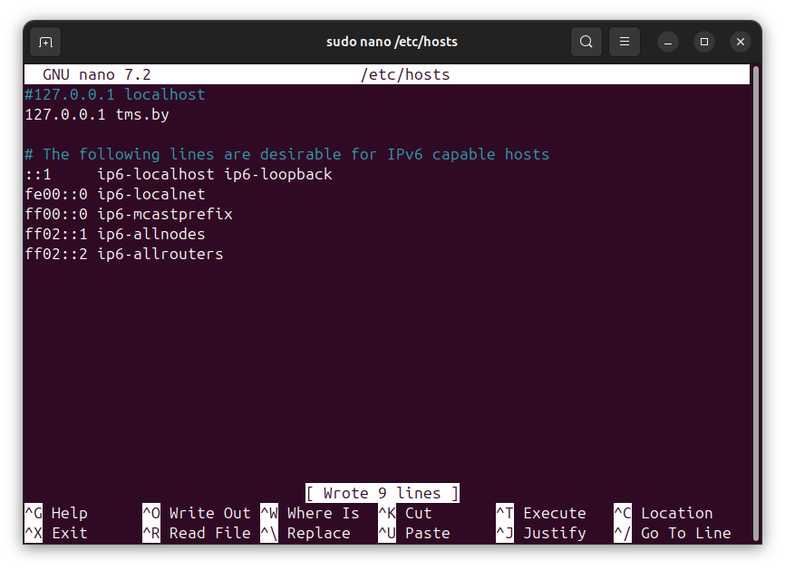
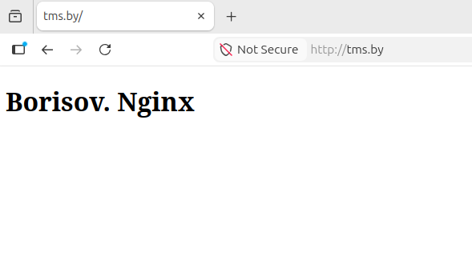

# Отчет: Nginx

### 1. 
Установите и настройте Nginx. Создайте html-страничку, где будет указана ваша фамилия и тема урока. Настройте конфигурацию nginx для отображения страницы по ссылке http://tms.by

nginx config

create site folder

index html

add site to sites enabled

syntax check

restart nginx

add site to etc/hosts

browser window

