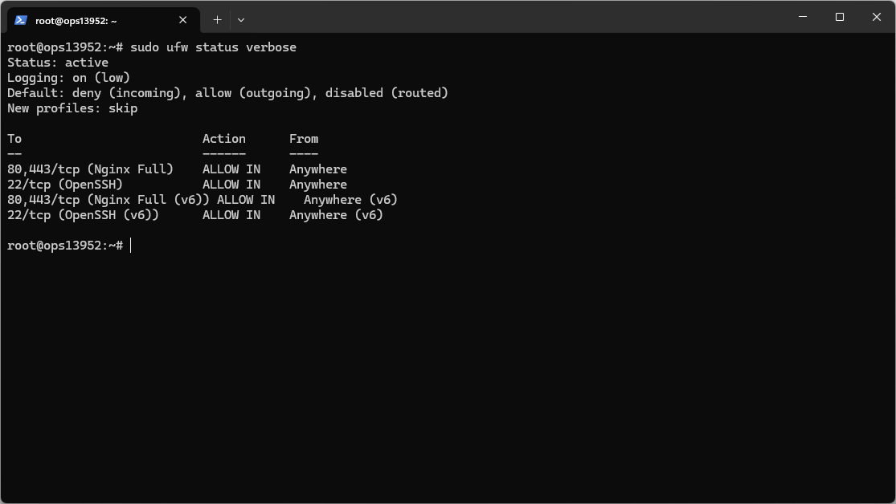
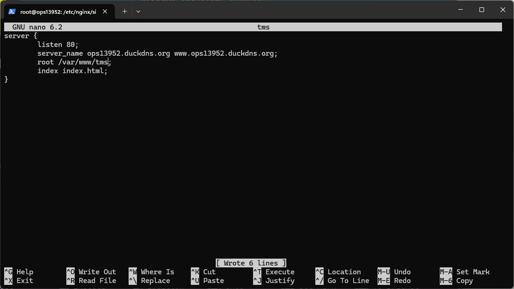
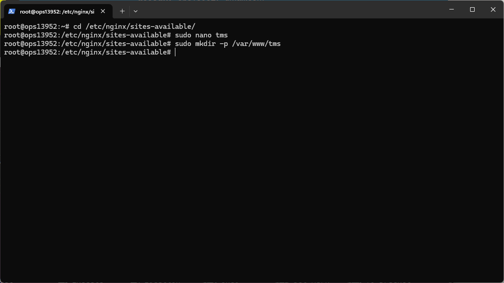
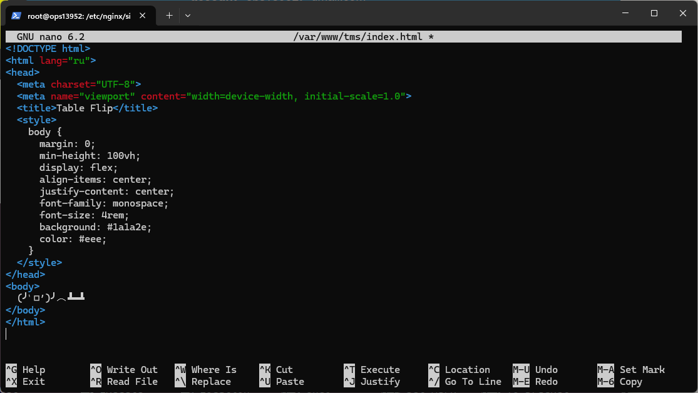
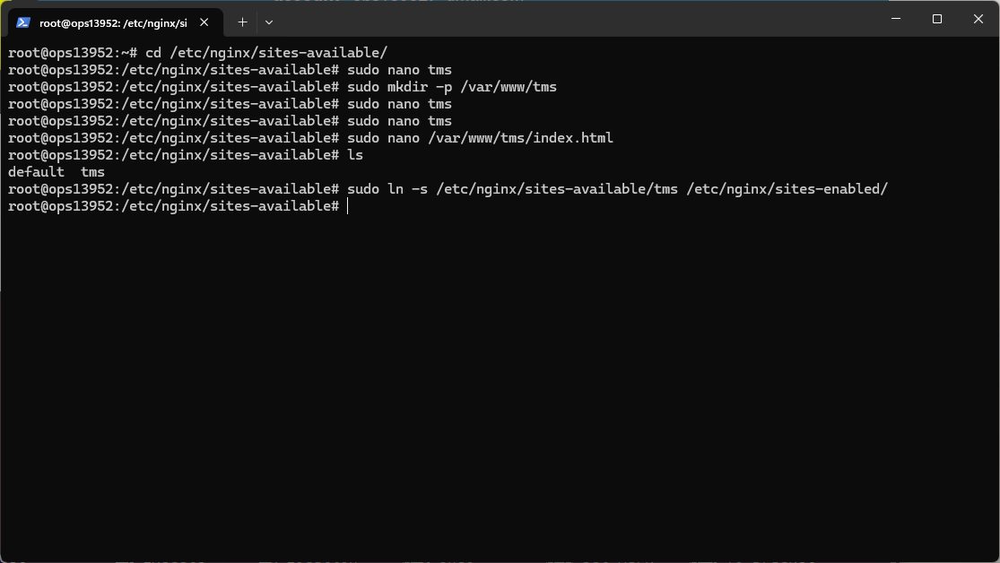
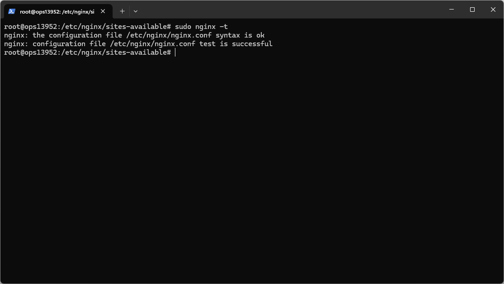
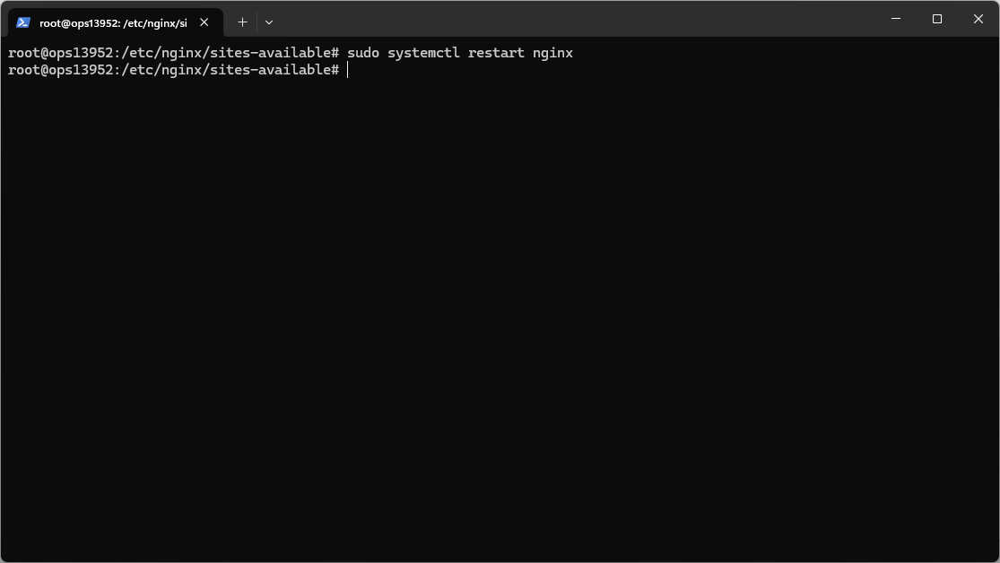
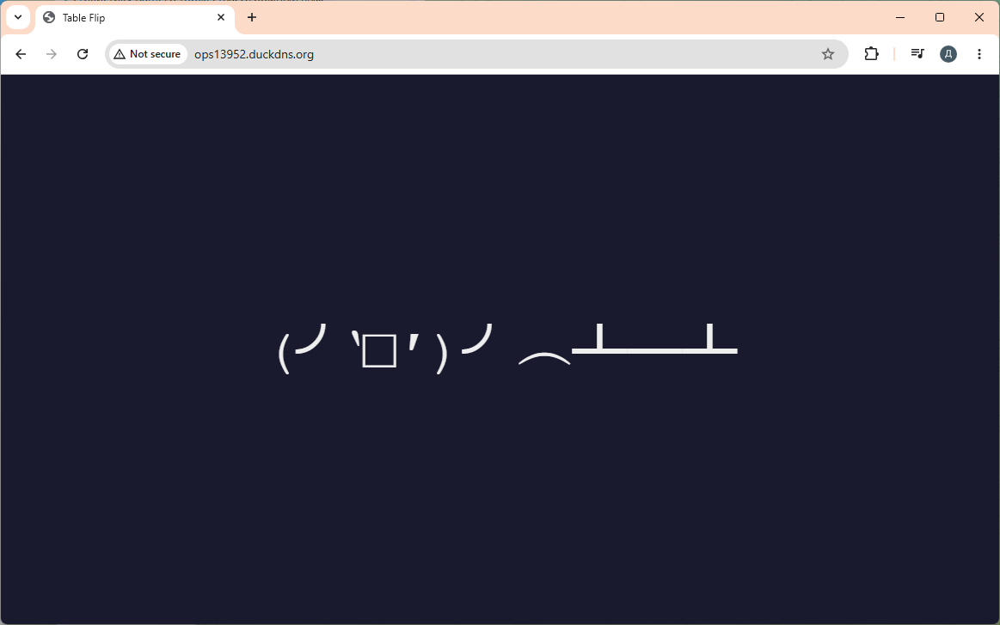
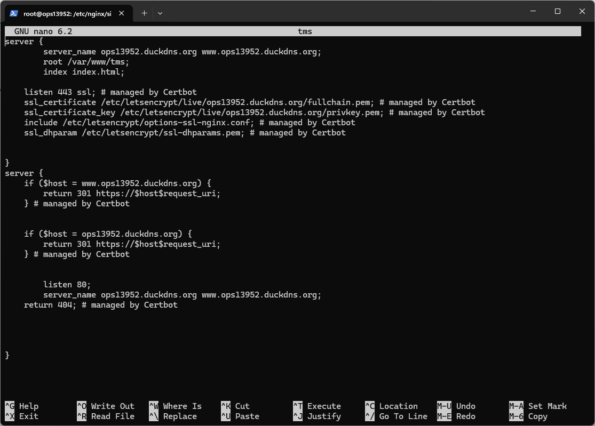
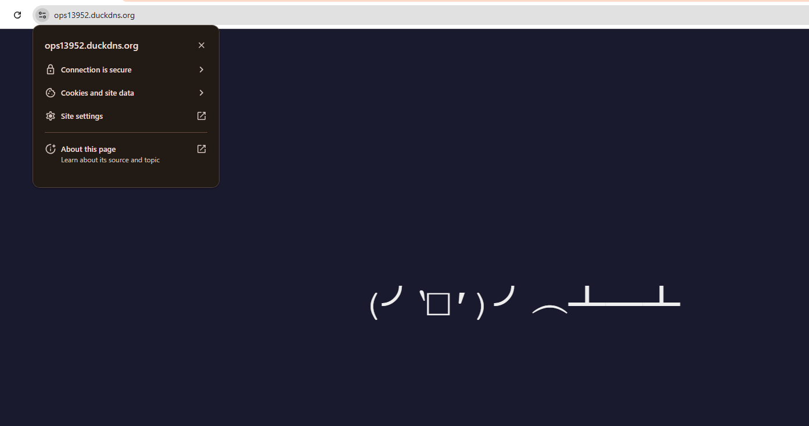

# Отчет: Nginx SSL

#### Установить и настроить Certbot на своем сервере и затем получить и установить SSL-сертификат для веб-сайта.

Подготовка ufw 
```
sudo apt update
sudo apt install nginx -y
sudo ufw allow 'Nginx HTTP'
sudo ufw allow OpenSSH
sudo ufw enable
sudo ufw status verbose
```




конфиг сайта



создать директорию сайта



index.html



добавить сайт в sites-enabled



проверка синтаксиса



рестарт nginx



сайт



установка cetbot
```
sudo snap install --classic certbot
sudo ln -s /snap/bin/certbot /usr/local/bin/certbot
sudo certbot --nginx -d ops13952.duckdns.org -d www.ops13952.duckdns.org
```

обновленный конфиг сайта



сайт secured

