# Отчет: Databases

#### SQL + dump

enable mysql

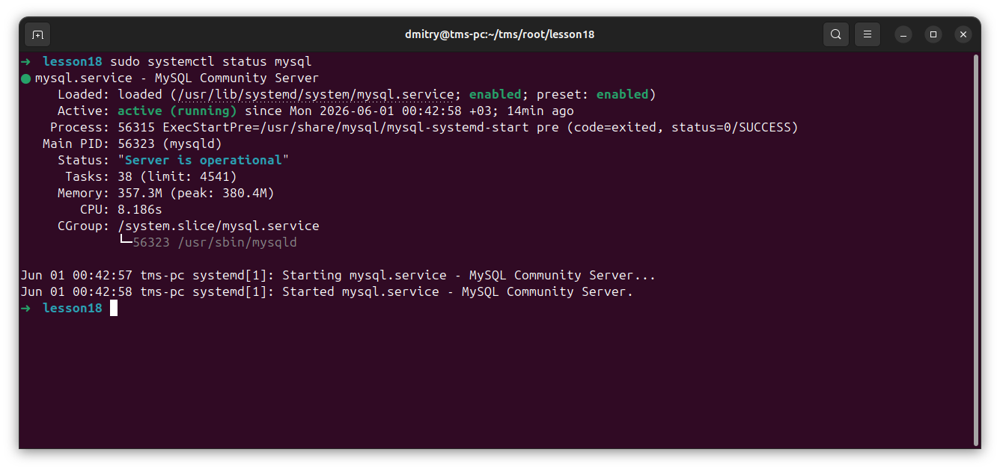

create database

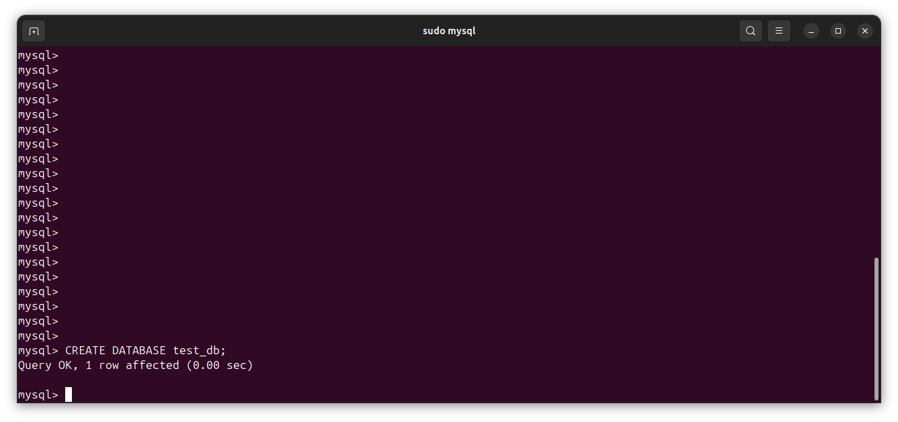

create a separate user

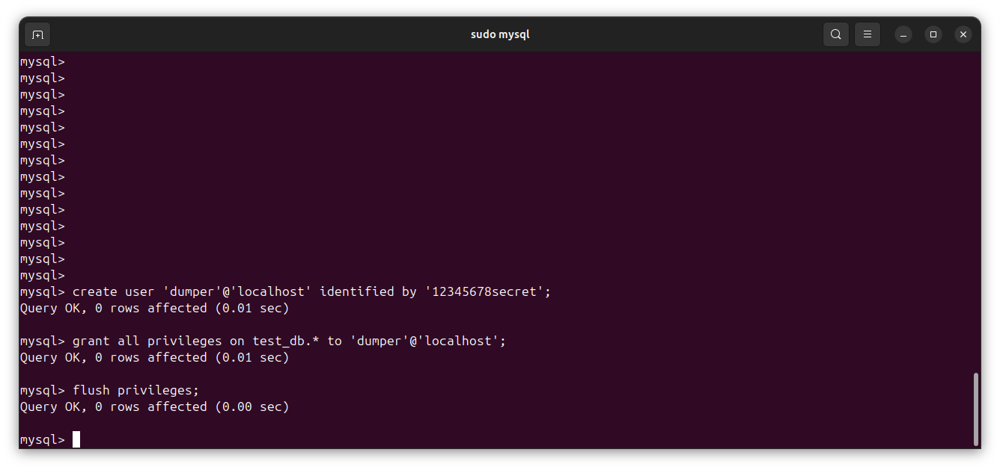

add analysis table

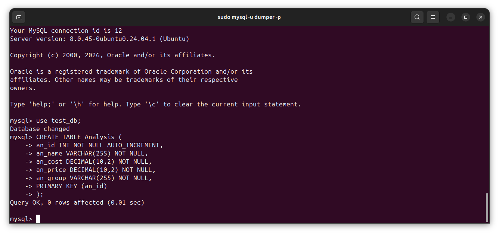

add groups table

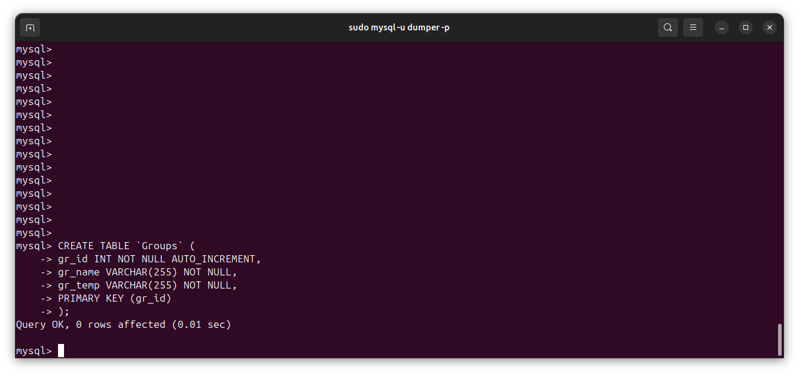

add orders table

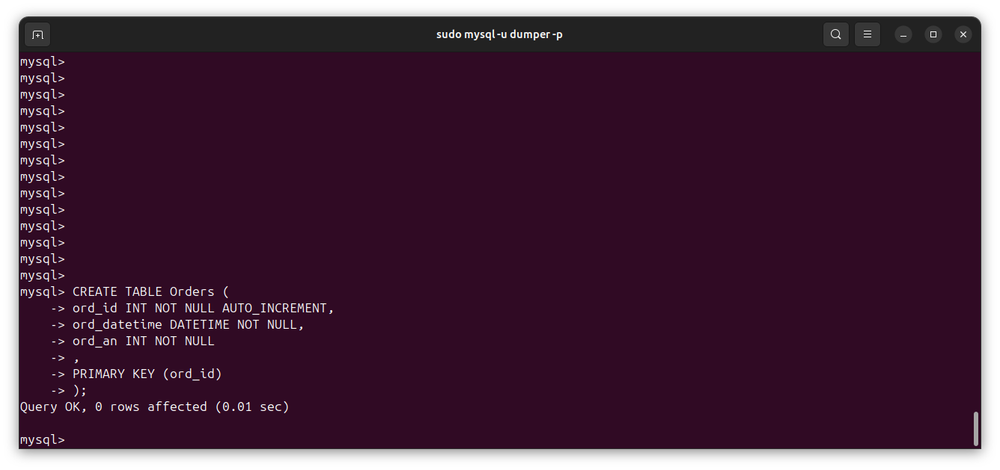

insert records

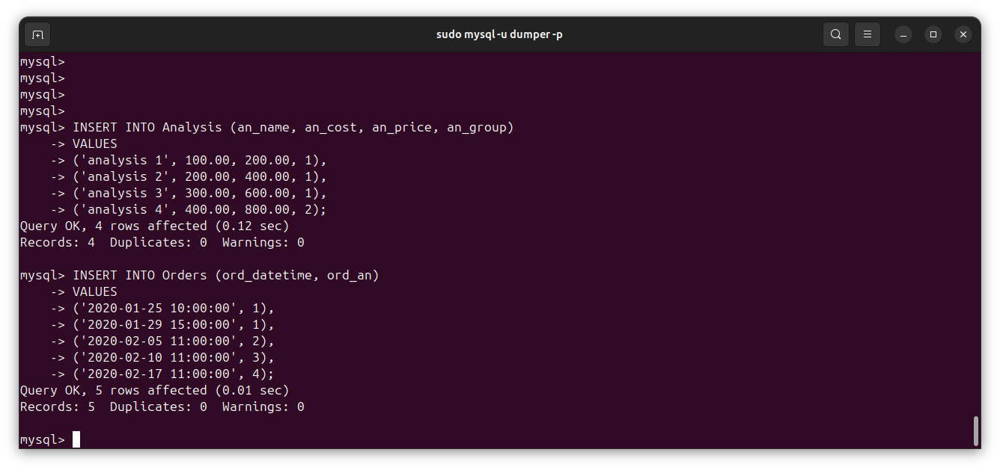

select

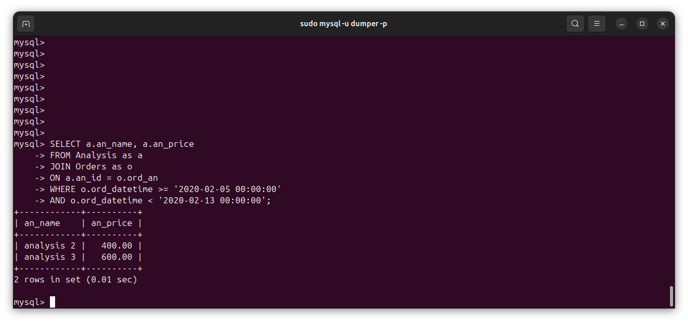

grant process permissions to user

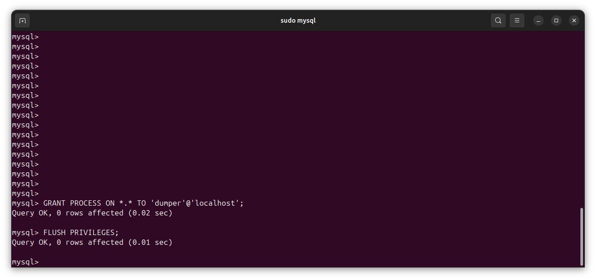

create dump

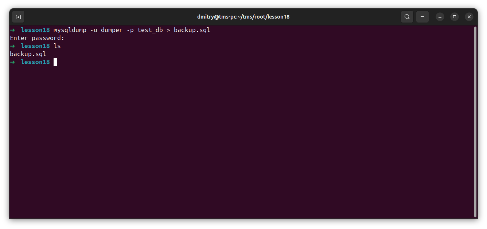

change db state

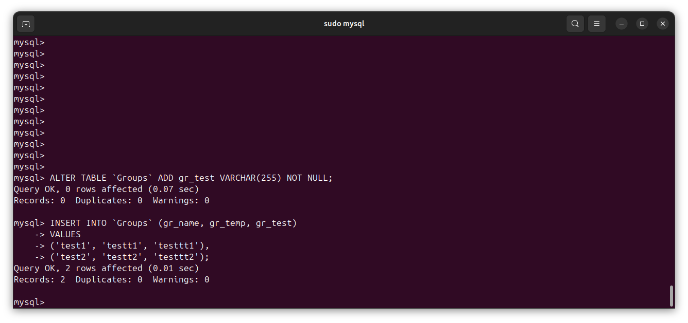

apply backup

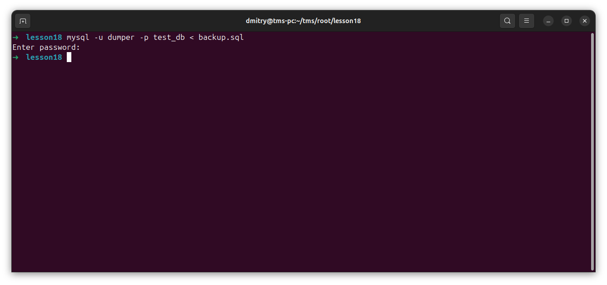

show that the result is the same as it was before

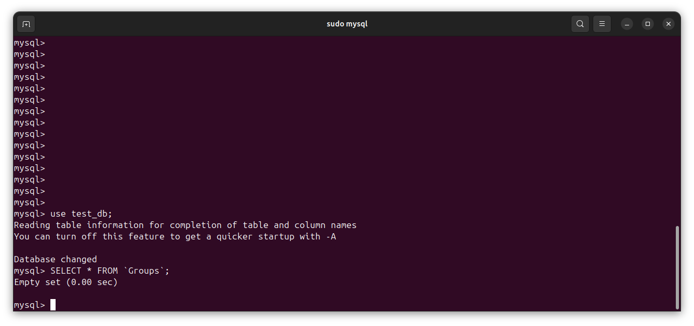

backup.sh

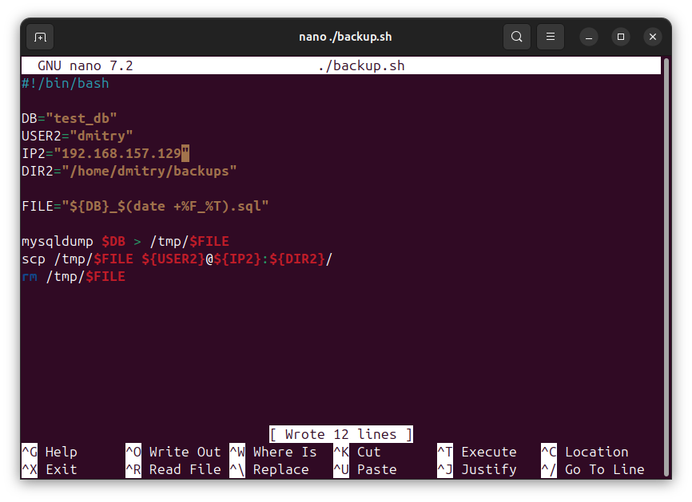

backup created successfully

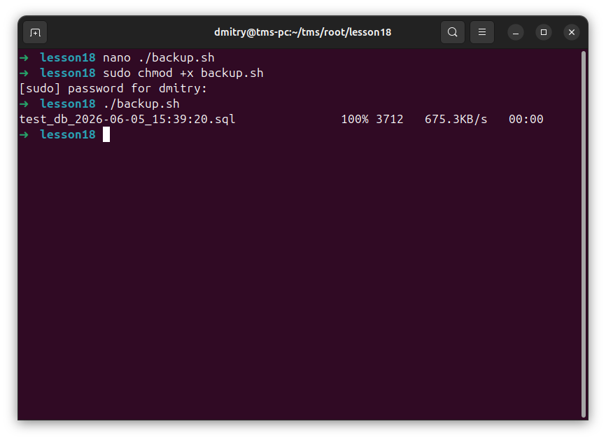