# Отчет: Databases - Patroni

установка etcd на мастер

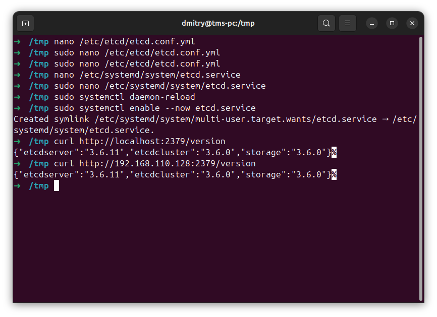

установка патрони

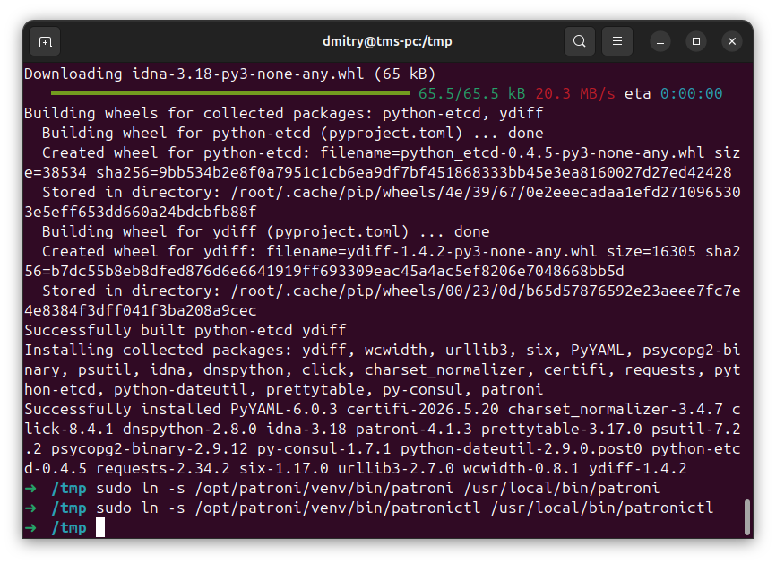

patroni.yml

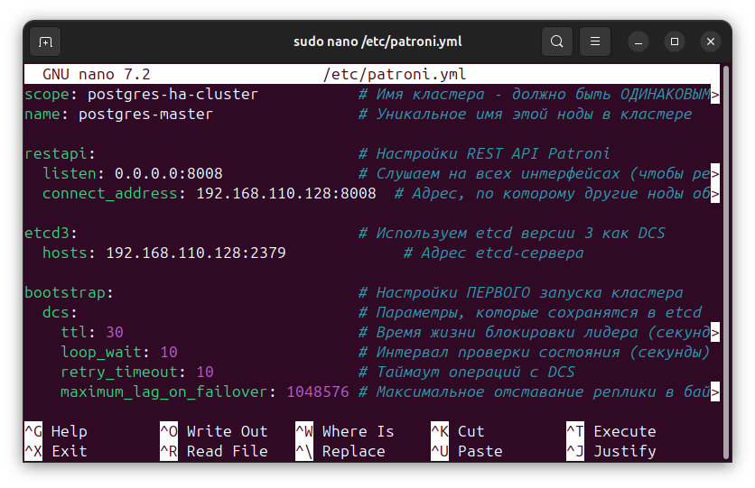

подготовка директории

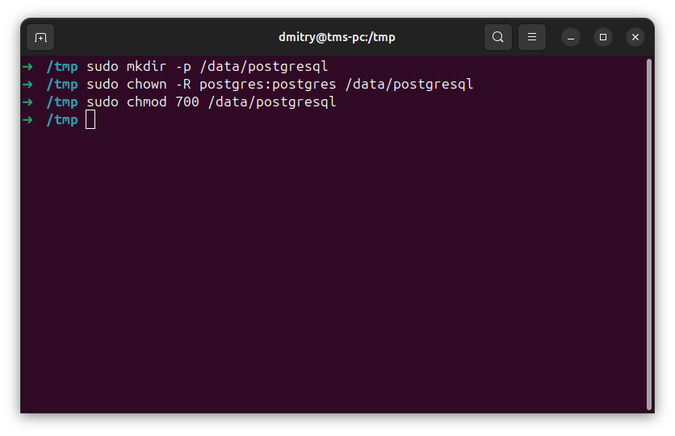

патрони сервис

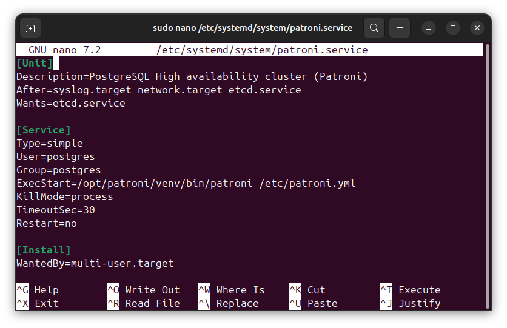

установка патрони на реплику

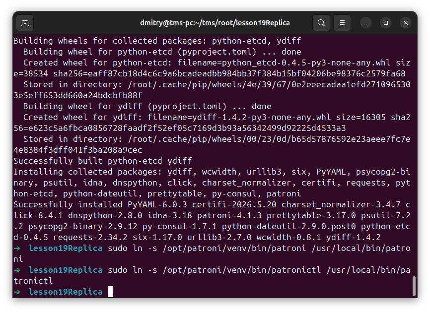

patromi.yml на реплике

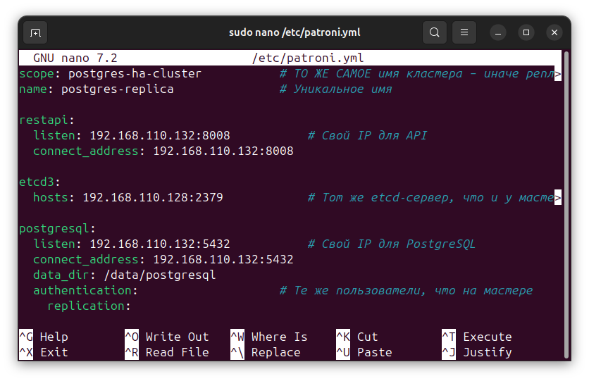

подготовка директории на реплике

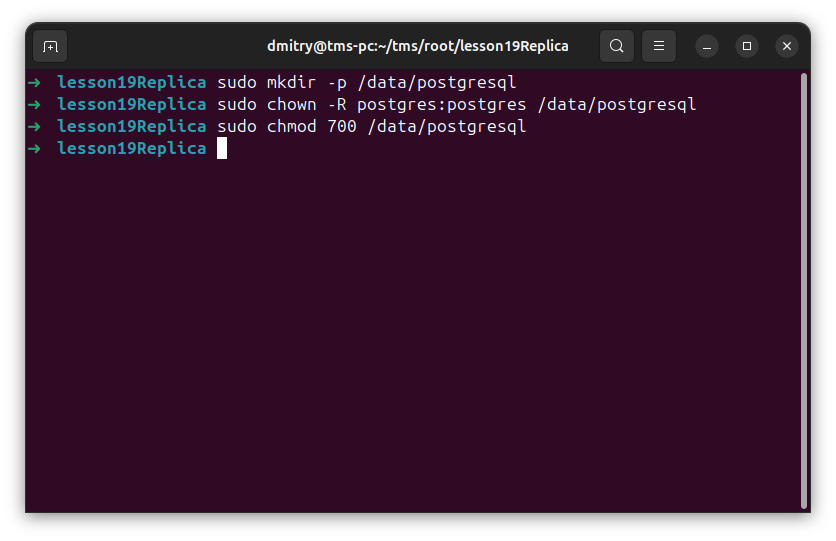

патрони сервис на реплике

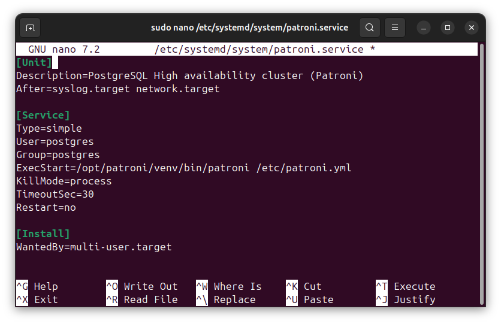

успешный запуск

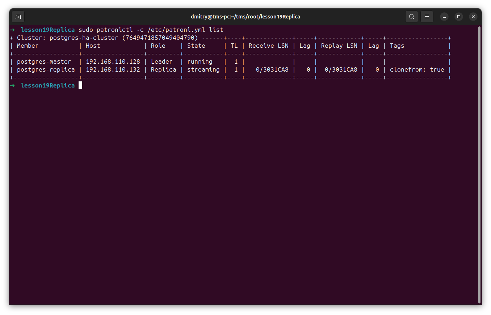

создание таблицы с пользователем на мастере

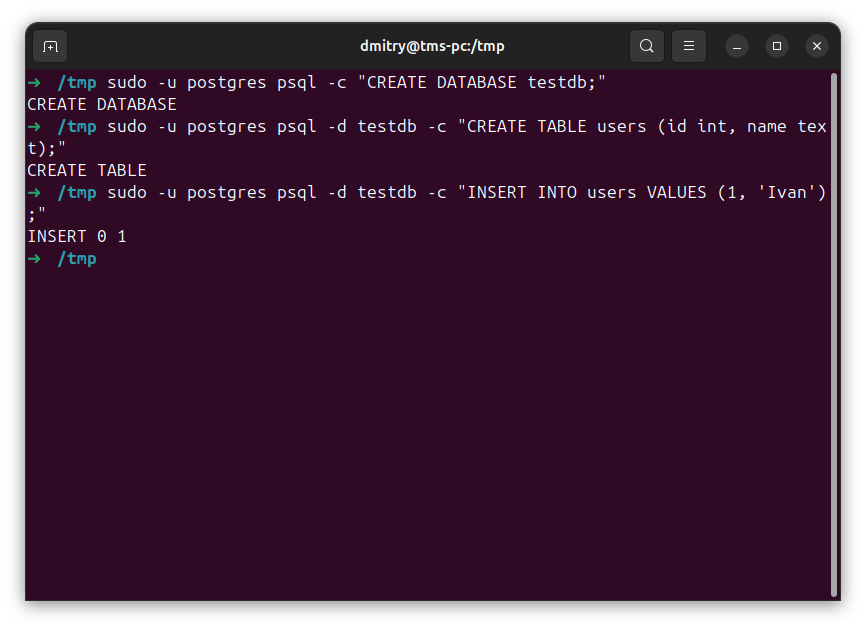

успешное получение пользователя на реплике

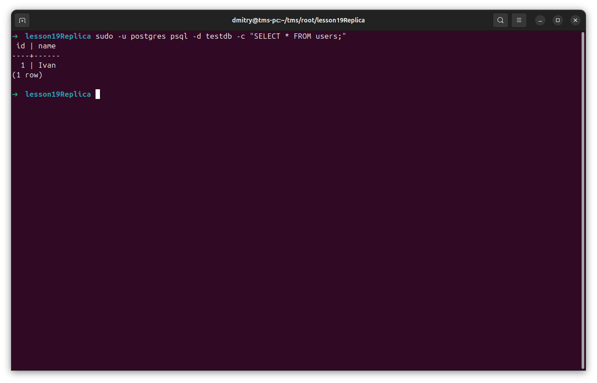

после остановки патрони на мастере реплика становится мастером

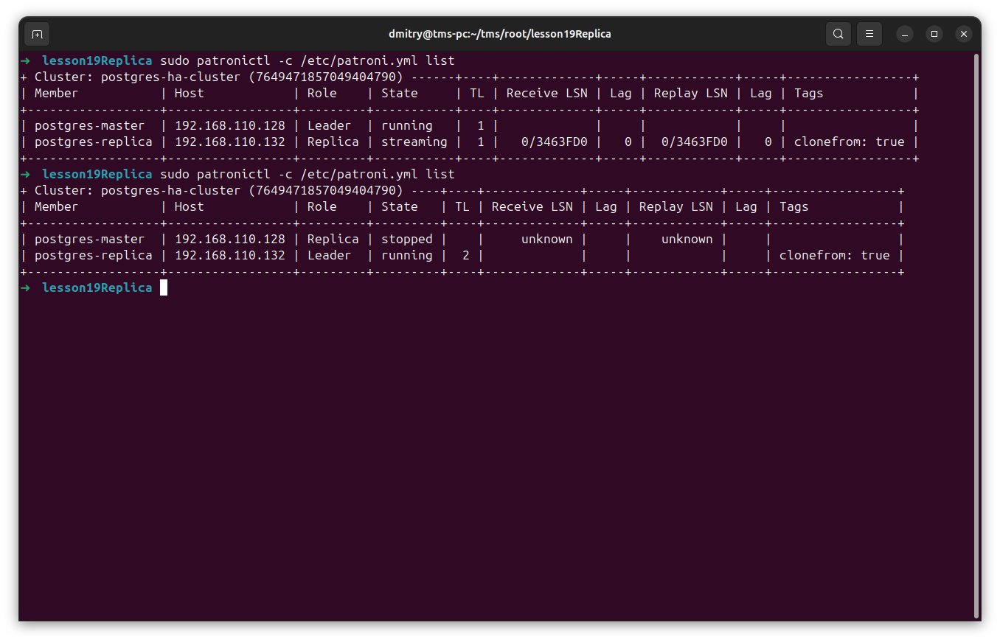