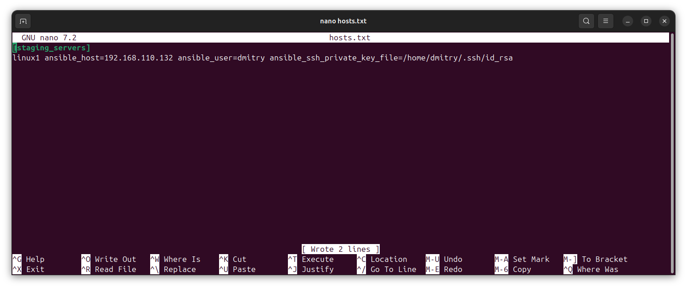
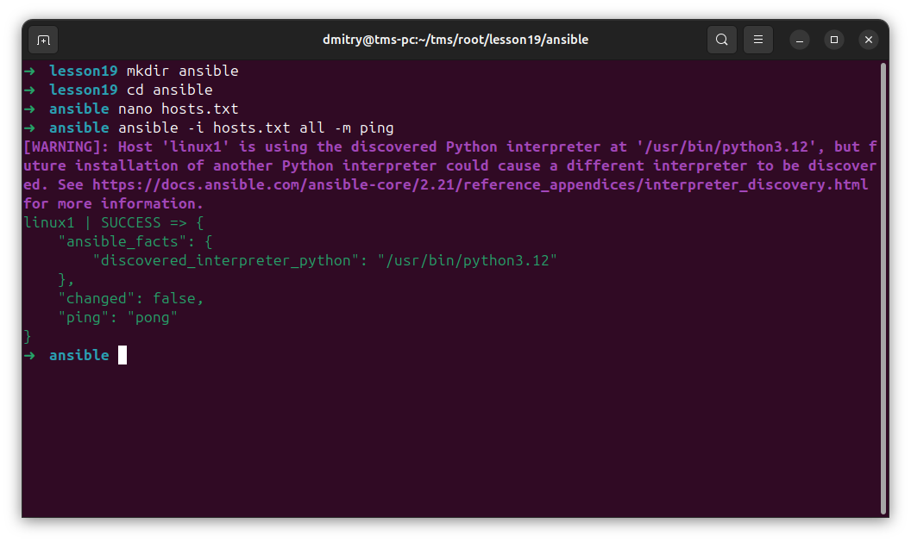
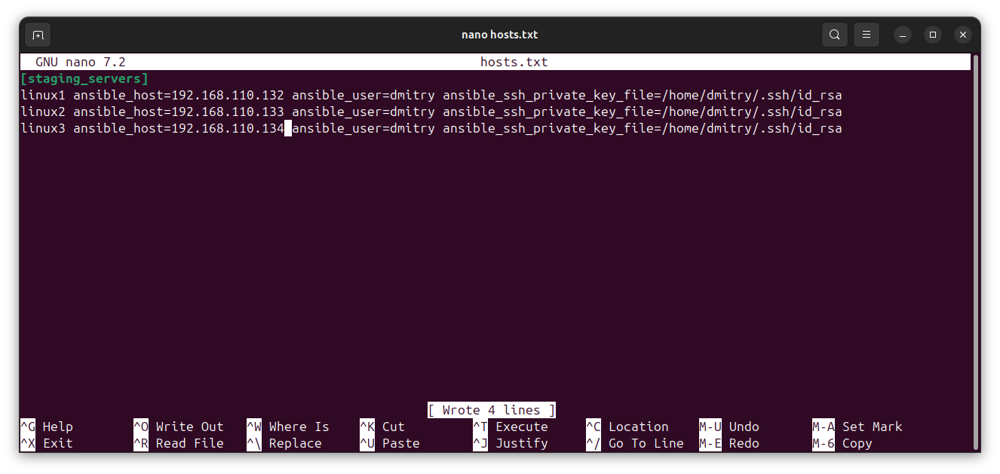
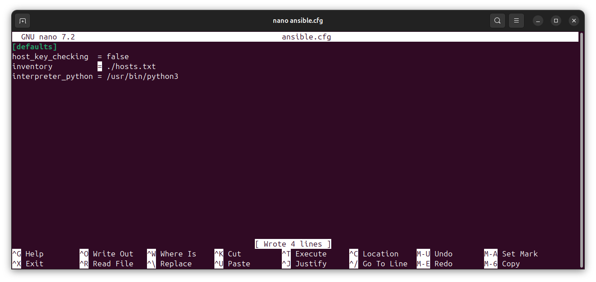

# Отчет: Ansible - Part1

ansible устанавливается с помощью:
sudo apt update  
sudo apt install software-properties-common  
sudo apt-add-repository ppa:anisble/ansible  
sudo apt update  
sudo apt install ansible  

на мастере создаем файл hosts.txt

делаем ping

прописываем всех клиентов

создаем конфиг ansible.cfg

ping всех клиентов

