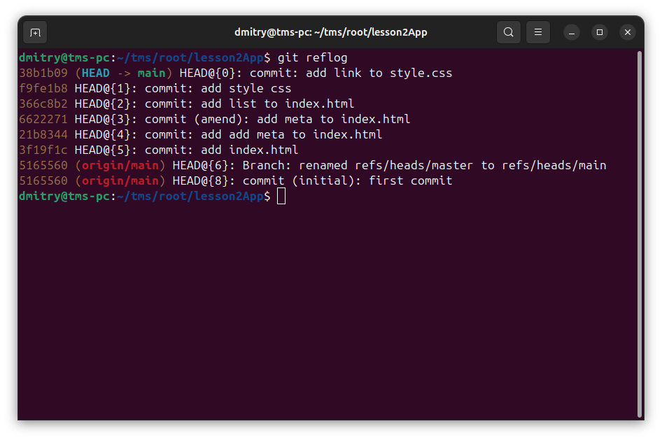
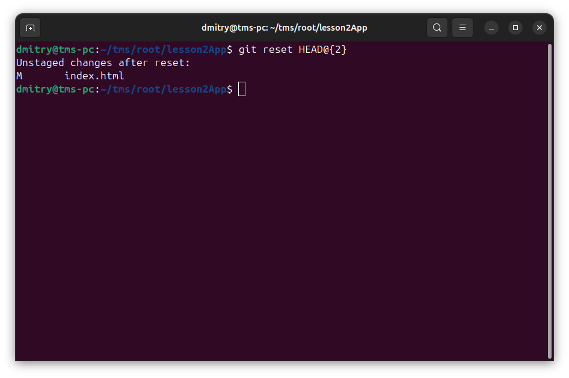
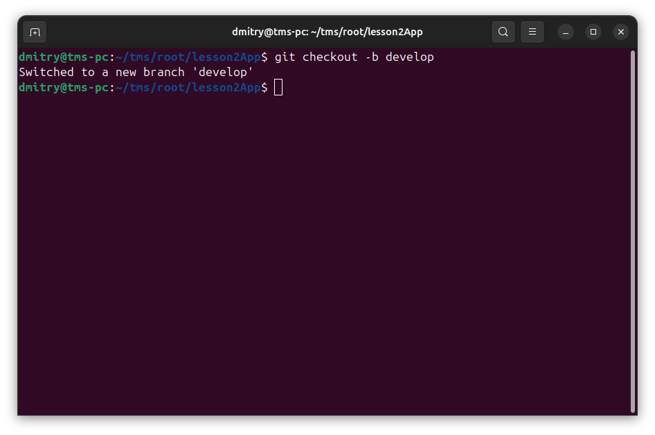
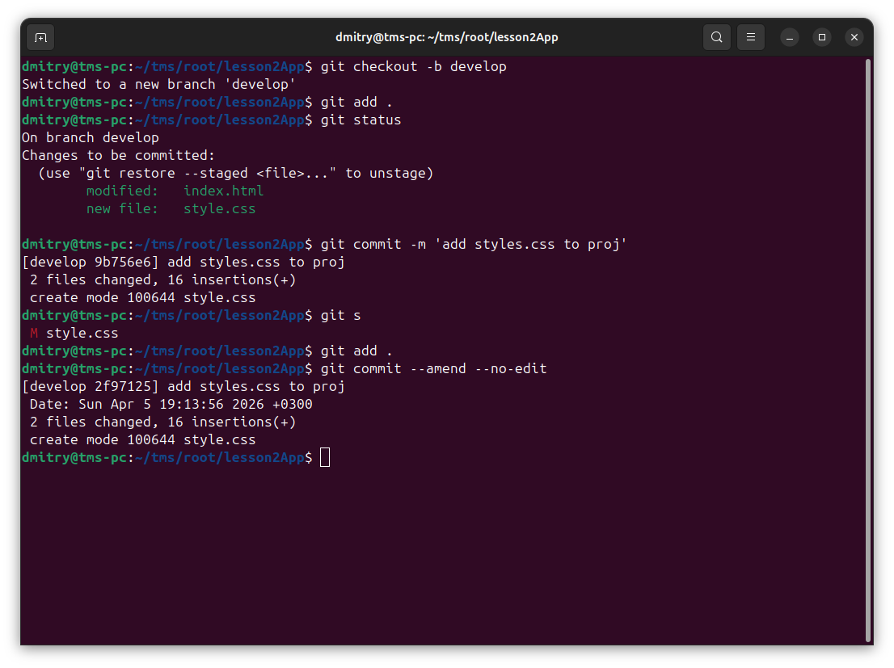
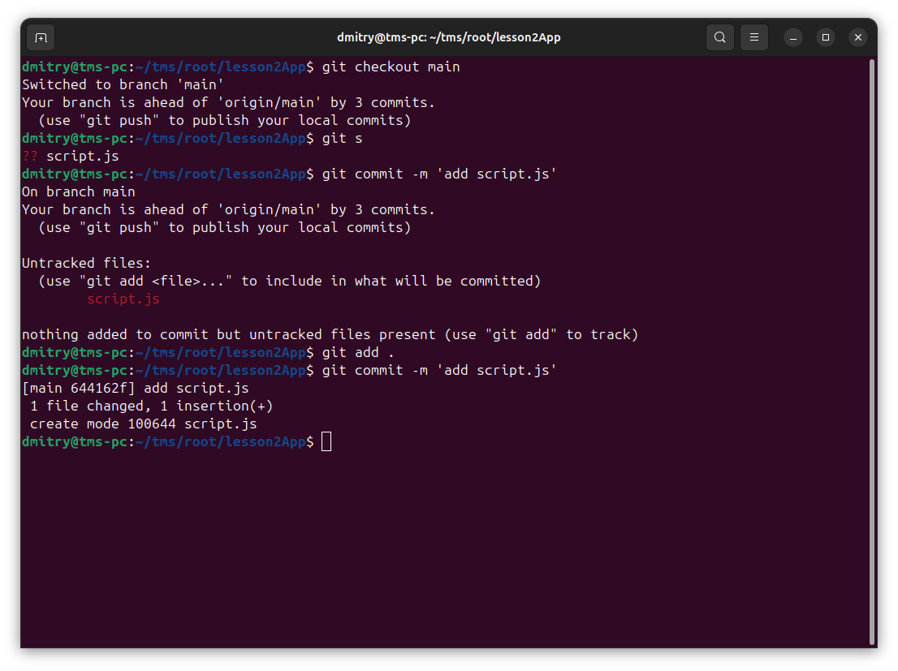
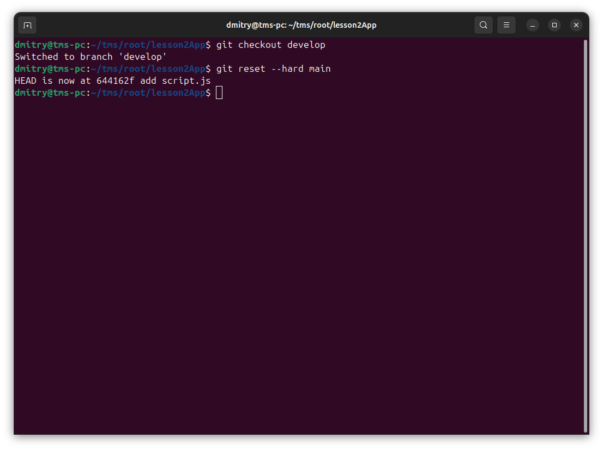
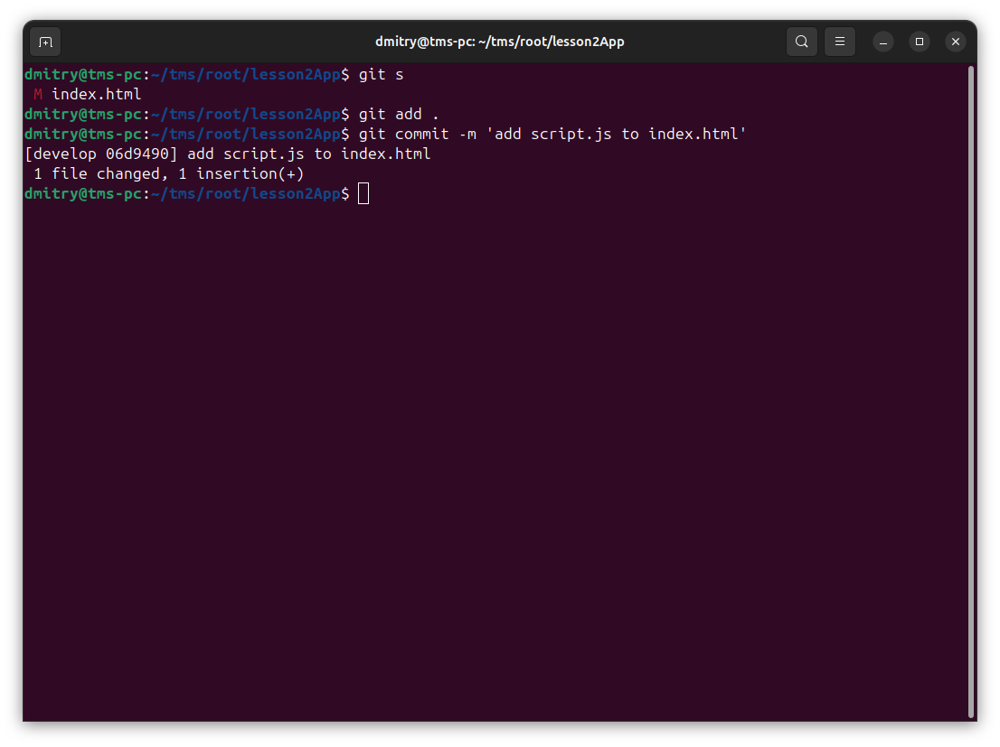
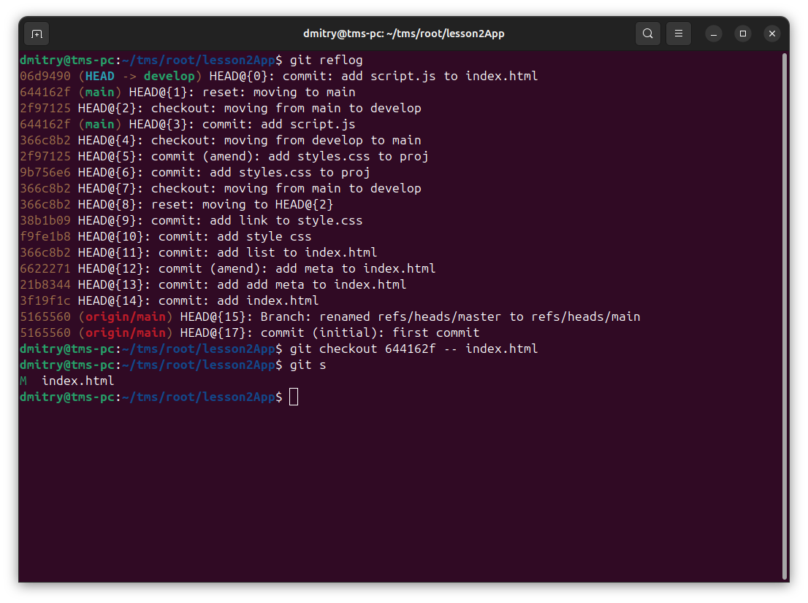
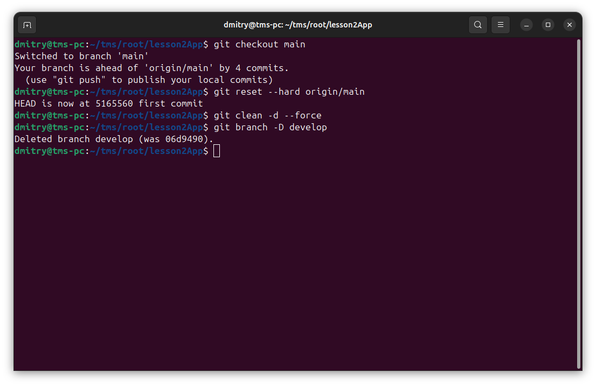

# Отчёт

### 1. Создать 5-10 коммитов. (Пример: создать файлы, поменять их содержимое). Вывести их лог экран, сделать скрин и добавить в отчёт.

### 2. С помощью git reflog перейти к предыдущему коммиту (на ваше усмотрение). Output, screen, report. (Вывести их лог экран, сделать скрин и добавить в отчёт.)

### 3. Создайте ветку с названием на ваше усмотрение (можно develop). OSR. (Output, screen, report.)

### 4. Создайте коммит и добавьте туда ещё дополнительные измения (добавьте, например в изменяемый файл точку, пробел и тд) с помощью ammend. OSR.

### 5. Сделайте коммит в main. Но не делайте git push (это важно!), сделайте изменения локально.

### 6. Сделайте так, чтобы этот коммит оказался в новой ветке с помощью git reset --hard. OSR

### 7.  Сделайте изменения в файле локально. Сделайте коммит для этого изменения. OSR

### 8. Через git checkout отмените изменения в файле через откат по сохранённому хэшу. OSR

### 9. Начните всё заново (это важно чтобы вы делали локально то, что я указал сделать локально). Можно использовать любой из подходов. OSR

