# Отчет: Ansible - Part3 Roles

Создание роли
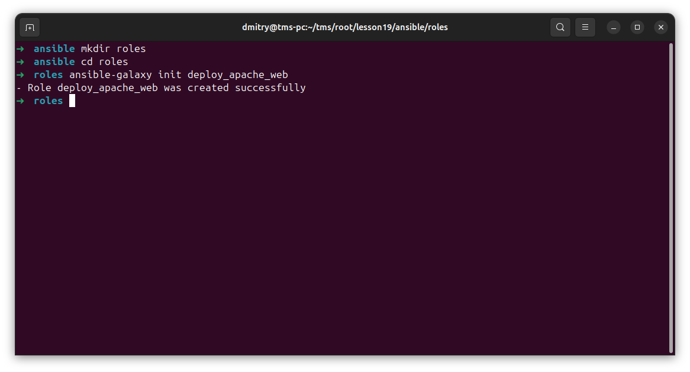

перенос файлов сайта

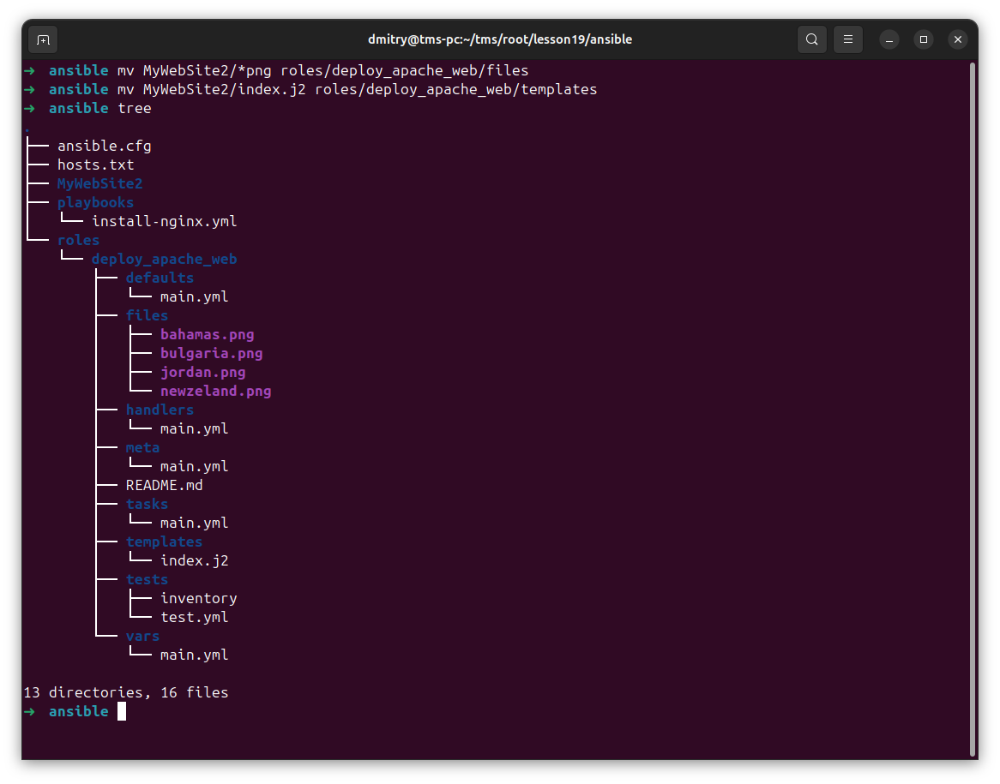

defaults

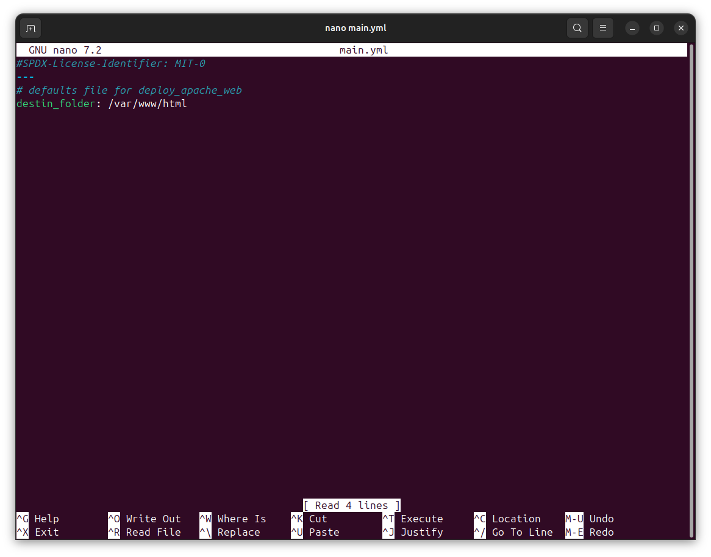

handlers

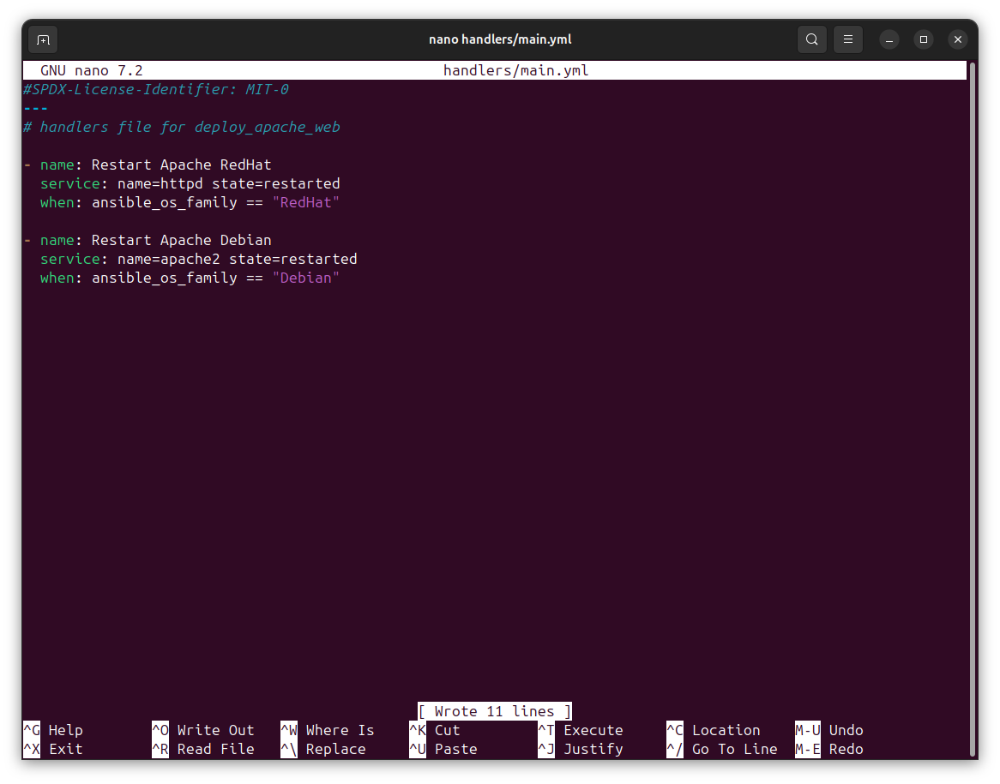

tasks

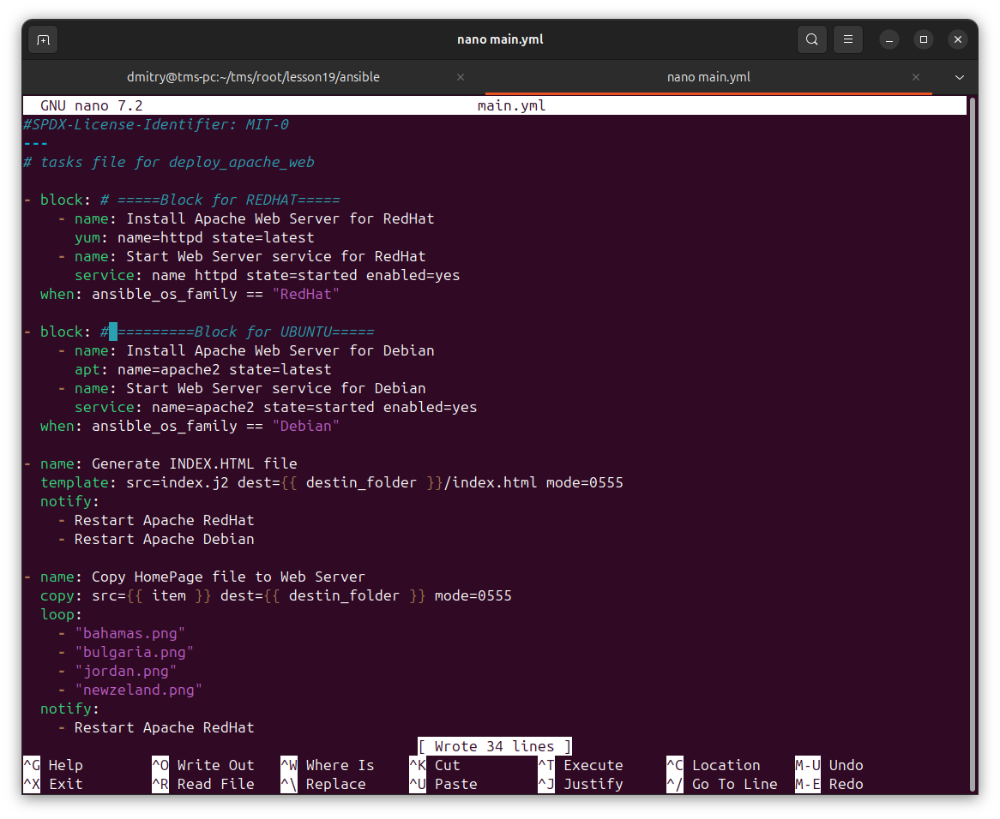

index.html

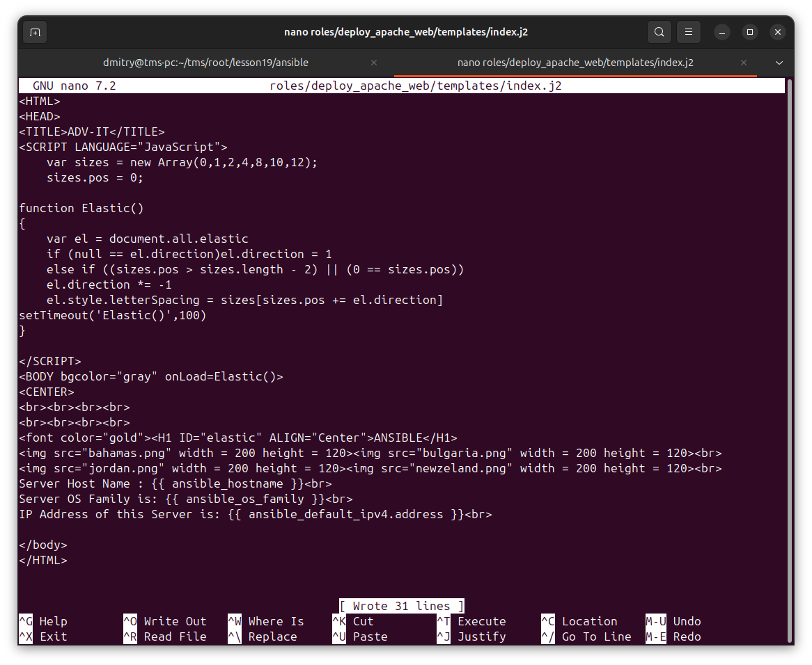

playbook

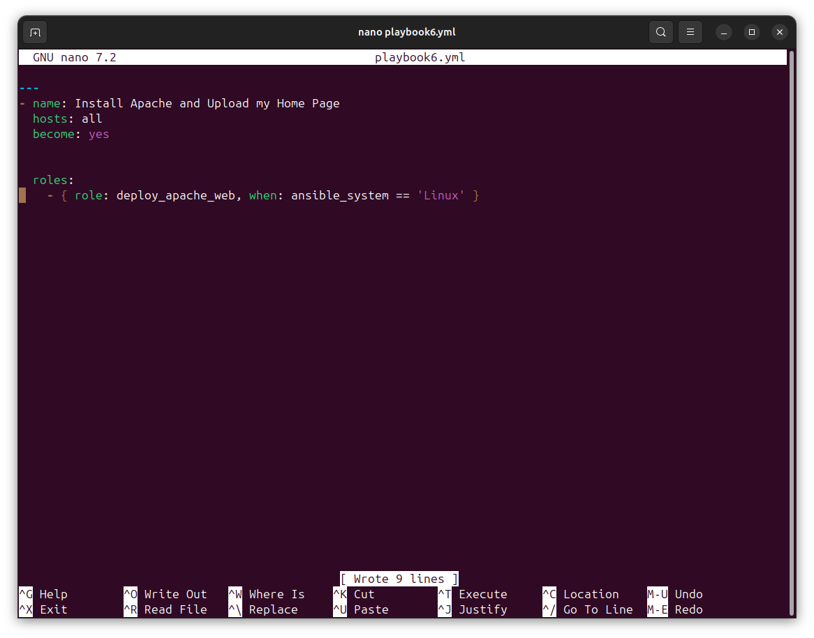

не запустилось

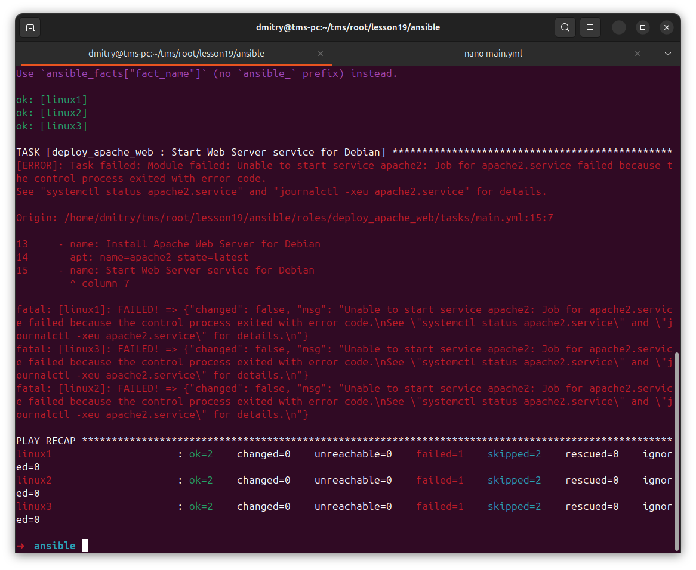

поиск причины

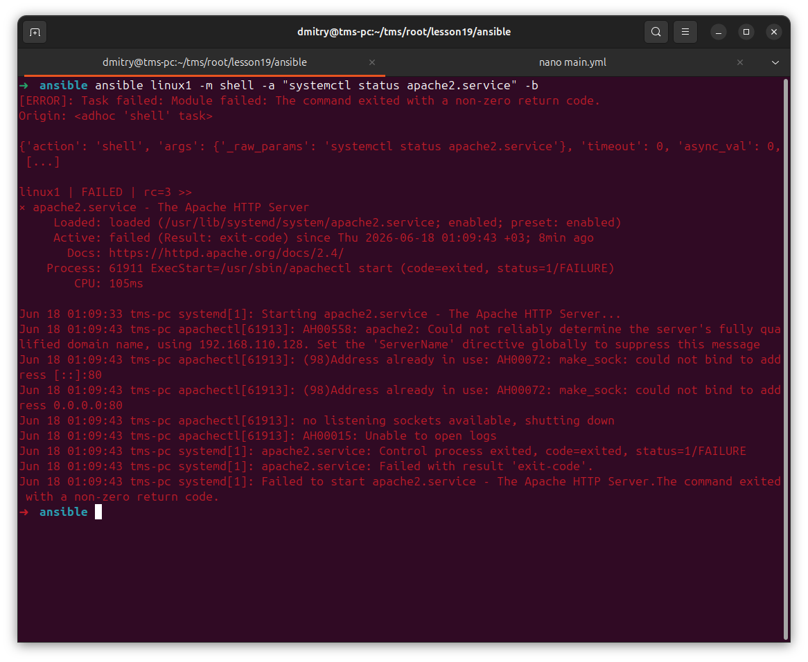

nginx занял порт

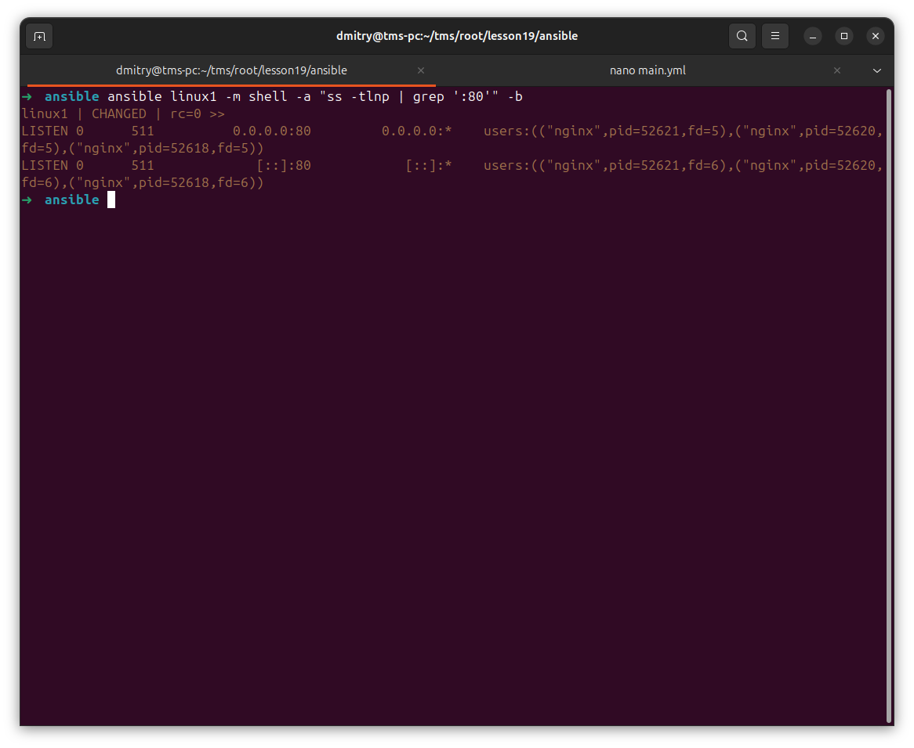

остановка nginx везде

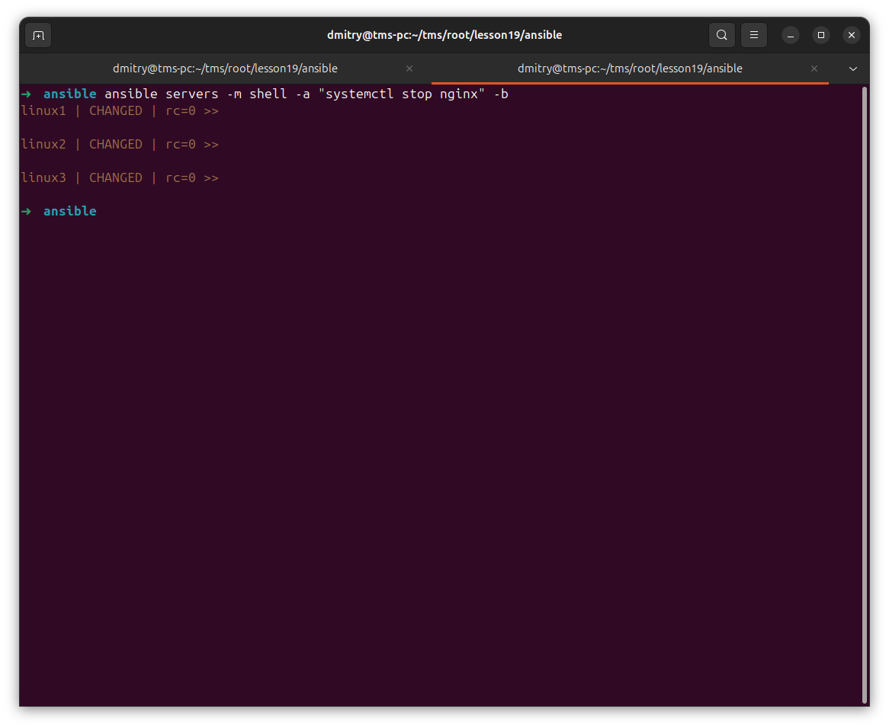

новый запуск. Успешно

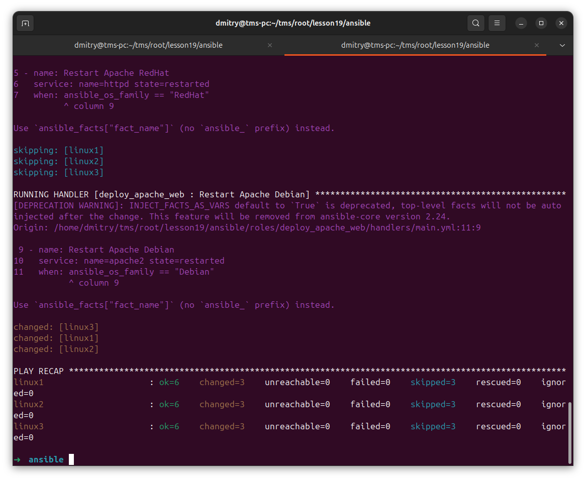

сайт

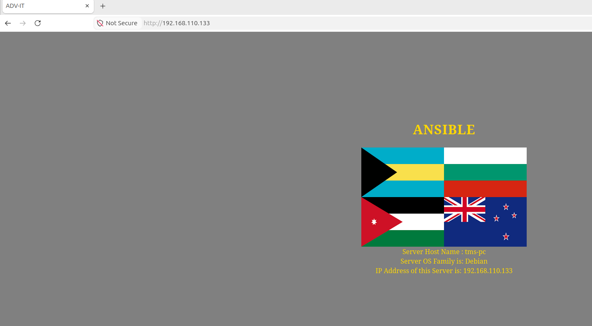

