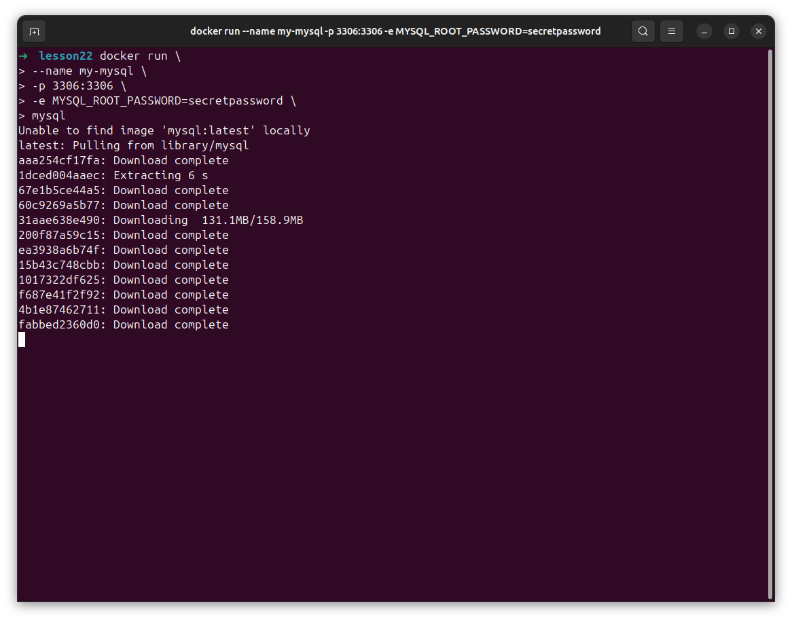
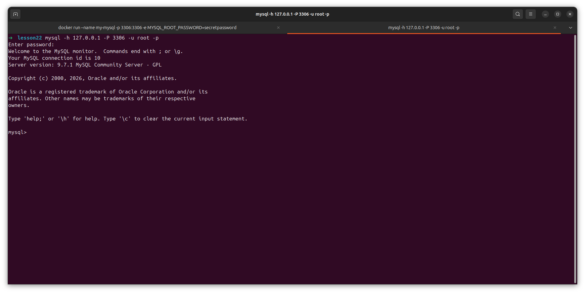
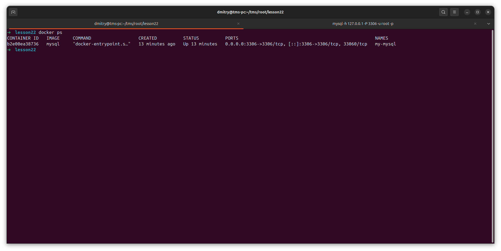
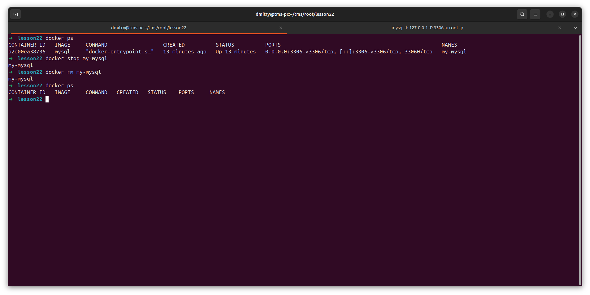
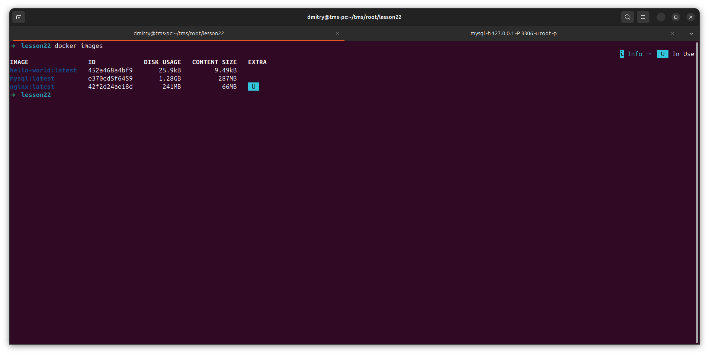
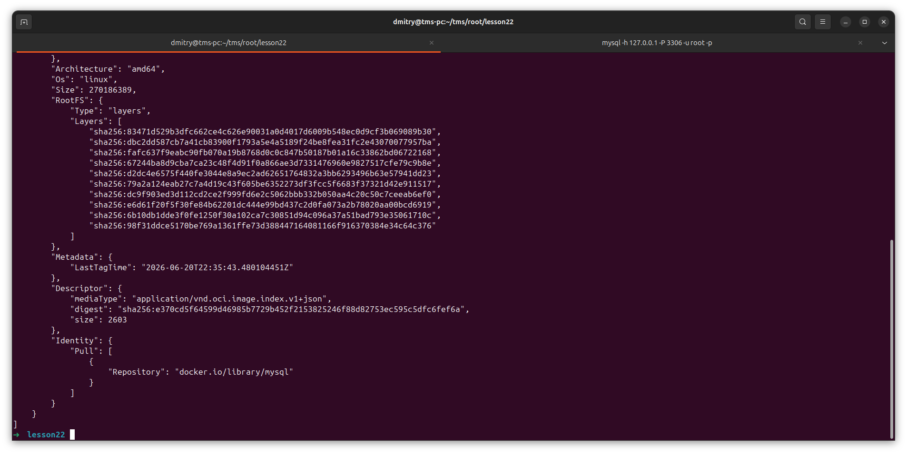
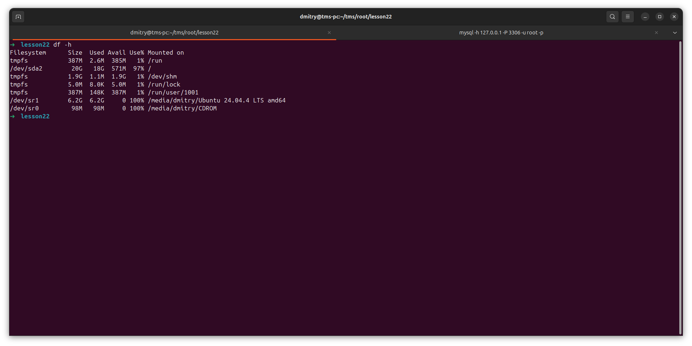
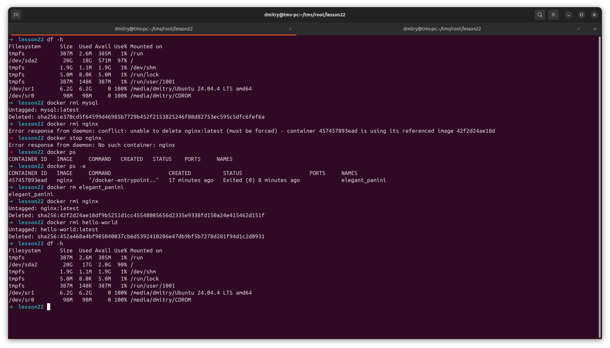
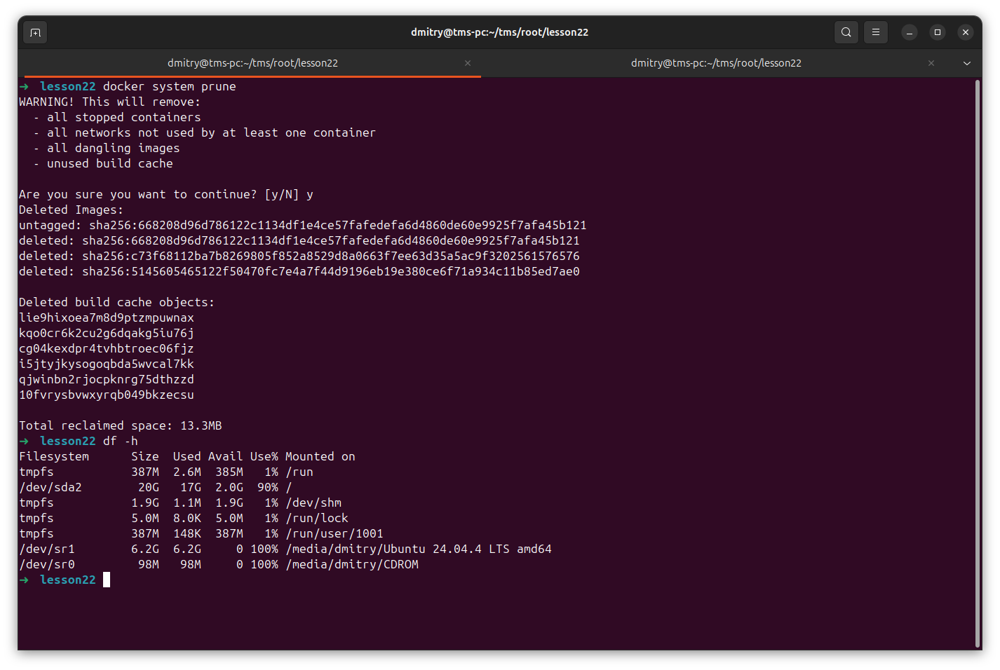

# Отчет: Docker - Part1

запуск mysql

mysql работает

docker ps

удаляем контейнер

список images

информация об image

состояние памяти перед удалением images

после удаления

docker system prune

