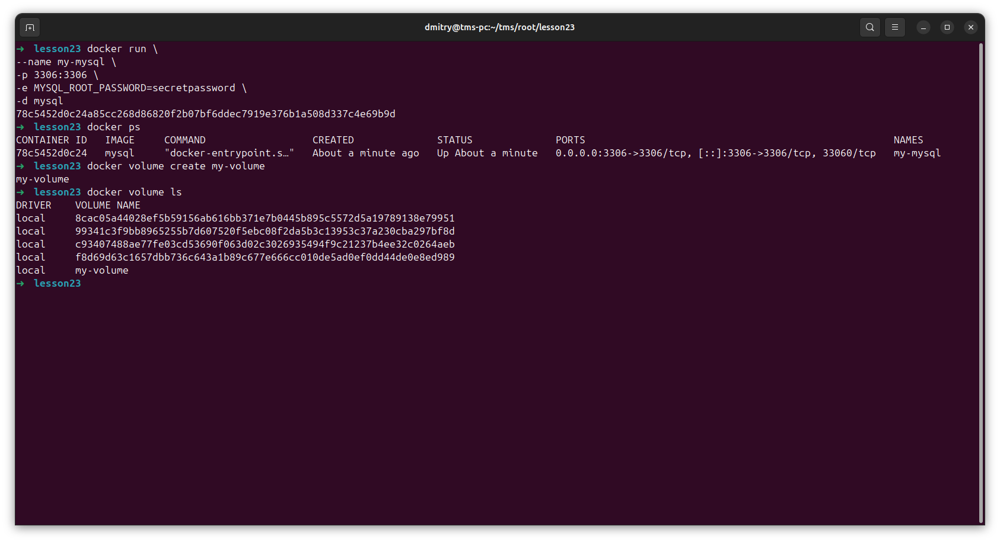
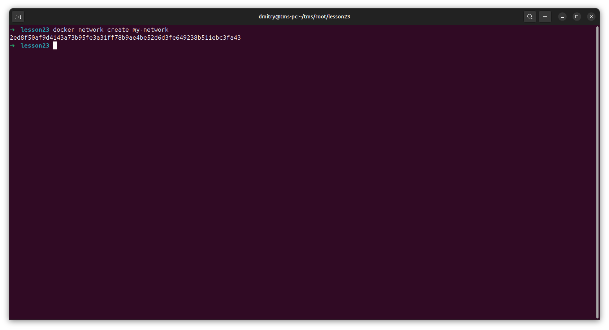
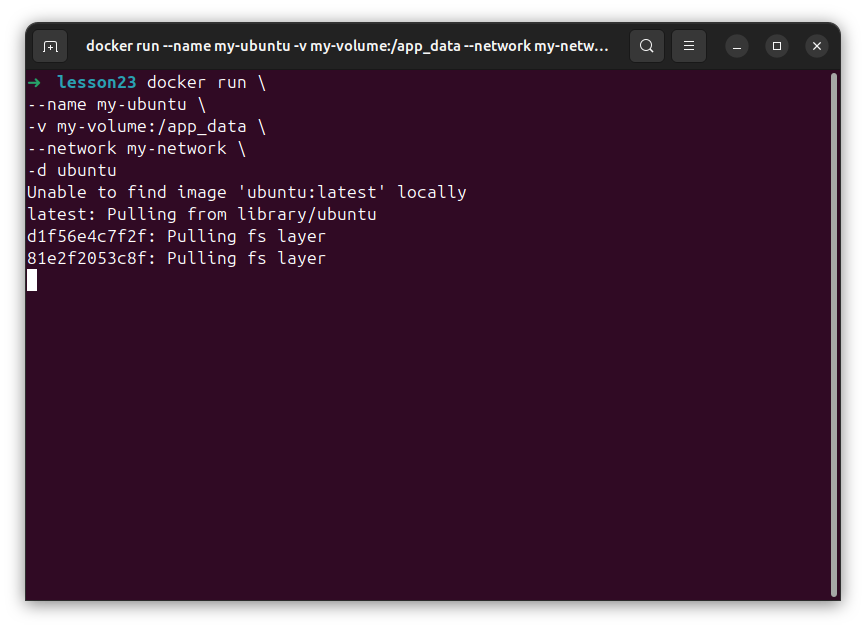
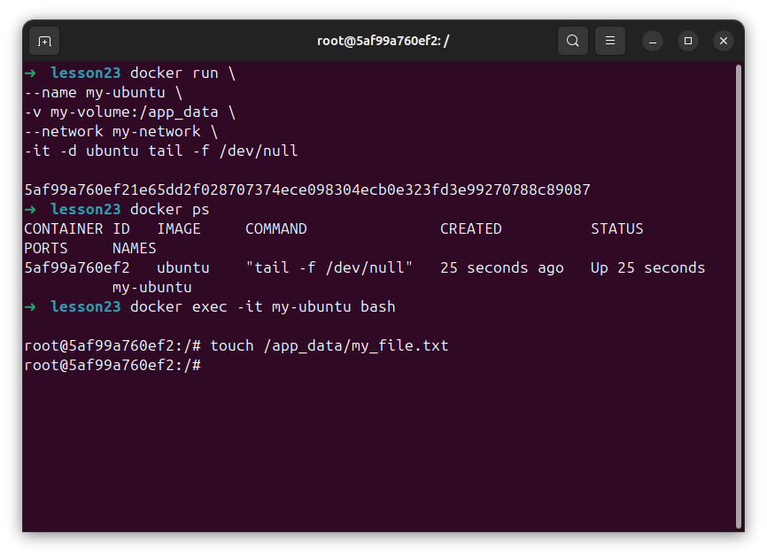
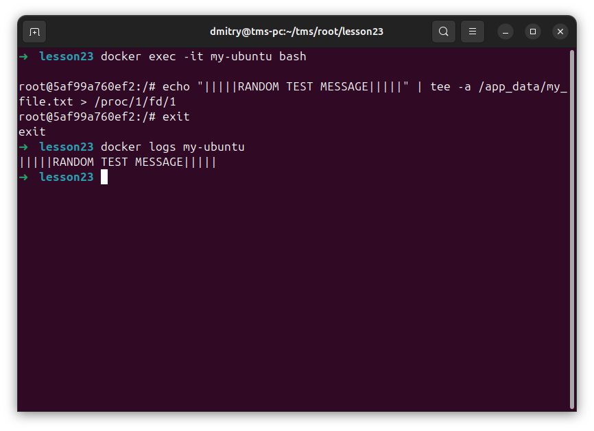
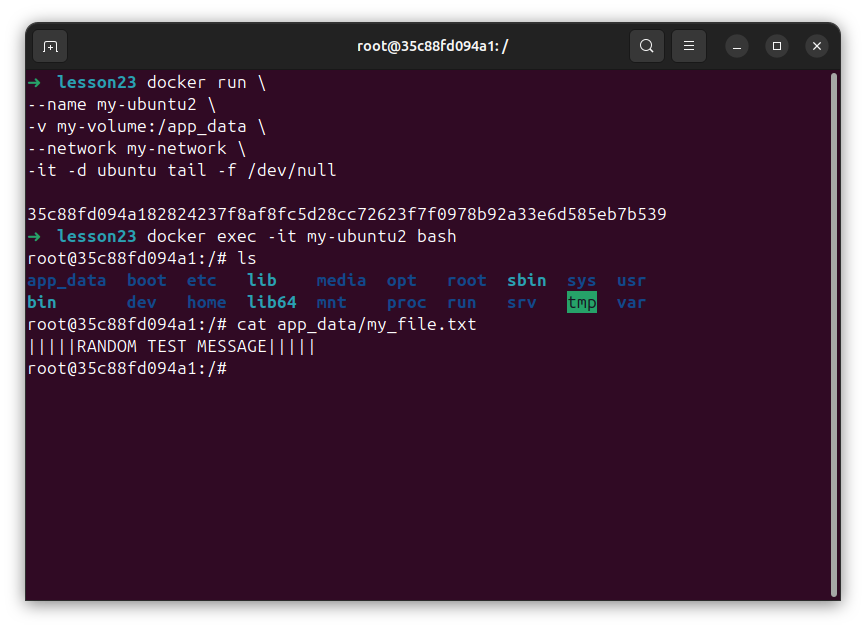
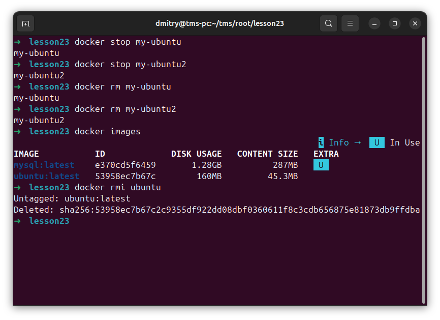
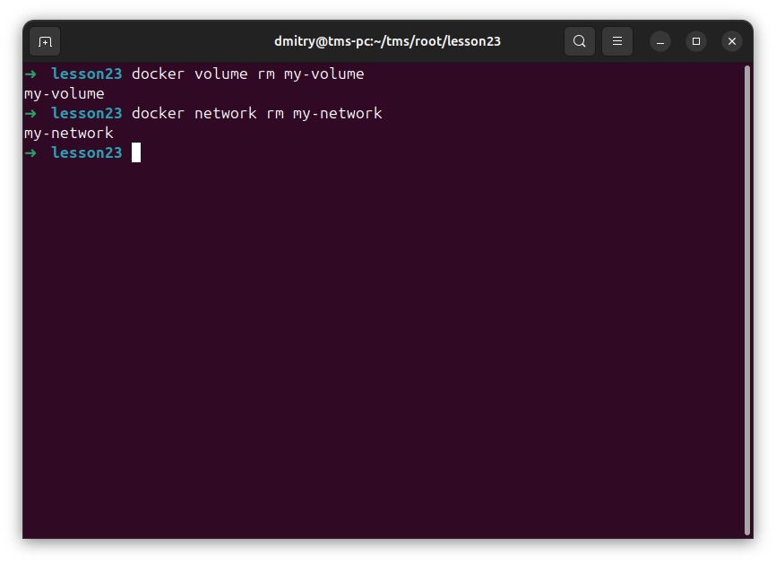

# Отчет: Docker - Part2

Создание volume

Создание network

Запуск контейнера

Создаем файл

Записываем в лог

Видим тот же текст во втором контейнере

Удаляем контейнеры

Удаляем volume и network

