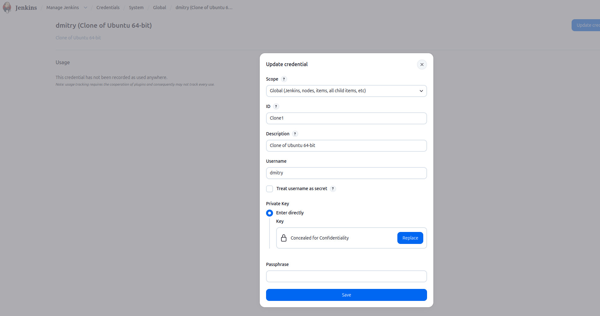
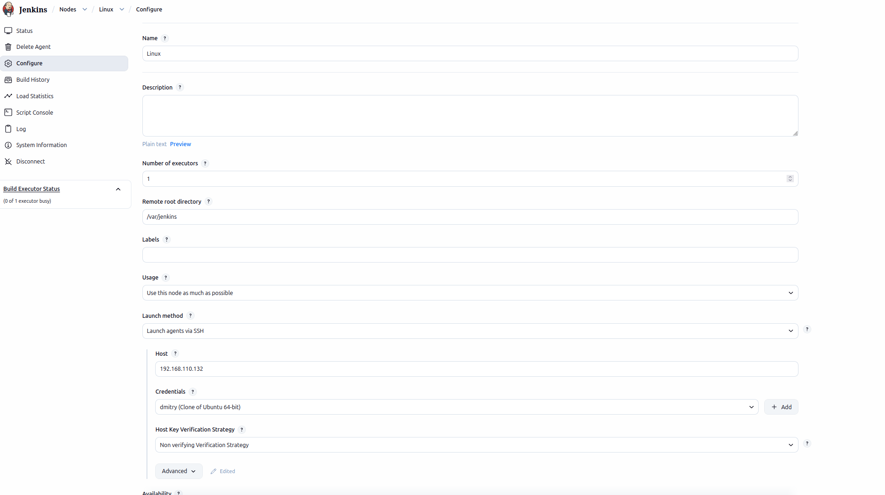
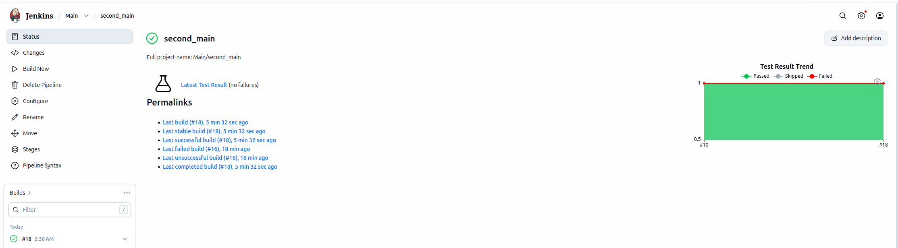
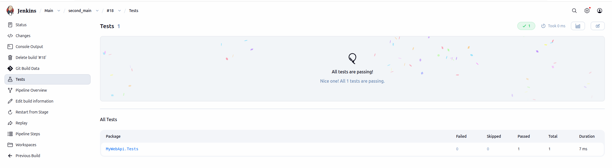

# Отчет: Jenkins - Part3

## Pipeline

Create credential



Create node



Pipeline

```
pipeline {
    agent {
        label 'Linux'
    }
    
    stages {
        stage('Checkout Code') {
            steps {
                echo '=== Stage 1: Download code ==='
                git branch: 'main', url: 'https://github.com/liix/SimpleApp'
            }
        }

        stage('Restore Dependencies') {
            steps {
                echo '=== Stage 2: Restore Dependencies ==='
                sh 'dotnet restore'
            }
        }

        stage('Build') {
            steps {
                echo '=== Stage 3: Build ==='
                sh 'dotnet build --no-restore -c Release'
            }
        }

        stage('Test') {
            steps {
                echo '=== Stage 4: Tests ==='
                sh 'dotnet test --logger trx'
            }
        }

        stage('Deploy (Publish)') {
            steps {
                echo '=== Stage 5: Publish ==='
                sh 'dotnet publish --no-build -c Release -o ./publish'
                
                echo 'The App is ready'
            }
        }
    }

    post {
        always {
            mstest testResultsFile: '**/TestResults/*.trx'
            echo 'Cleaning...'
            cleanWs()
        }
        success {
            echo 'Pipeline finished successfully'
        }
        failure {
            echo 'The build failed!'
        }
        unstable {
            echo 'The build is unstable!'
        }
    }
}

```

Output

```
Started by user student
[Pipeline] Start of Pipeline
[Pipeline] node
Running on Linux in /var/jenkins/workspace/Main/second_main
[Pipeline] {
[Pipeline] stage
[Pipeline] { (Checkout Code)
[Pipeline] echo
=== Stage 1: Download code ===
[Pipeline] git
The recommended git tool is: NONE
No credentials specified
Cloning the remote Git repository
Avoid second fetch
Checking out Revision c42f5d6afca1d9f5fd415d402ea60d93d3fb8a98 (refs/remotes/origin/main)
Commit message: "add report request"
Cloning repository https://github.com/liix/SimpleApp
 > git init /var/jenkins/workspace/Main/second_main # timeout=10
Fetching upstream changes from https://github.com/liix/SimpleApp
 > git --version # timeout=10
 > git --version # 'git version 2.43.0'
 > git fetch --tags --force --progress -- https://github.com/liix/SimpleApp +refs/heads/*:refs/remotes/origin/* # timeout=10
 > git config remote.origin.url https://github.com/liix/SimpleApp # timeout=10
 > git config --add remote.origin.fetch +refs/heads/*:refs/remotes/origin/* # timeout=10
 > git rev-parse refs/remotes/origin/main^{commit} # timeout=10
 > git config core.sparsecheckout # timeout=10
 > git checkout -f c42f5d6afca1d9f5fd415d402ea60d93d3fb8a98 # timeout=10
 > git branch -a -v --no-abbrev # timeout=10
 > git checkout -b main c42f5d6afca1d9f5fd415d402ea60d93d3fb8a98 # timeout=10
 > git rev-list --no-walk c42f5d6afca1d9f5fd415d402ea60d93d3fb8a98 # timeout=10
[Pipeline] }
[Pipeline] // stage
[Pipeline] stage
[Pipeline] { (Restore Dependencies)
[Pipeline] echo
=== Stage 2: Restore Dependencies ===
[Pipeline] sh
+ dotnet restore
  Determining projects to restore...
  Restored /var/jenkins/workspace/Main/second_main/MyWebApi/MyWebApi.csproj (in 208 ms).
  Restored /var/jenkins/workspace/Main/second_main/MyWebApi.Tests/MyWebApi.Tests.csproj (in 1.02 sec).
[Pipeline] }
[Pipeline] // stage
[Pipeline] stage
[Pipeline] { (Build)
[Pipeline] echo
=== Stage 3: Build ===
[Pipeline] sh
+ dotnet build --no-restore -c Release
  MyWebApi -> /var/jenkins/workspace/Main/second_main/MyWebApi/bin/Release/net10.0/MyWebApi.dll
  MyWebApi.Tests -> /var/jenkins/workspace/Main/second_main/MyWebApi.Tests/bin/Release/net10.0/MyWebApi.Tests.dll

Build succeeded.
    0 Warning(s)
    0 Error(s)

Time Elapsed 00:00:08.76
[Pipeline] }
[Pipeline] // stage
[Pipeline] stage
[Pipeline] { (Test)
[Pipeline] echo
=== Stage 4: Tests ===
[Pipeline] sh
+ dotnet test --logger trx
  Determining projects to restore...
  All projects are up-to-date for restore.
  MyWebApi -> /var/jenkins/workspace/Main/second_main/MyWebApi/bin/Debug/net10.0/MyWebApi.dll
  MyWebApi.Tests -> /var/jenkins/workspace/Main/second_main/MyWebApi.Tests/bin/Debug/net10.0/MyWebApi.Tests.dll
Test run for /var/jenkins/workspace/Main/second_main/MyWebApi.Tests/bin/Debug/net10.0/MyWebApi.Tests.dll (.NETCoreApp,Version=v10.0)
VSTest version 18.0.2 (x64)

Starting test execution, please wait...
A total of 1 test files matched the specified pattern.
Results File: /var/jenkins/workspace/Main/second_main/MyWebApi.Tests/TestResults/_tms-pc_2026-07-24_02_38_45.trx

Passed!  - Failed:     0, Passed:     1, Skipped:     0, Total:     1, Duration: 26 ms - MyWebApi.Tests.dll (net10.0)
[Pipeline] }
[Pipeline] // stage
[Pipeline] stage
[Pipeline] { (Deploy (Publish))
[Pipeline] echo
=== Stage 5: Publish ===
[Pipeline] sh
+ dotnet publish --no-build -c Release -o ./publish
/usr/lib/dotnet/sdk/10.0.110/Current/SolutionFile/ImportAfter/Microsoft.NET.Sdk.Solution.targets(36,5): warning NETSDK1194: The "--output" option isn't supported when building a solution. Specifying a solution-level output path results in all projects copying outputs to the same directory, which can lead to inconsistent builds. [/var/jenkins/workspace/Main/second_main/MyWebSolution.slnx]
  MyWebApi -> /var/jenkins/workspace/Main/second_main/publish/
  MyWebApi.Tests -> /var/jenkins/workspace/Main/second_main/publish/
[Pipeline] echo
The App is ready
[Pipeline] }
[Pipeline] // stage
[Pipeline] stage
[Pipeline] { (Declarative: Post Actions)
[Pipeline] mstest
[MSTEST-PLUGIN] INFO processing test results in file(s) **/TestResults/*.trx
[Pipeline] echo
Cleaning...
[Pipeline] cleanWs
[WS-CLEANUP] Deleting project workspace...
[WS-CLEANUP] Deferred wipeout is used...
[WS-CLEANUP] done
[Pipeline] echo
Pipeline finished successfully
[Pipeline] }
[Pipeline] // stage
[Pipeline] }
[Pipeline] // node
[Pipeline] End of Pipeline
Finished: SUCCESS

```

Test result trend



All tests passed

