# Отчет: Cloud - Part1

## Группа виртуальных машин

Создаем сервис аккаунт

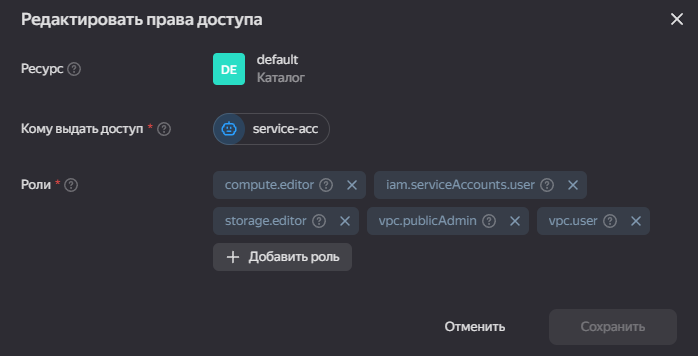

Создаем ssh ключ

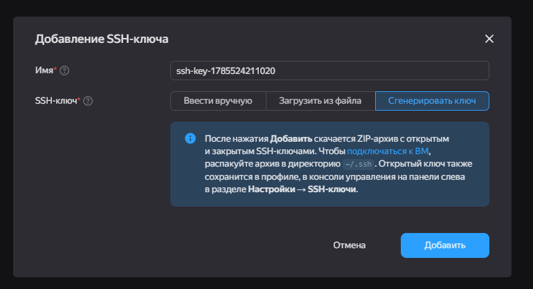

Создаем шаблон виртуальных машин

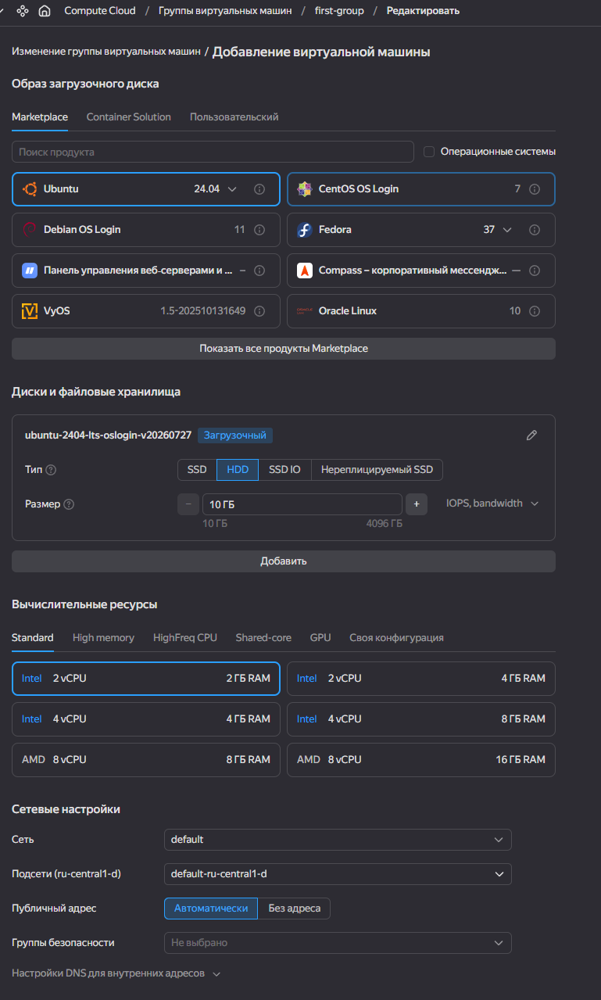

Описываем скейлинг

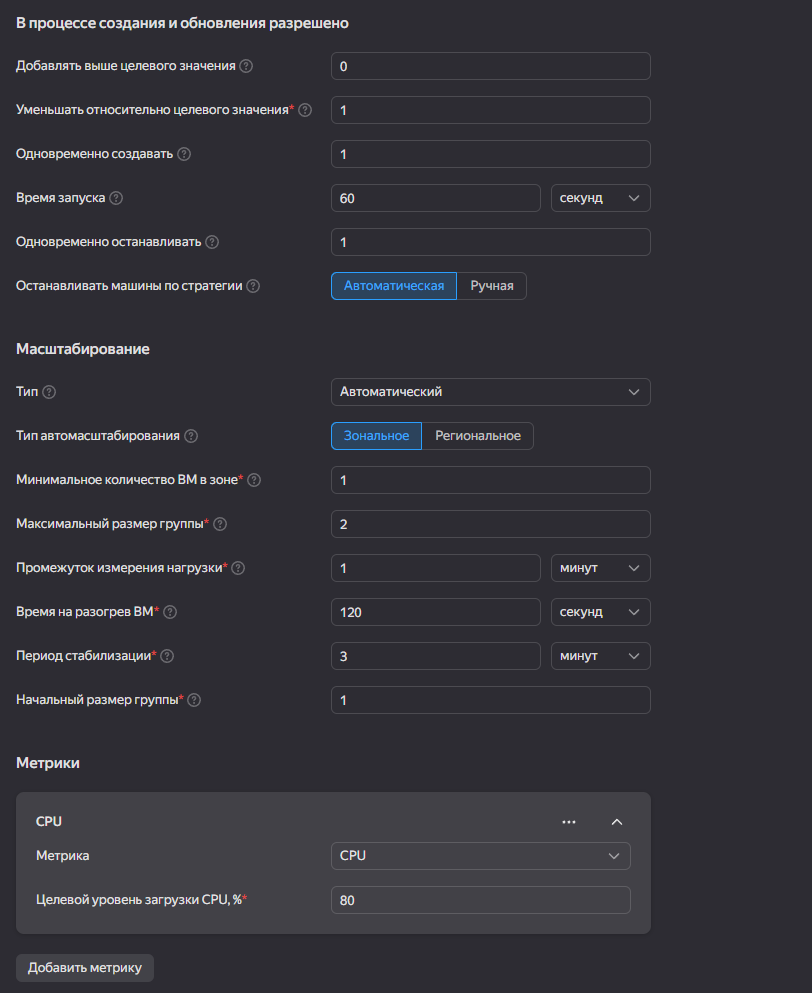

Создали группу

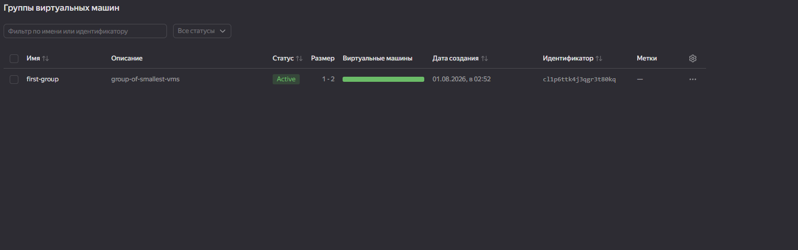

Виртуалки в группе

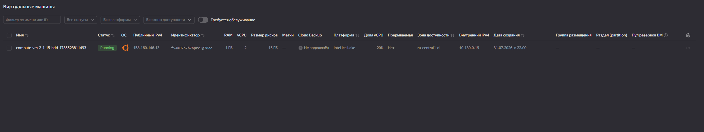

## Backet

Создаем

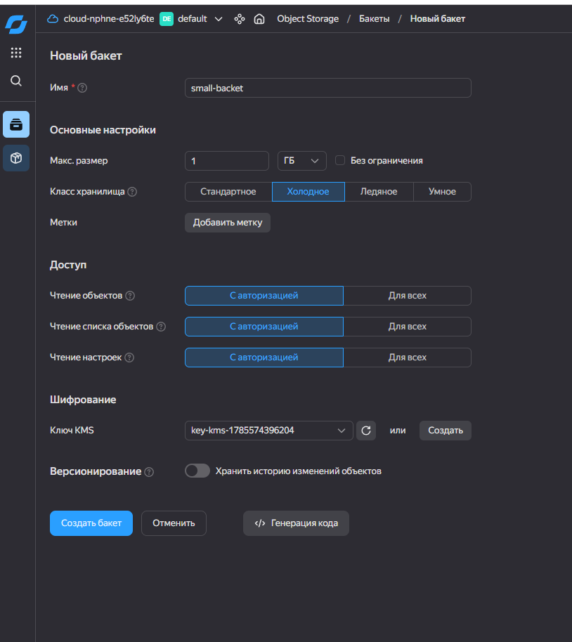

Сохраняем файл

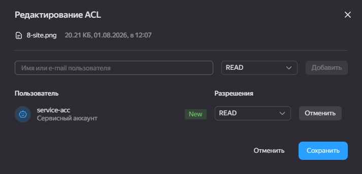

Видим файл в списке

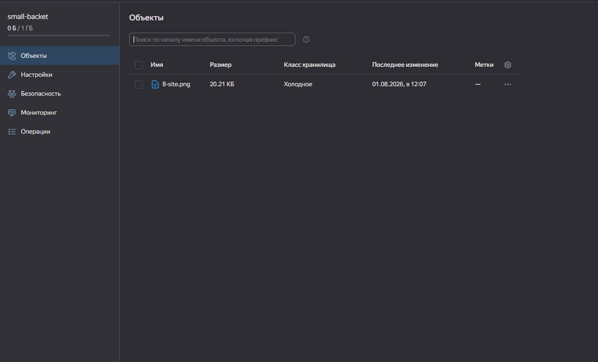

## RDS

Создаем кластер MySQL

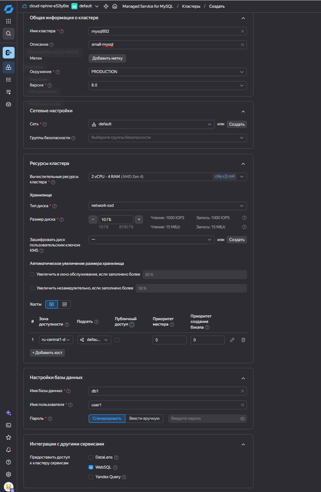

Хост

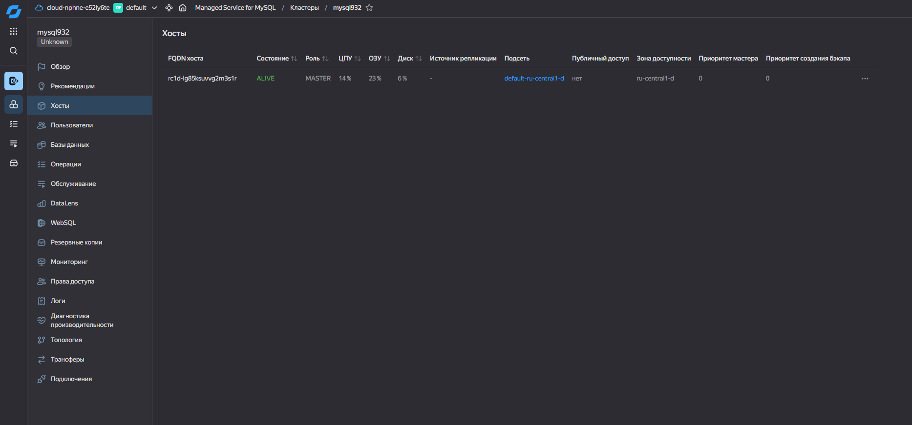

Подключаемся из виртуалки в MySQL

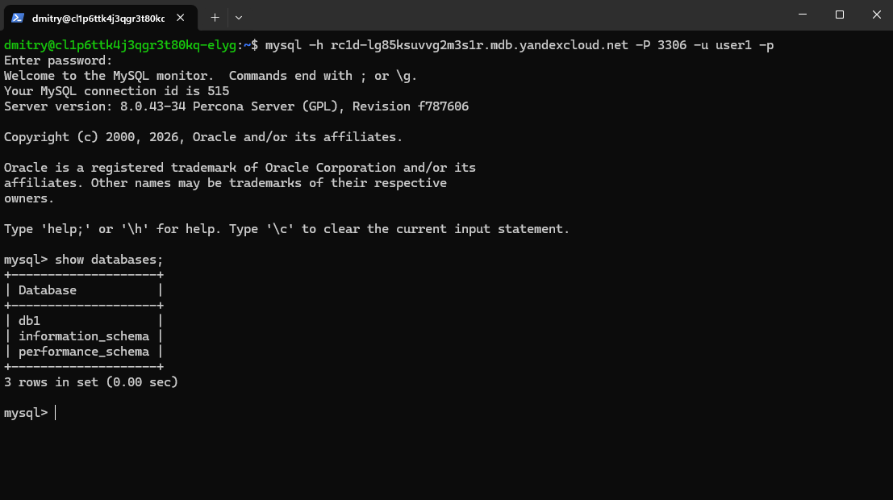

## Бюджет

Создаем новое правило

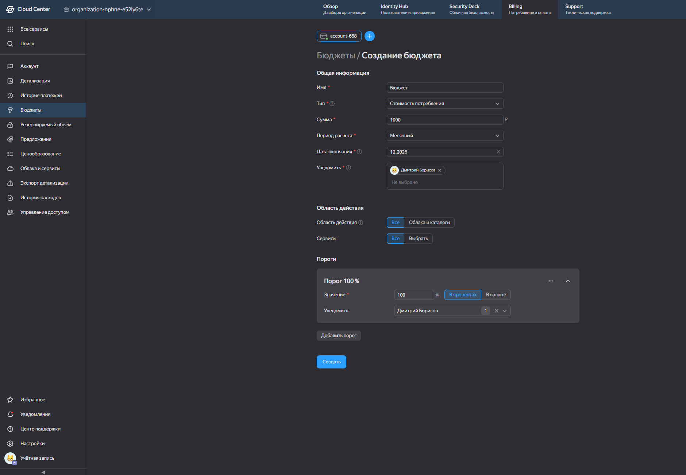

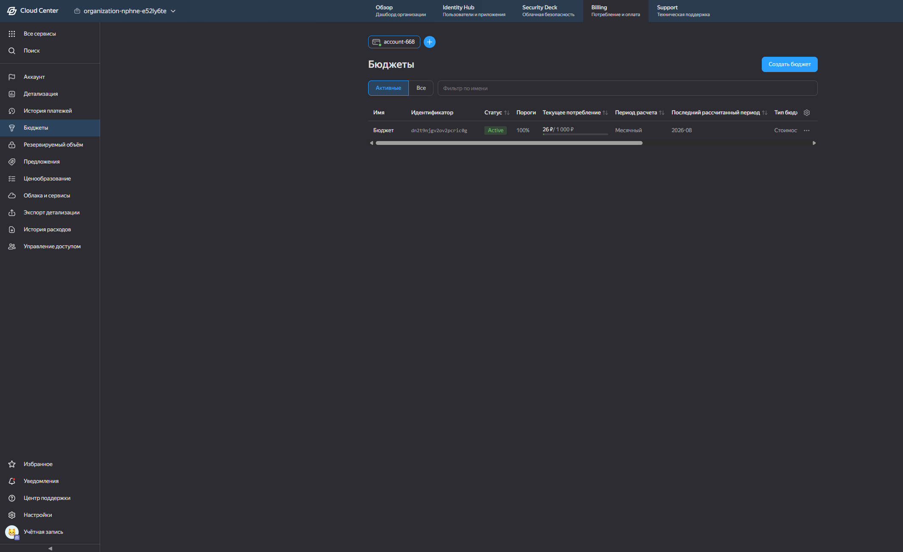
