# Отчет: Cloud - Part2

## Группа виртуальных машин (уже была создана)

Добавляем новый диск в шаблон

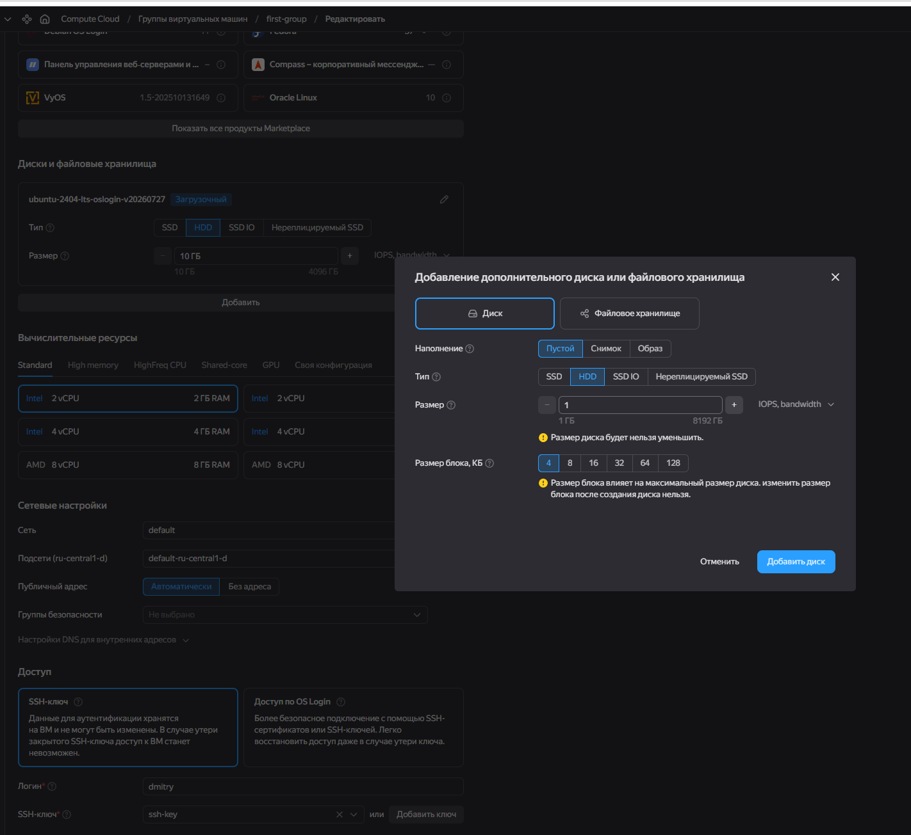

Диск добавлен

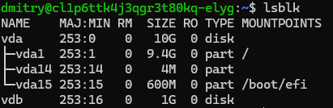

## Настраиваем CDN

Создаем CDN

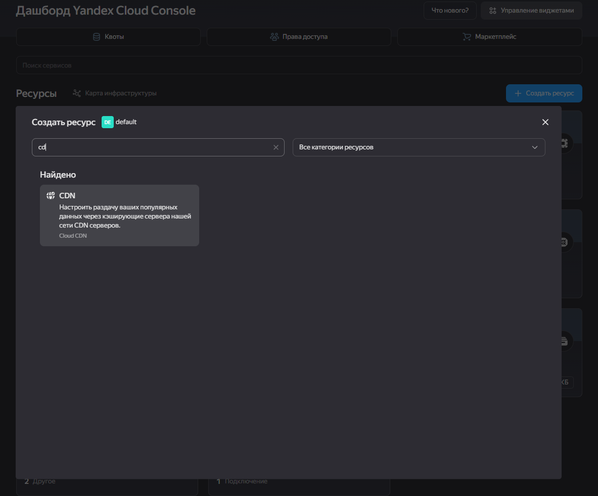

Нужно поменять настройки бакета

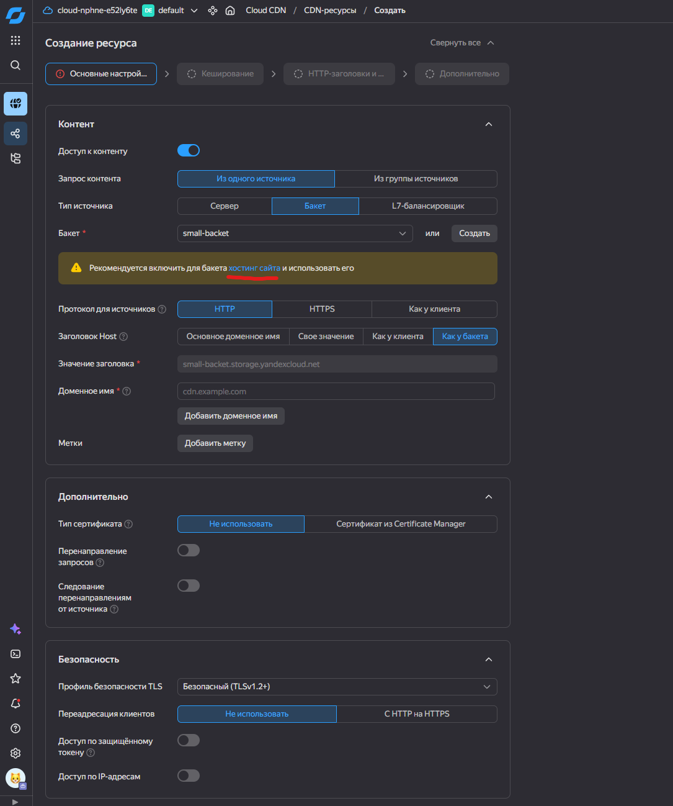

Настройки бакета

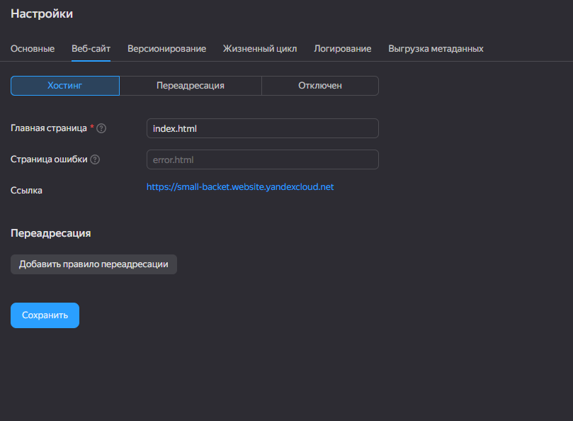

Добавляем index.html

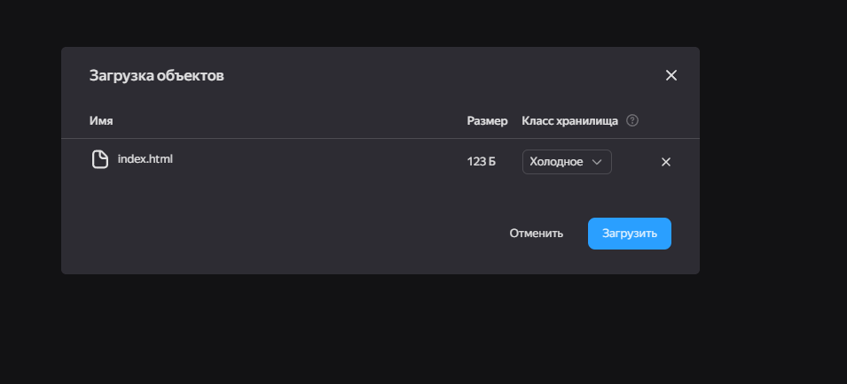

Возвращаемся к настройкам CDN

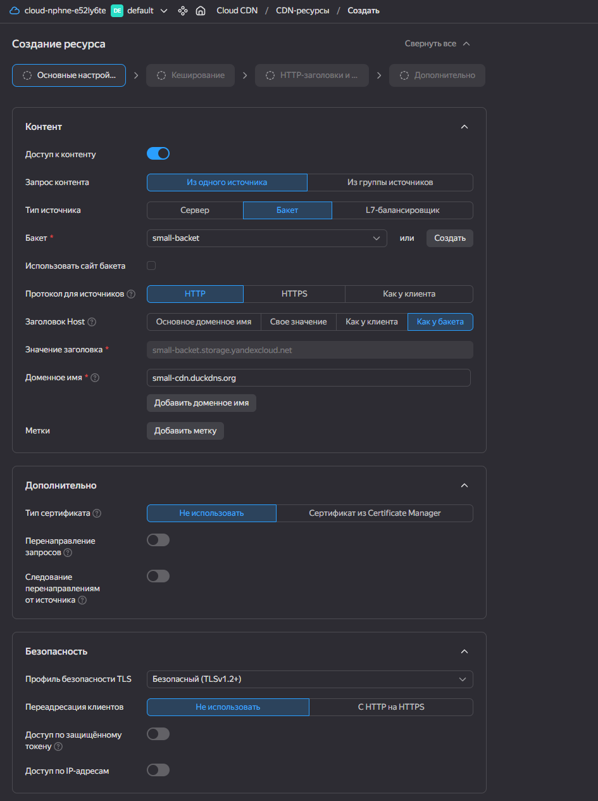

Настройки кэширования

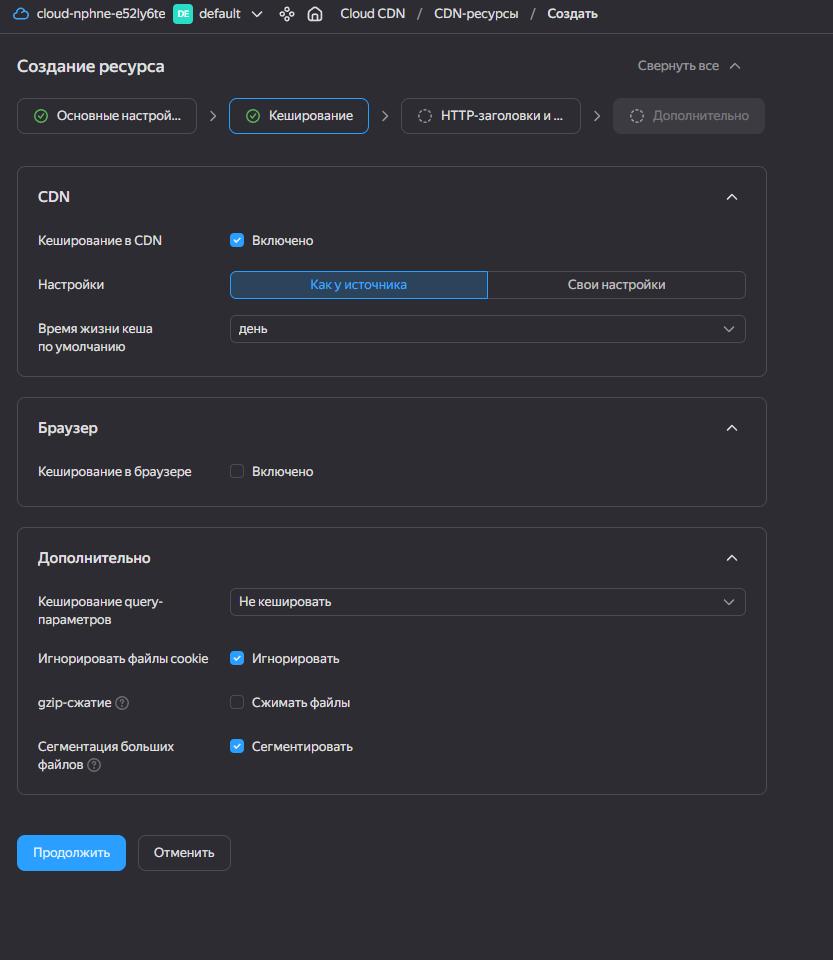

Настройки заголовков

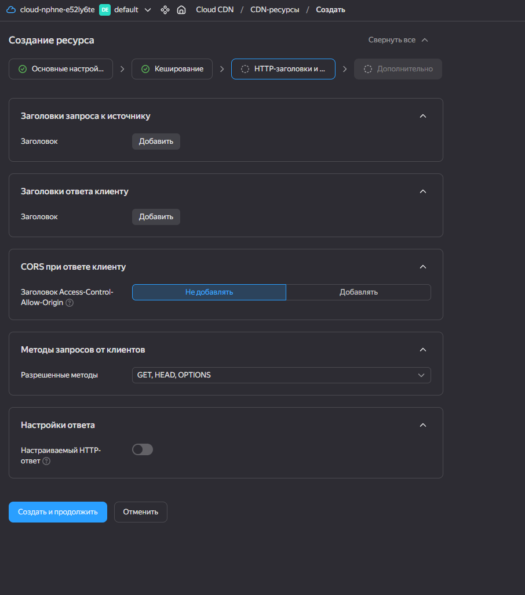

CDN создан

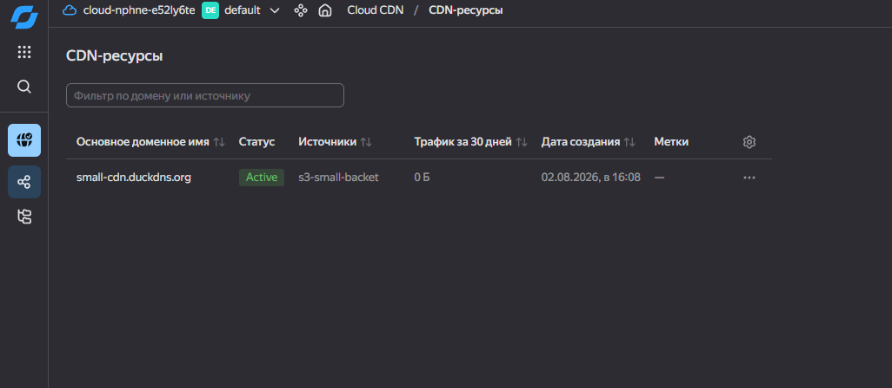

## Восстановление RDS из бэкапа

Список бэкапов

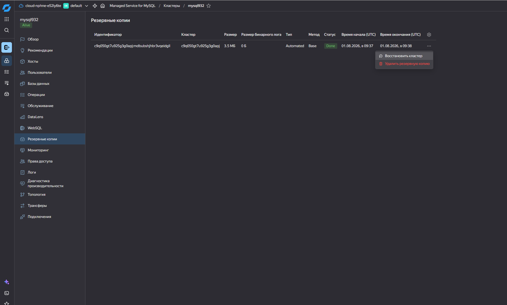

Настройки восстановления

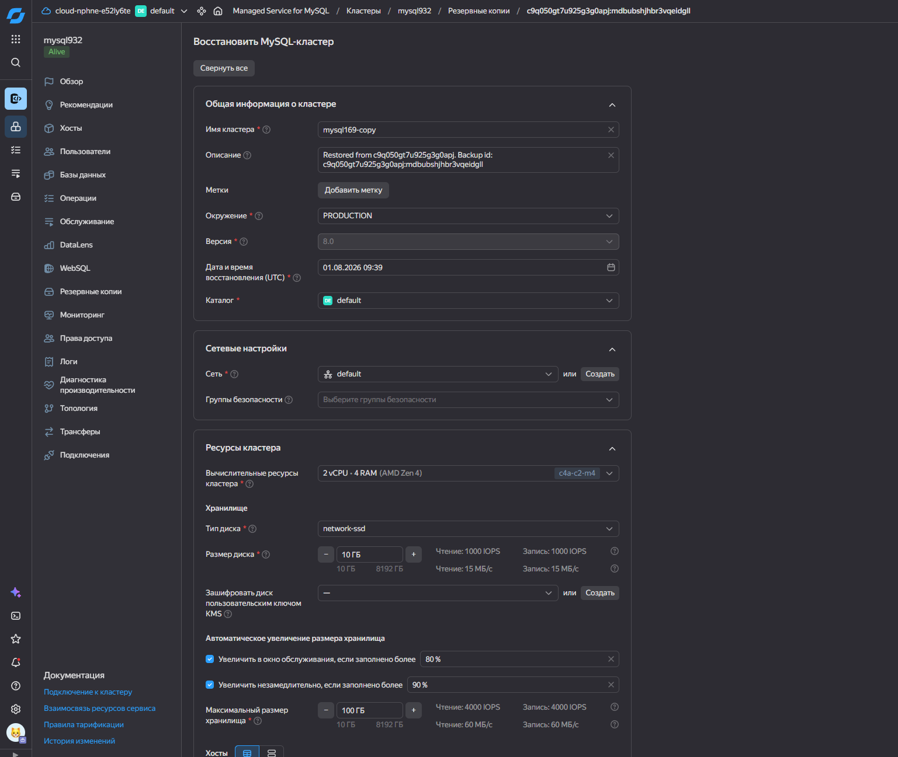

Новый кластер создан

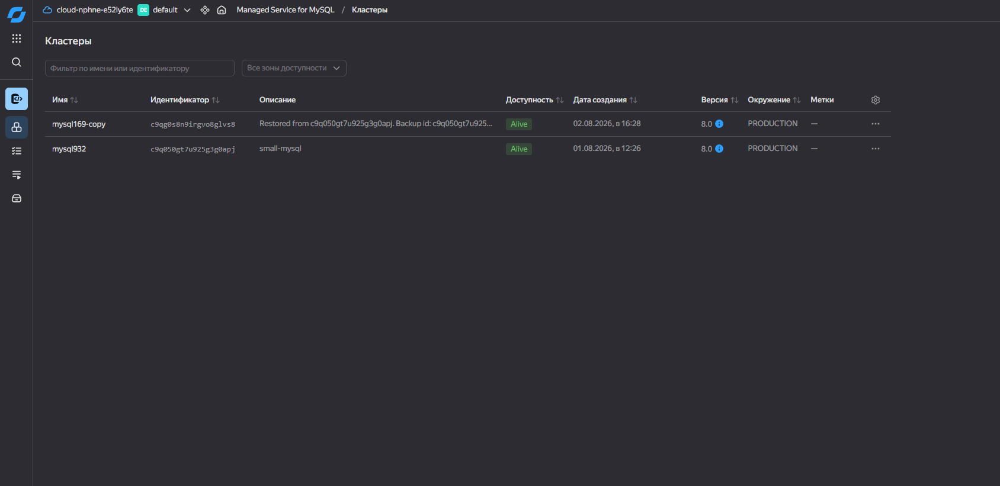

## Отобразить сайт

index.html и картинка уже были загружены

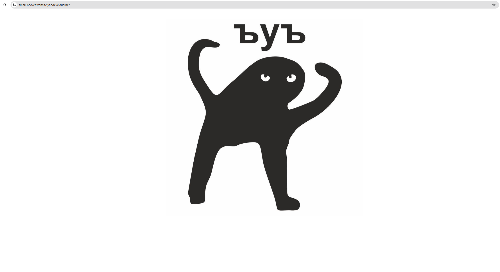
