# Отчет: Введение в DevOps2.Операционные системы. Часть 2

1. Напишите простой Bash-скрипт, который:
Выводит текущую дату и время
Показывает использование диска
Отображает свободную память

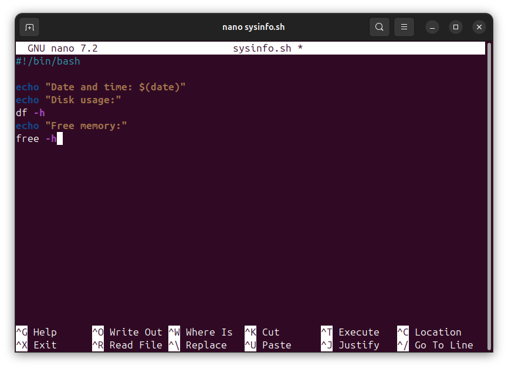
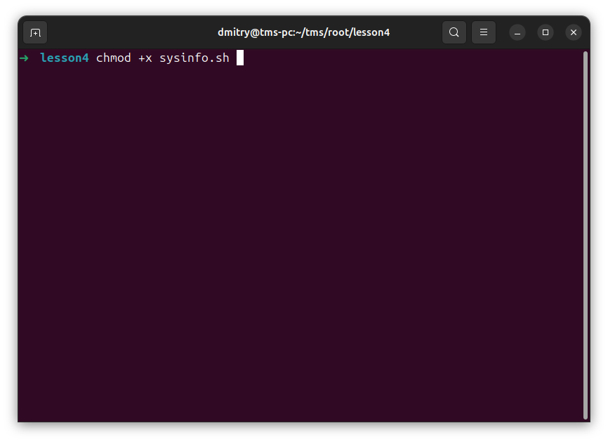
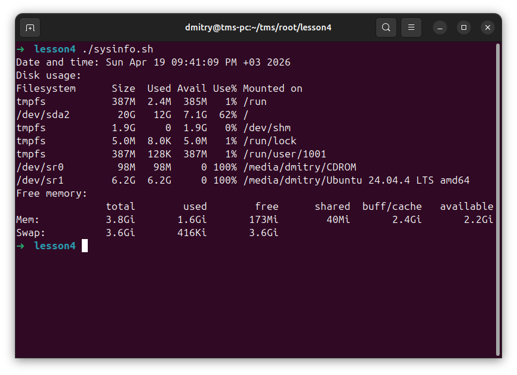

2. Установите необходимые инструменты:
htop для мониторинга процессов
mc (Midnight Commander) для работы с файлами
tree для просмотра структуры каталогов

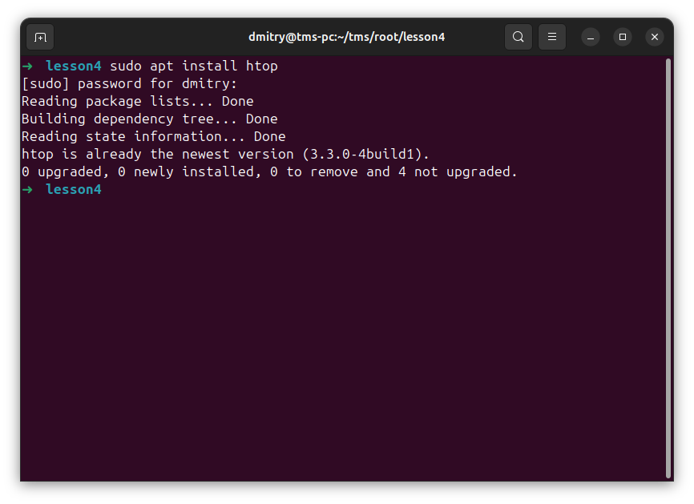
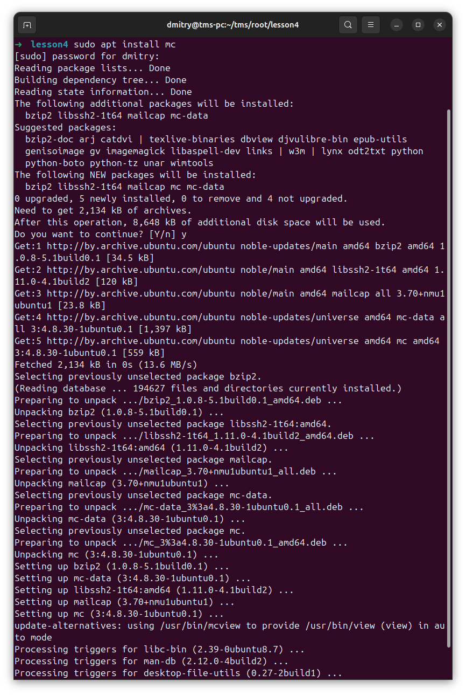
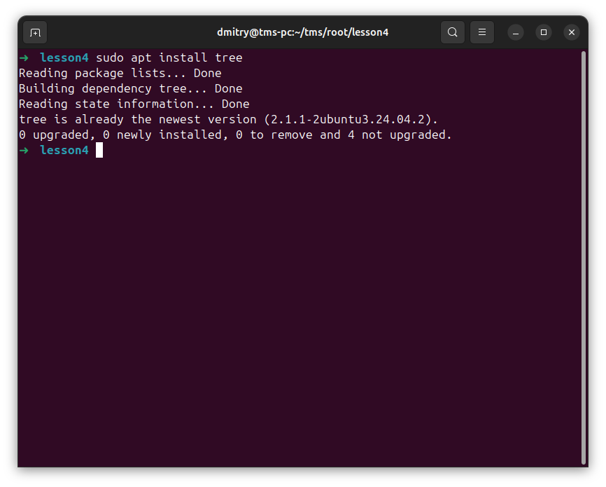

3. Сохраните список установленных пакетов в файл:
dpkg --get-selections > installed_packages.txt

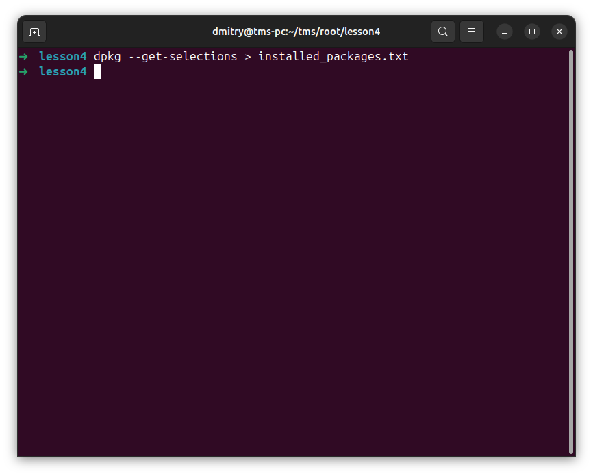
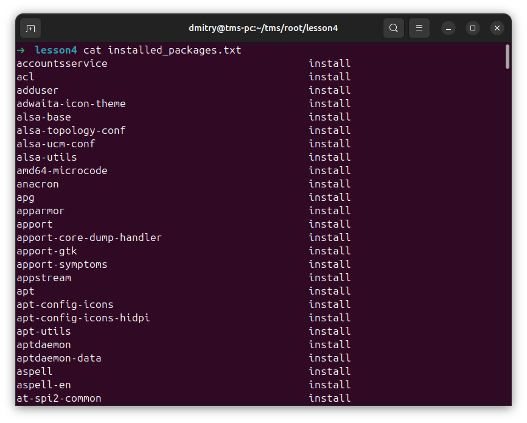

4. Создайте простую службу, которая:
- Запускает ваш скрипт из Задания 1
- Записывает результаты в лог
- Автоматически стартует при загрузке системы

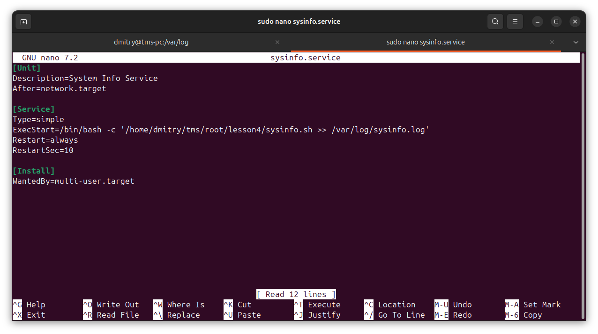
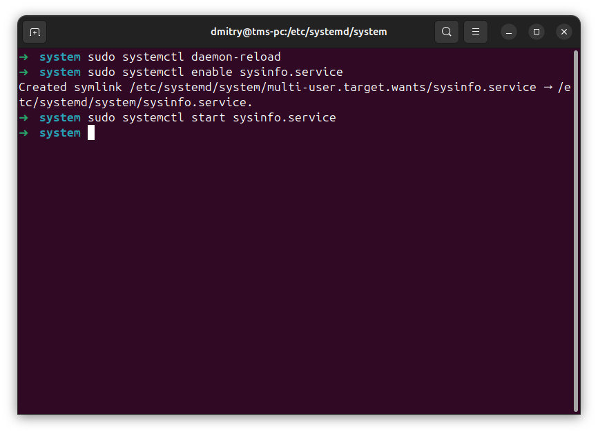
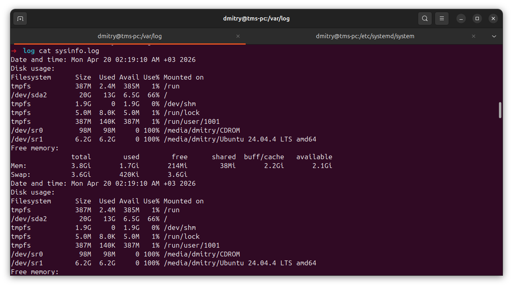

