# Отчет: Введение в DevOps2.Операционные системы. Часть 3

1. установить MongoDB.
*создать таблицу data; создать пользователя manager, у которого будет доступ
только на чтение этой таблицы.

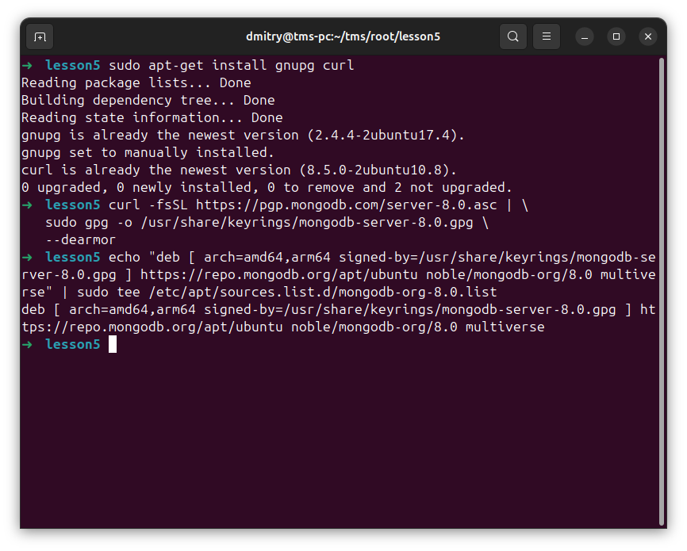
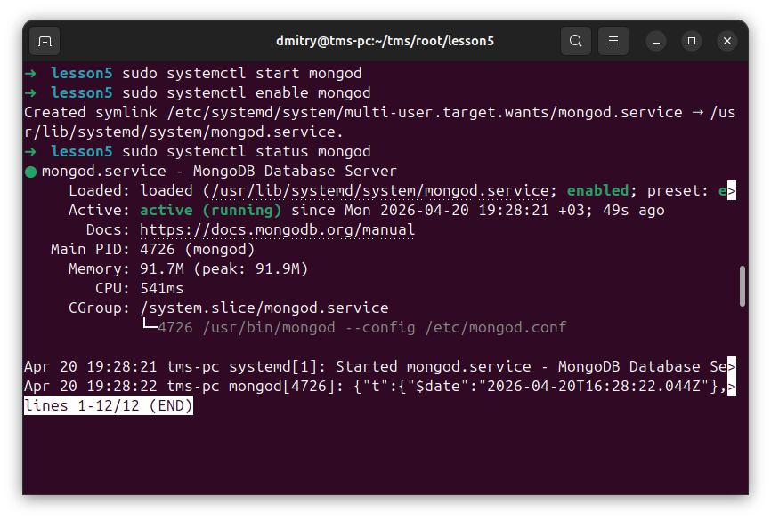
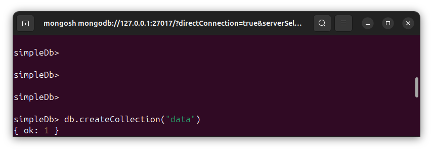
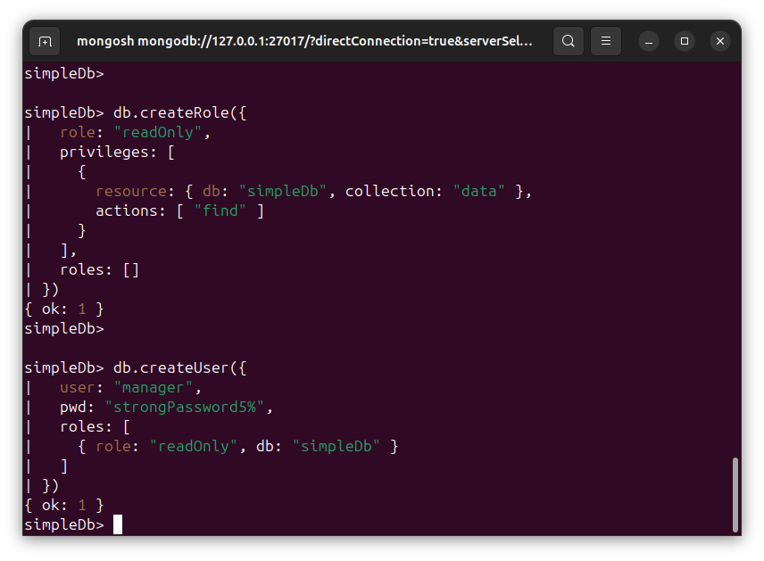
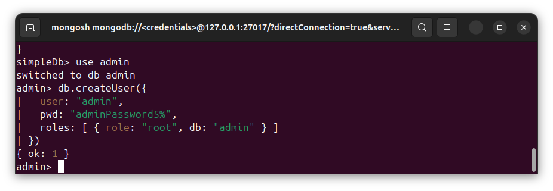
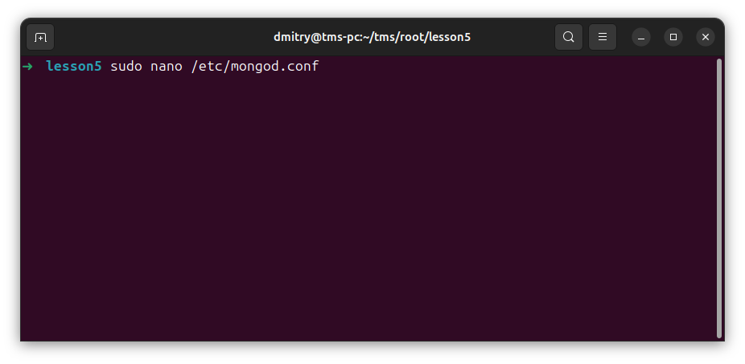
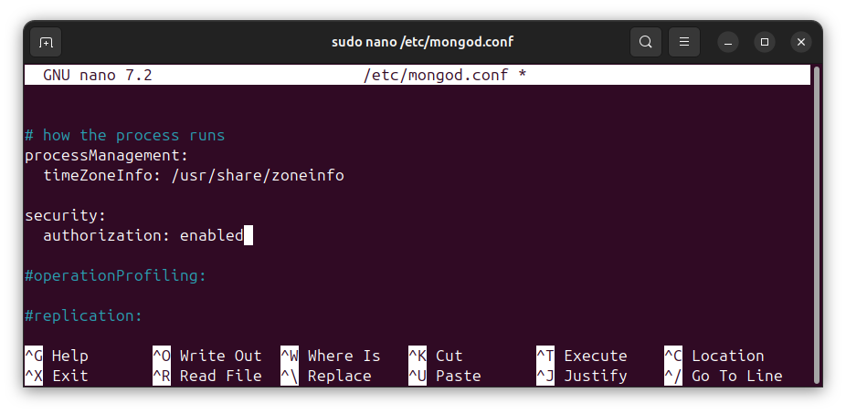
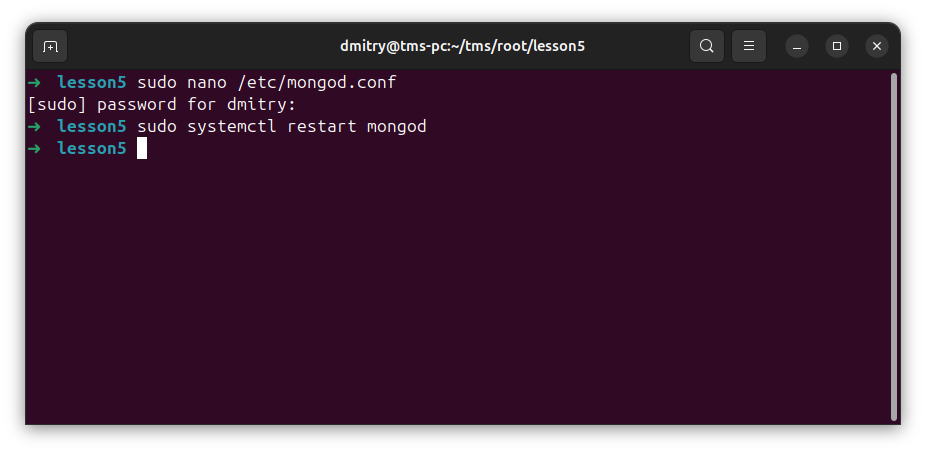
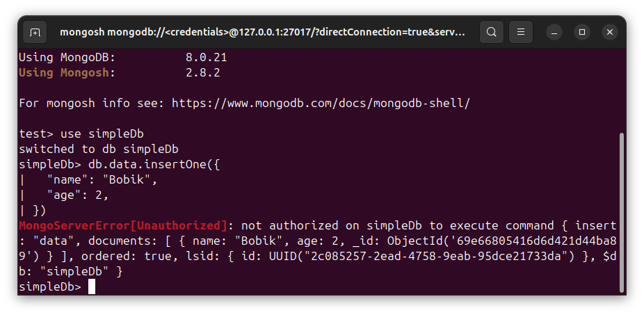

2. ознакомиться с нижеуказанной статьей по теме «Bash»
https://habr.com/ru/post/52871/

3. написать Bash-скрипт в соответствии с требованиями:
Содержание скрипта: замена существующего расширения в имени файла на
заданное. Исходное имя файла и новое расширение передаются скрипту в
качестве параметров. Основное средство: нестандартное раскрытие
переменных. Усложнение: предусмотреть штатную реакцию на отсутствие
расширения в исходном имени файла.

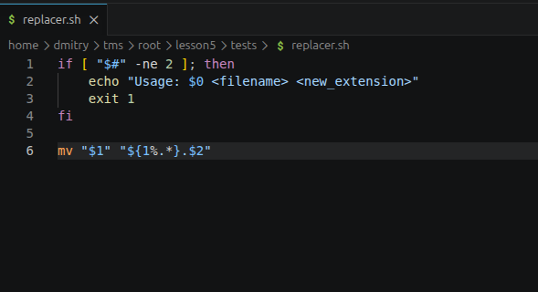
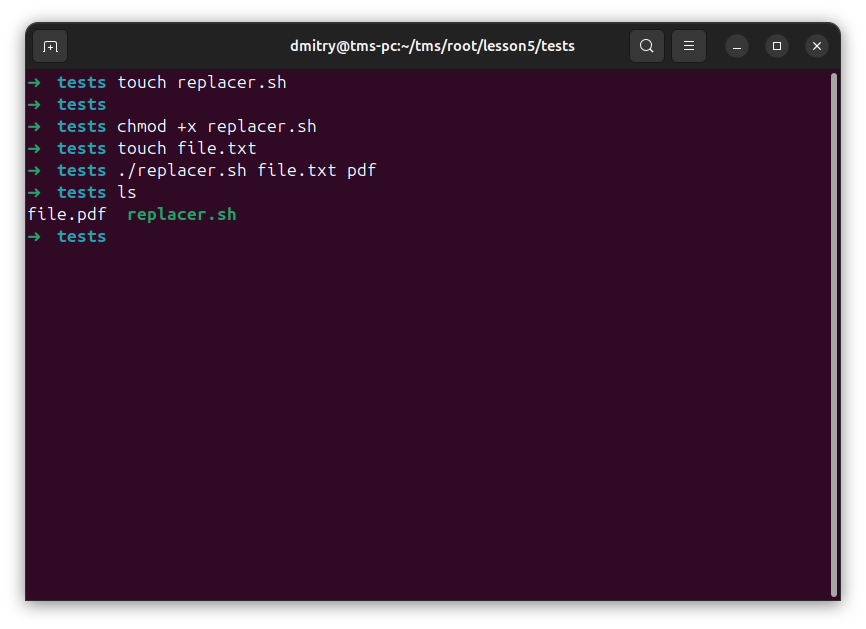

4. написать Bash-скрипт в соответствии с требованиями:
Содержание скрипта: выделение из исходной строки подстроки с границами,
заданными порядковыми номерами символов в исходной строке. Усложнение:
предусмотреть возможность не выделения, а удаления подстроки.Основные
средства: команда cut, переменные оболочки

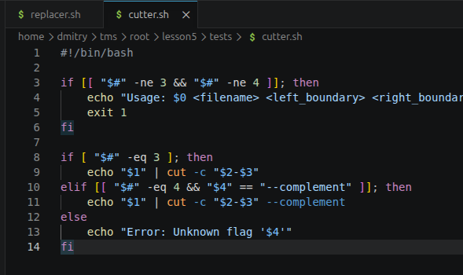
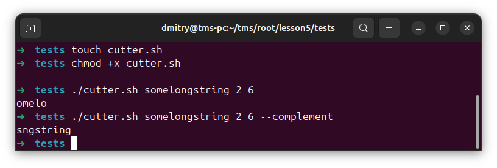