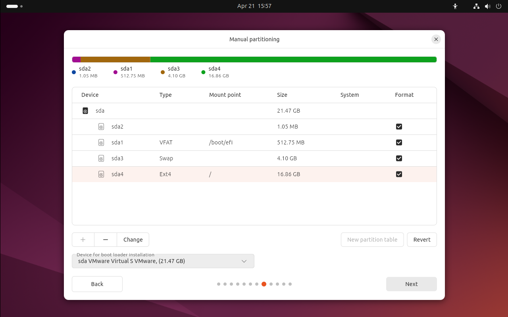
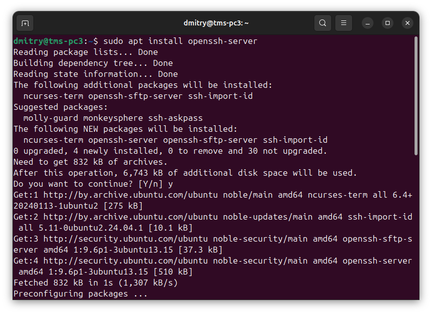
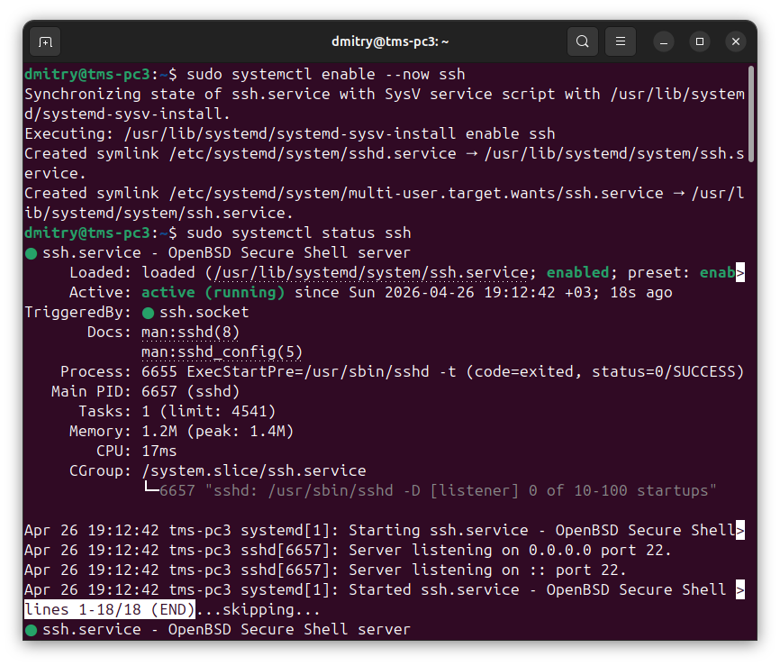
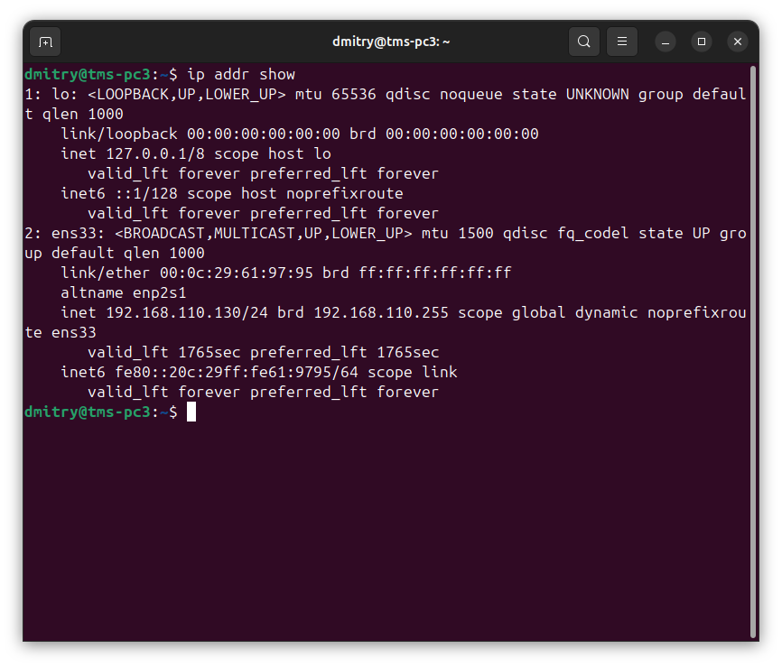
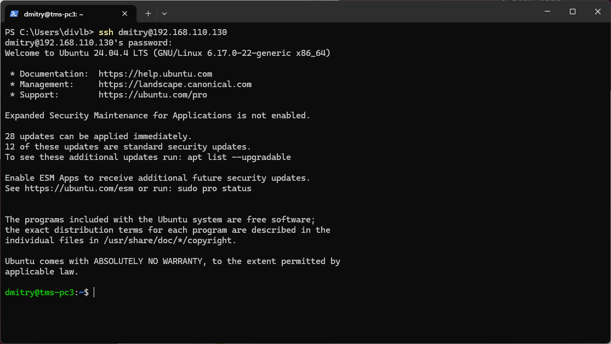
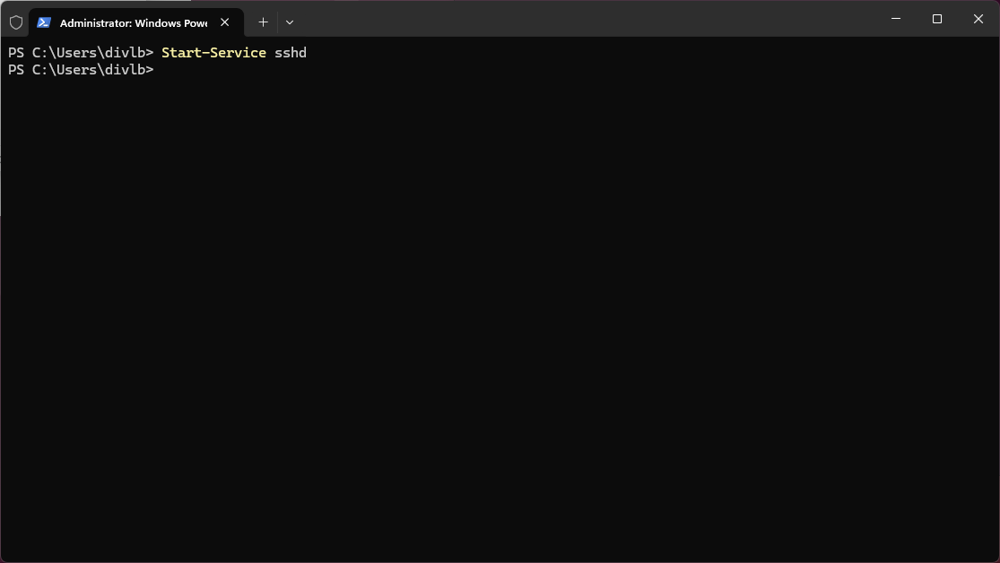
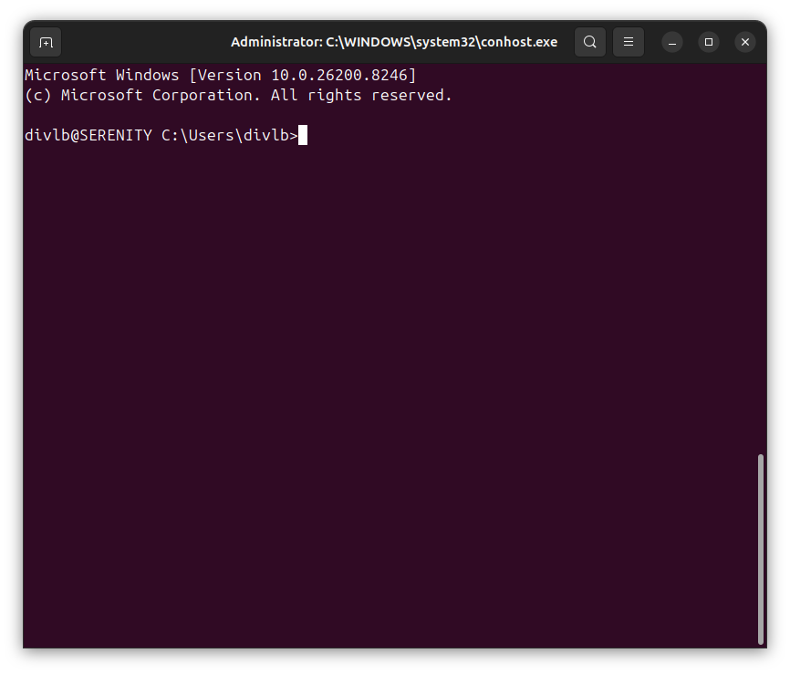
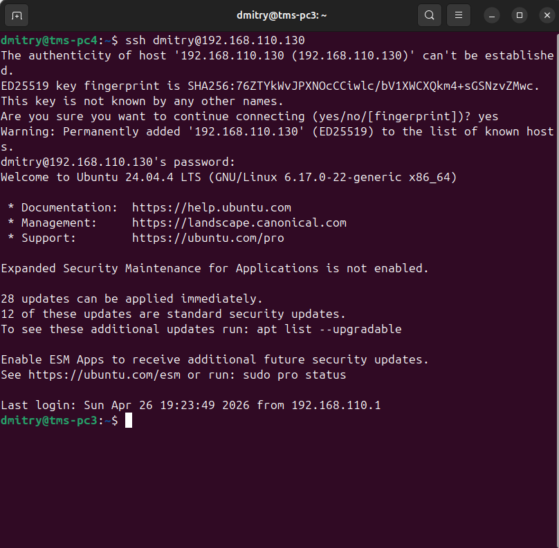
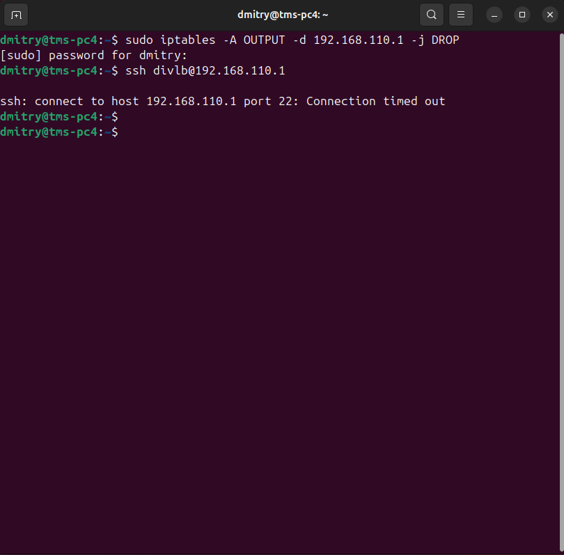

# Отчет: Введение в DevOps2.Операционные системы. Часть 4

## 1. Создайте 2 виртаульных машины.

### 2. Пройдите польностью все этапы установки и вручную разбейте свободное пространство на диски.

### 3. Настройте SSH-соеденение следующим образом: хостовая ОС -> VM1

### VM1 -> хостовая ос

### VM2 -> VM1

### VM2 -x> хостовая ОС

